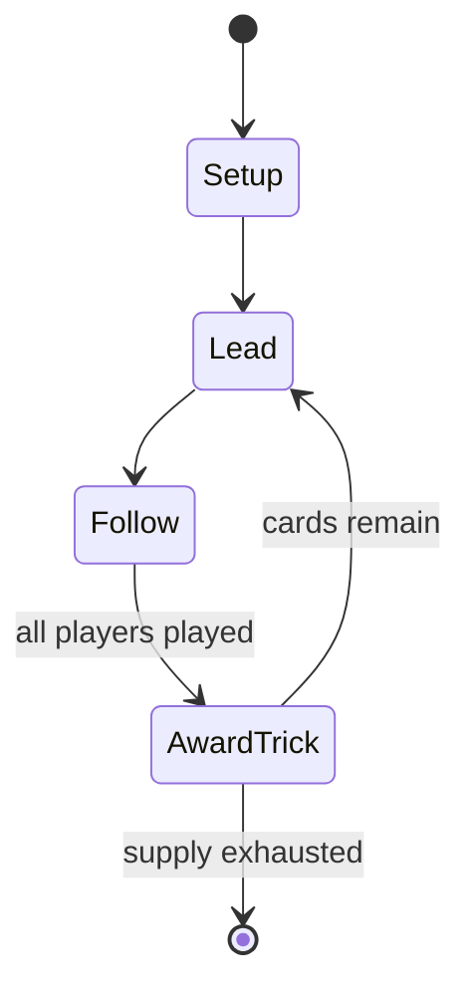

# Sedma

*card game*

`sedma` &nbsp; state: **DEEPENED** &nbsp; method: **heuristic**

## Found layer (recorded, not trusted)

| field | value |
| --- | --- |
| wikidata | Q33120381 |
| wikipedia | Sedma |
| genres (source) | -- |
| instance of (source) | trick-taking game |
| country of origin | -- |

## Declared layer (orders bench work)

| field | value |
| --- | --- |
| year created | -- |
| epoch | -- |
| region | -- |
| media | CARD |
| players | 2-4 |
| age band | -- |
| exogenous process | DEPLETING_DECK |
| loss shape | -- |
| live axes | - |
| horizon | -- |
| scoring shape | LINEAR_ACCUMULATION |
| information | -- |
| interaction | TEAM |
| turn structure | TRICK_ROUND |
| tractability | EXACT_WITH_CUT |
| randomness | DECK_DEPLETING |
| luck factor | 0.48 |
| rules complexity | 1.82 |
| strategic depth | 2.25 |
| novelty | 0.8001 |
| solved status | -- |
| strategies | spatial_packing |
| algorithms | -- |

## Object model

```
Episode
  players      : 2-4
  turn_structure: TRICK_ROUND
  horizon       : ?
  scoring       : LINEAR_ACCUMULATION

Deck           -- ordered multiset, drawn without replacement
Hand           -- private multiset held by one player
DiscardPile    -- public accumulation of spent cards
```

## State transition diagram



## Research item -- turn trace

```
# Sedma -- simulated turn events
# generated from the DECLARED vector, not from a rulebook.
# structure: exo=DEPLETING_DECK loss=None horizon=None scoring=LINEAR_ACCUMULATION axes=-

t=0    SETUP        players=2  pot=0  capacity=3
t=1    DRAW         p1 draw from deck -> outcome #6  (p=0.088)
t=2    FORCED       p1 single legal option taken (pot_gain=+2.0)
t=3    DRAW         p1 draw from deck -> outcome #5  (p=0.073)
t=4    FORCED       p1 single legal option taken (pot_gain=+0.7)
t=5    ENDTURN      turn passes to p2
t=6    DRAW         p2 draw from deck -> outcome #3  (p=0.169)
t=7    FORCED       p2 single legal option taken (pot_gain=+1.3)
t=8    DRAW         p2 draw from deck -> outcome #4  (p=0.168)
t=9    FORCED       p2 single legal option taken (pot_gain=+1.7)
t=10   DRAW         p2 draw from deck -> outcome #5  (p=0.059)
t=11   FORCED       p2 single legal option taken (pot_gain=+1.3)
t=12   ENDTURN      turn passes to p1
t=13   DRAW         p1 draw from deck -> outcome #3  (p=0.232)
t=14   FORCED       p1 single legal option taken (pot_gain=+1.7)
t=15   DRAW         p1 draw from deck -> outcome #5  (p=0.257)
t=16   FORCED       p1 single legal option taken (pot_gain=+1.6)
t=17   DRAW         p1 draw from deck -> outcome #1  (p=0.290)
t=18   FORCED       p1 single legal option taken (pot_gain=+0.6)
t=19   DRAW         p1 draw from deck -> outcome #6  (p=0.112)
t=20   FORCED       p1 single legal option taken (pot_gain=+1.2)
t=21   DRAW         p1 draw from deck -> outcome #1  (p=0.246)
t=22   FORCED       p1 single legal option taken (pot_gain=+1.3)
t=23   DRAW         p1 draw from deck -> outcome #6  (p=0.173)
t=24   FORCED       p1 single legal option taken (pot_gain=+0.7)
t=25   DRAW         p1 draw from deck -> outcome #6  (p=0.137)
t=26   FORCED       p1 single legal option taken (pot_gain=+0.9)

terminal: VARIABLE
```

## Conditions

| kind | threshold | effect | trigger |
| --- | --- | --- | --- |
| BOUNDARY | 50 points | -- | The object is to win more than half of them, i.e. at least 50 points. |

## Source extract

Sedma is a Czech 4-card trick-and-draw game played by four players in fixed partnerships with a
32-card Bohemian-pattern pack. Card suits do not play a role in this game, and there is no
ranking order. A trick is won by the last player to play a card of the same rank as the card
led. The card game gives its name to the 'Sedma group' which includes closely related games such
as the Finnish Ristikontra, the Yugoslavian Sedmice, the Romanian Șeptică, the Hungarian
Zsírozás (also Zsíros or Zsír), the Bavarian Lusti-Kartl'n, the German Schmierer and the
possibly Polish Hola. These games have been described as highly unusual members of the ace–ten
family, found only in Central and Eastern Europe.   == Cards ==  Normally a 32-card, German-
suited, Bohemian-pattern pack is used; these are obtainable online. However, as in other games
played with this pack it can be replaced by other German-suited cards, a French-suited Piquet
pack comprising 32 cards from Ace to Seven in each suit. In extremis, a standard 52-card pack
may be used from which 2s to 6s are removed. The most powerful cards in the game are the Sevens
because they beat all other cards; however, the only counting cards are Aces a

<sub>Wikipedia, CC BY-SA. Retained as evidence for the structural
classification above. Every rule inferred from it is HYPOTHESIZED
until audited against a rulebook.</sub>
