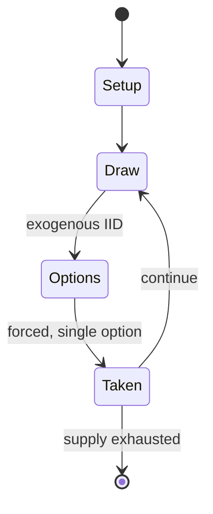

# Senet

`senet` &nbsp; state: **DEEPENED** &nbsp; method: **heuristic**

## Found layer (recorded, not trusted)

| field | value |
| --- | --- |
| wikidata | Q582169 |
| wikipedia | Senet |
| genres (source) | -- |
| instance of (source) | -- |
| country of origin | -- |

## Declared layer (orders bench work)

| field | value |
| --- | --- |
| year created | -2620 |
| epoch | DEEP_ANTIQUITY |
| region | -- |
| media | BOARD |
| players | -- |
| age band | -- |
| exogenous process | IID |
| loss shape | -- |
| live axes | SPATIAL |
| horizon | VARIABLE |
| scoring shape | SET_COLLECTION_CONVEX |
| information | -- |
| interaction | SOLITAIRE |
| turn structure | PRIORITY_QUEUE |
| tractability | SAMPLING_ONLY |
| randomness | DICE |
| luck factor | 0.35 |
| rules complexity | 2.14 |
| strategic depth | 2.25 |
| novelty | 0.4088 |
| solved status | -- |
| strategies | set_collection |
| algorithms | -- |

## Object model

```
Episode
  players      : ?
  turn_structure: PRIORITY_QUEUE
  horizon       : VARIABLE
  scoring       : SET_COLLECTION_CONVEX

Board          -- spatial substrate; cells carry position and occupancy
Piece          -- movable token owned by a player
Placement      -- position subject to geometric legality
```

## State transition diagram



## Research item -- turn trace

```
# Senet -- simulated turn events
# generated from the DECLARED vector, not from a rulebook.
# structure: exo=IID loss=None horizon=VARIABLE scoring=SET_COLLECTION_CONVEX axes=SPATIAL

t=0    SETUP        players=2  pot=0  capacity=3
t=1    DRAW         p1 roll from d6 pool -> outcome #6  (p=0.267)
t=2    FORCED       p1 single legal option taken (pot_gain=+1.7)
t=3    DRAW         p1 roll from d6 pool -> outcome #3  (p=0.054)
t=4    FORCED       p1 single legal option taken (pot_gain=+1.3)
t=5    DRAW         p1 roll from d6 pool -> outcome #4  (p=0.028)
t=6    FORCED       p1 single legal option taken (pot_gain=+1.4)
t=7    DRAW         p1 roll from d6 pool -> outcome #3  (p=0.209)
t=8    FORCED       p1 single legal option taken (pot_gain=+1.4)
t=9    SPATIAL      p1 places at (6,2); adjacency legal
t=10   DRAW         p1 roll from d6 pool -> outcome #1  (p=0.038)
t=11   FORCED       p1 single legal option taken (pot_gain=+1.7)
t=12   ENDTURN      turn passes to p2
t=13   DRAW         p2 roll from d6 pool -> outcome #5  (p=0.096)
t=14   FORCED       p2 single legal option taken (pot_gain=+1.0)
t=15   DRAW         p2 roll from d6 pool -> outcome #5  (p=0.028)
t=16   FORCED       p2 single legal option taken (pot_gain=+0.7)
t=17   DRAW         p2 roll from d6 pool -> outcome #1  (p=0.146)
t=18   FORCED       p2 single legal option taken (pot_gain=+1.1)
t=19   DRAW         p2 roll from d6 pool -> outcome #5  (p=0.178)
t=20   FORCED       p2 single legal option taken (pot_gain=+1.1)
t=21   SPATIAL      p2 places at (2,4); adjacency legal
t=22   ENDTURN      turn passes to p1
t=23   DRAW         p1 roll from d6 pool -> outcome #3  (p=0.297)
t=24   FORCED       p1 single legal option taken (pot_gain=+1.5)
t=25   DRAW         p1 roll from d6 pool -> outcome #5  (p=0.129)
t=26   FORCED       p1 single legal option taken (pot_gain=+1.8)
t=27   SPATIAL      p1 places at (2,1); adjacency legal

terminal: VARIABLE
```

## Conditions

| kind | threshold | effect | trigger |
| --- | --- | --- | --- |
| TERMINATE | -- | -- | The game ends when the board is emptied, and the winner is whoever scored the most of their own pawns. |
| BOUNDARY | -- | -- | Senet was also adopted in Cyprus around the end of the third millennium BCE and continued until at least the Bronze Age. |
| BOUNDARY | -- | -- | At least by the New Kingdom, these pieces were in the form of hounds or dog-headed figurines. |
| BOUNDARY | -- | -- | At least by the New Kingdom in Egypt (1550–1077 BCE), the game reflected the concept of the ka (vital essence of the soul) passing through the duat (underworld), represented in the game by the spaces connecting the indiv |
| BOUNDARY | -- | -- | The game's length can be extended by increasing the number of pawns allocated to each player as desired, to a maximum of ten pawns per player. |
| BOUNDARY | -- | -- | House 26, "the House of Happiness": Pawns cannot bypass this house under any circumstance, each pawn must land on it at least once before it can be legally taken off the board. |

## Source extract

Senet or senat (Ancient Egyptian: 𓊃𓈖𓏏𓏠, romanized: znt, lit. 'passing'; cf. Coptic ⲥⲓⲛⲉ /sinə/,
'passing, afternoon') is a board game from ancient Egypt that consists of ten or more pawns on a
30-square playing board. The earliest representation of senet is dated to c. 2620 BCE from the
Mastaba of Hesy-Re, while similar boards and hieroglyphic signs are found even earlier,
including in the Levant in the Early Bronze Age II period. Even though the game has a 2,000-year
history in Egypt, there appears to be very little variation in terms of key components. This can
be determined by studying the various senet boards that have been found by archaeologists, as
well as depictions of senet being played throughout Egyptian history on places like tomb walls
and papyrus scrolls. However, the game fell out of use during the Roman period, and its original
rules are the subject of conjecture.   == History ==  Fragmentary boards that could be senet
have been found in First Dynasty burials in Egypt, c. 3100 BCE. The first unequivocal painting
of this ancient game is from the Third Dynasty tomb of the high official Hesy. People are
depicted playing senet in a painting in the tomb of the Fifth Dyna

<sub>Wikipedia, CC BY-SA. Retained as evidence for the structural
classification above. Every rule inferred from it is HYPOTHESIZED
until audited against a rulebook.</sub>
