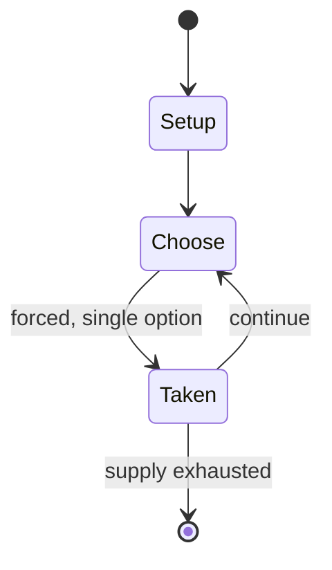

# senterej

*chess variant*

`senterej` &nbsp; state: **DEEPENED** &nbsp; method: **heuristic**

## Found layer (recorded, not trusted)

| field | value |
| --- | --- |
| wikidata | Q117477 |
| wikipedia | Senterej |
| genres (source) | -- |
| instance of (source) | chess variant |
| country of origin | -- |

## Declared layer (orders bench work)

| field | value |
| --- | --- |
| year created | -- |
| epoch | -- |
| region | -- |
| media | MEMORY |
| players | -- |
| age band | -- |
| exogenous process | -- |
| loss shape | -- |
| live axes | - |
| horizon | -- |
| scoring shape | WINNER_TAKE_ALL |
| information | -- |
| interaction | COMPETITIVE |
| turn structure | PHASE_STRUCTURED |
| tractability | SAMPLING_ONLY |
| randomness | SIMULTANEOUS_CHOICE |
| luck factor | 0.3 |
| rules complexity | 2.42 |
| strategic depth | 2.25 |
| novelty | 0.6423 |
| solved status | -- |
| strategies | memory_recall |
| algorithms | -- |

## Object model

```
Episode
  players      : ?
  turn_structure: PHASE_STRUCTURED
  horizon       : ?
  scoring       : WINNER_TAKE_ALL

State          -- opaque; no medium or axis evidence was found
Player         -- an agent that selects among legal successors
```

## State transition diagram



## Research item -- turn trace

```
# senterej -- simulated turn events
# generated from the DECLARED vector, not from a rulebook.
# structure: exo=None loss=None horizon=None scoring=WINNER_TAKE_ALL axes=-

t=0    SETUP        players=2  pot=0  capacity=4
t=1    FORCED       p1 single legal option taken (pot_gain=+1.8)
t=2    FORCED       p1 single legal option taken (pot_gain=+0.8)
t=3    FORCED       p1 single legal option taken (pot_gain=+1.5)
t=4    ENDTURN      turn passes to p2
t=5    FORCED       p2 single legal option taken (pot_gain=+1.7)
t=6    FORCED       p2 single legal option taken (pot_gain=+1.3)
t=7    FORCED       p2 single legal option taken (pot_gain=+1.0)
t=8    ENDTURN      turn passes to p1
t=9    FORCED       p1 single legal option taken (pot_gain=+1.0)
t=10   ENDTURN      turn passes to p2
t=11   FORCED       p2 single legal option taken (pot_gain=+1.1)
t=12   FORCED       p2 single legal option taken (pot_gain=+1.0)
t=13   FORCED       p2 single legal option taken (pot_gain=+2.0)
t=14   FORCED       p2 single legal option taken (pot_gain=+1.8)
t=15   FORCED       p2 single legal option taken (pot_gain=+1.8)
t=16   ENDTURN      turn passes to p1
t=17   FORCED       p1 single legal option taken (pot_gain=+1.4)
t=18   FORCED       p1 single legal option taken (pot_gain=+1.6)
t=19   ENDTURN      turn passes to p2
t=20   FORCED       p2 single legal option taken (pot_gain=+1.6)
t=21   FORCED       p2 single legal option taken (pot_gain=+1.7)
t=22   FORCED       p2 single legal option taken (pot_gain=+1.2)
t=23   FORCED       p2 single legal option taken (pot_gain=+0.7)
t=24   ENDTURN      turn passes to p1
t=25   FORCED       p1 single legal option taken (pot_gain=+1.6)
t=26   FORCED       p1 single legal option taken (pot_gain=+1.7)

terminal: VARIABLE
```

## Conditions

| kind | threshold | effect | trigger |
| --- | --- | --- | --- |
| WIN | -- | -- | One side win the game, in case of the opponent's king is being checkmated under the opponent has any pieces of ferz/alfil(s)/horse(s)/rook(s) still alive |

## Source extract

Senterej (Amharic: ሰንጠረዥ sänṭäräž), also known as Ethiopian chess, is a regional chess variant,
the form of chess traditionally played in Ethiopia and Eritrea. It was the last popular survival
of shatranj. According to Richard Pankhurst, the game became extinct sometime after the Italian
invasion of Ethiopia in the 1930s. A distinctive feature of Senterej is the opening phase –
players make as many moves as they like without regard for how many moves the opponent has made;
this continues until the first capture is made. Memorization of opening lines is therefore not a
feature of the game.   == Rules ==   === Pieces ===  Broadly, the pieces move the same way as in
shatranj; however, there are regional variations.   Each king (negus) stands just to the right
of the centerline from its player's point of view. It moves one step in any direction as a chess
king.  At the left of the king stands the ferz, moving one square diagonally. (One source says
it moves one step in any direction, but may only capture diagonally. There may have been
regional variations.)  On the flanks of the king and ferz stands a piece called the fil or alfil
(saba). It leaps diagonally to the second square distan

<sub>Wikipedia, CC BY-SA. Retained as evidence for the structural
classification above. Every rule inferred from it is HYPOTHESIZED
until audited against a rulebook.</sub>
