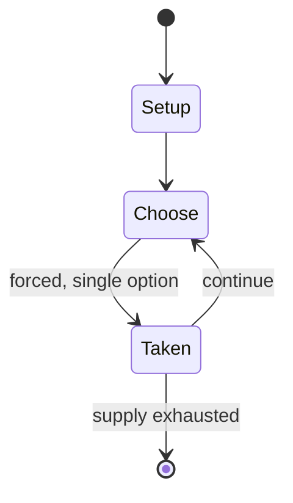

# Sepak raga

*Indonesian and Malaysian traditional sport*

`sepak_raga` &nbsp; state: **DEEPENED** &nbsp; method: **heuristic**

## Found layer (recorded, not trusted)

| field | value |
| --- | --- |
| wikidata | Q7434721 |
| wikipedia | Sepak raga |
| genres (source) | -- |
| instance of (source) | traditional sport, type of sport |
| country of origin | Malacca sultanate |

## Declared layer (orders bench work)

| field | value |
| --- | --- |
| year created | -- |
| epoch | -- |
| region | -- |
| media | SPORT |
| players | -- |
| age band | -- |
| exogenous process | -- |
| loss shape | -- |
| live axes | - |
| horizon | -- |
| scoring shape | -- |
| information | -- |
| interaction | SOLITAIRE |
| turn structure | -- |
| tractability | SAMPLING_ONLY |
| randomness | -- |
| luck factor | 0.35 |
| rules complexity | 1.68 |
| strategic depth | 2.0 |
| novelty | 0.3945 |
| solved status | -- |
| strategies | -- |
| algorithms | -- |

## Object model

```
Episode
  players      : ?
  turn_structure: ?
  horizon       : ?
  scoring       : ?

Pitch          -- bounded physical region
Player         -- embodied agent with a foul count
Clock          -- counts down; stoppages are rule events
Official       -- detects infractions and applies penalties
```

## State transition diagram



## Research item -- turn trace

```
# Sepak raga -- simulated turn events
# generated from the DECLARED vector, not from a rulebook.
# structure: exo=None loss=None horizon=None scoring=None axes=-

t=0    SETUP        players=2  pot=0  capacity=4
t=1    FORCED       p1 single legal option taken (pot_gain=+2.0)
t=2    ENDTURN      turn passes to p2
t=3    FORCED       p2 single legal option taken (pot_gain=+1.7)
t=4    ENDTURN      turn passes to p1
t=5    FORCED       p1 single legal option taken (pot_gain=+1.5)
t=6    FORCED       p1 single legal option taken (pot_gain=+2.0)
t=7    ENDTURN      turn passes to p2
t=8    FORCED       p2 single legal option taken (pot_gain=+1.6)
t=9    FORCED       p2 single legal option taken (pot_gain=+1.8)
t=10   FORCED       p2 single legal option taken (pot_gain=+1.1)
t=11   FORCED       p2 single legal option taken (pot_gain=+0.7)
t=12   FORCED       p2 single legal option taken (pot_gain=+1.6)
t=13   ENDTURN      turn passes to p1
t=14   FORCED       p1 single legal option taken (pot_gain=+1.1)
t=15   FORCED       p1 single legal option taken (pot_gain=+0.9)
t=16   FORCED       p1 single legal option taken (pot_gain=+1.2)
t=17   FORCED       p1 single legal option taken (pot_gain=+0.7)
t=18   ENDTURN      turn passes to p2
t=19   FORCED       p2 single legal option taken (pot_gain=+1.5)
t=20   ENDTURN      turn passes to p1
t=21   FORCED       p1 single legal option taken (pot_gain=+1.5)
t=22   ENDTURN      turn passes to p2
t=23   FORCED       p2 single legal option taken (pot_gain=+1.6)
t=24   ENDTURN      turn passes to p1
t=25   FORCED       p1 single legal option taken (pot_gain=+0.5)
t=26   FORCED       p1 single legal option taken (pot_gain=+1.3)

terminal: VARIABLE
```

## Conditions

| kind | threshold | effect | trigger |
| --- | --- | --- | --- |
| TERMINATE | -- | -- | The match is divided into two stages, namely the preliminary round is called the trot and the final round is called boko. |

## Source extract

Sepak raga (Minangkabau: sipak rago) is a traditional Indonesian and Malaysian sport, developed
in the Malay Archipelago. This game is related to the modern sepak takraw. Similar games include
footbag net, footvolley, bossaball and jianzi.  This game is played by five to ten people by
forming a circle in an open field, where the sports ball is played with the feet and certain
techniques so that the ball moves from one player to another without falling to the ground. The
raga ball is made from young coconut leaves or rattan bark which is woven by hand. The sport
requires speed, agility and ball control. The tradition of sepak raga is found in various
regions in Nusantara archipelago, including West Sumatra: sipak rago; Riau and North Sumatra:
rago tinggi; Java: sepak tengkong; Central Kalimantan: sepak sawut; Sulawesi: paraga. It is also
found in the Malay Peninsula region, including Johor, Penang and Pahang.   == History ==  Sepak
takraw is known by the Indonesian and Malaysian people in several areas such as Borneo, the
Malay Peninsula, Sumatra and Sulawesi as Sepak raga, which is a game for local children who
still use a ball made of rattan. In this game, each player must show pr

<sub>Wikipedia, CC BY-SA. Retained as evidence for the structural
classification above. Every rule inferred from it is HYPOTHESIZED
until audited against a rulebook.</sub>
