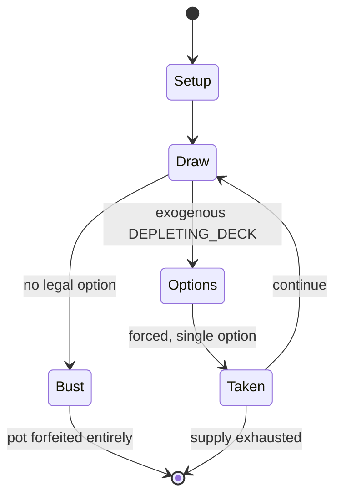

# Sette e Mezzo

*jarito*

`sette_e_mezzo` &nbsp; state: **DEEPENED** &nbsp; method: **heuristic**

## Found layer (recorded, not trusted)

| field | value |
| --- | --- |
| wikidata | Q1035867 |
| wikipedia | Sette e mezzo |
| genres (source) | -- |
| instance of (source) | card game |
| country of origin | -- |

## Declared layer (orders bench work)

| field | value |
| --- | --- |
| year created | -- |
| epoch | -- |
| region | -- |
| media | CARD |
| players | -- |
| age band | -- |
| exogenous process | DEPLETING_DECK |
| loss shape | TOTAL_RUIN |
| live axes | - |
| horizon | -- |
| scoring shape | -- |
| information | -- |
| interaction | COMPETITIVE |
| turn structure | -- |
| tractability | EXACT_WITH_CUT |
| randomness | DECK_SHUFFLE |
| luck factor | 0.48 |
| rules complexity | 1.8 |
| strategic depth | 2.0 |
| novelty | 0.7568 |
| solved status | -- |
| strategies | -- |
| algorithms | -- |

## Object model

```
Episode
  players      : ?
  turn_structure: ?
  horizon       : ?
  scoring       : ?

Deck           -- ordered multiset, drawn without replacement
Hand           -- private multiset held by one player
DiscardPile    -- public accumulation of spent cards
```

## State transition diagram



## Research item -- turn trace

```
# Sette e Mezzo -- simulated turn events
# generated from the DECLARED vector, not from a rulebook.
# structure: exo=DEPLETING_DECK loss=TOTAL_RUIN horizon=None scoring=None axes=-

t=0    SETUP        players=2  pot=0  capacity=4
t=1    DRAW         p1 draw from deck -> outcome #6  (p=0.278)
t=2    FORCED       p1 single legal option taken (pot_gain=+1.9)
t=3    DRAW         p1 draw from deck -> outcome #6  (p=0.076)
t=4    FORCED       p1 single legal option taken (pot_gain=+1.2)
t=5    ENDTURN      turn passes to p2
t=6    DRAW         p2 draw from deck -> outcome #4  (p=0.090)
t=7    FORCED       p2 single legal option taken (pot_gain=+1.7)
t=8    DRAW         p2 draw from deck -> outcome #1  (p=0.049)
t=9    FORCED       p2 single legal option taken (pot_gain=+1.5)
t=10   ENDTURN      turn passes to p1
t=11   DRAW         p1 draw from deck -> outcome #5  (p=0.196)
t=12   FORCED       p1 single legal option taken (pot_gain=+1.3)
t=13   DRAW         p1 draw from deck -> outcome #6  (p=0.010)
t=14   FORCED       p1 single legal option taken (pot_gain=+0.9)
t=15   DRAW         p1 draw from deck -> outcome #3  (p=0.270)
t=16   FORCED       p1 single legal option taken (pot_gain=+0.7)
t=17   DRAW         p1 draw from deck -> outcome #1  (p=0.025)
t=18   DEATH        p1 no legal option -- BUST. pot 9.2 -> 0.0
t=19   NOTE         loss_shape=TOTAL_RUIN: entire pot forfeited

terminal: VARIABLE
```

## Source extract

Sette e mezzo (Italian for 'seven and a half') is an Italian comparing card game similar to
blackjack. In Spanish it is known as siete y media. It is traditionally played in Italy during
Christmas holidays. The game is also known in English as seven and a half.   == Rules == Sette e
mezzo is played with a 40-card deck, a standard deck with eights, nines, and tens removed. The
value of cards ace through seven is their pip value (1 through 7), face cards are worth 1⁄2
point each. Players compete against the dealer, but not against each other. The objective of the
game is to beat the dealer in one of the following ways:  Get 71⁄2 points on the player's first
two cards (called a reale or natural), without a dealer natural 71⁄2; Reach a final score higher
than the dealer without exceeding 71⁄2; or Let the dealer draw additional cards until their hand
exceeds 71⁄2. The score of each player’s hand is calculated by adding the points of their cards.
Players must bet before receiving their first card, which is dealt face down. After receiving
it, they must decide whether to stand (end their turn) or hit (receive another card). Players
may stand or hit as long as they do not go bust (exceed 7

<sub>Wikipedia, CC BY-SA. Retained as evidence for the structural
classification above. Every rule inferred from it is HYPOTHESIZED
until audited against a rulebook.</sub>
