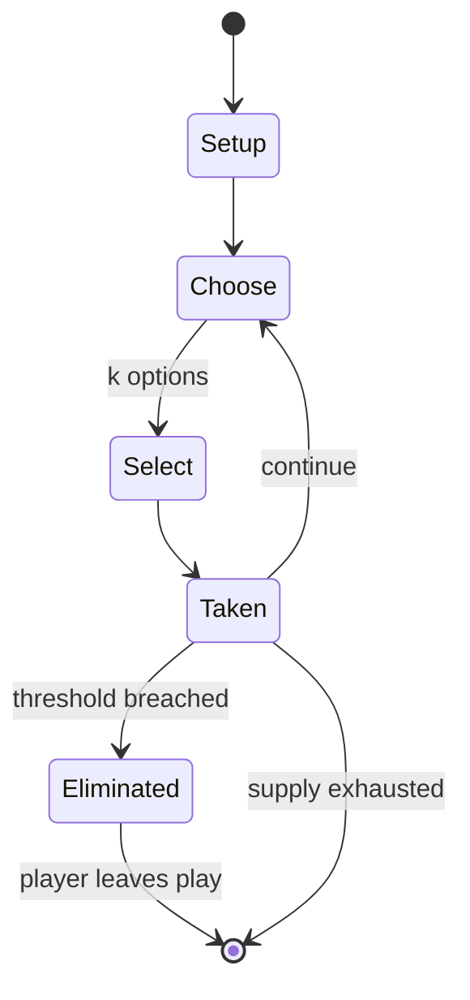

# Seven stones

`seven_stones` &nbsp; state: **DEEPENED** &nbsp; method: **heuristic**

## Found layer (recorded, not trusted)

| field | value |
| --- | --- |
| wikidata | Q2989166 |
| wikipedia | Seven stones |
| genres (source) | -- |
| instance of (source) | -- |
| country of origin | -- |

## Declared layer (orders bench work)

| field | value |
| --- | --- |
| year created | -- |
| epoch | -- |
| region | -- |
| media | - |
| players | -- |
| age band | -- |
| exogenous process | -- |
| loss shape | ELIMINATION |
| live axes | SELECT |
| horizon | -- |
| scoring shape | LINEAR_ACCUMULATION |
| information | -- |
| interaction | COMPETITIVE |
| turn structure | -- |
| tractability | SAMPLING_ONLY |
| randomness | -- |
| luck factor | 0.35 |
| rules complexity | 2.07 |
| strategic depth | 2.0 |
| novelty | 0.608 |
| solved status | -- |
| strategies | -- |
| algorithms | -- |

## Object model

```
Episode
  players      : ?
  turn_structure: ?
  horizon       : ?
  scoring       : LINEAR_ACCUMULATION

OptionSet      -- the choices available after an exogenous draw
```

## State transition diagram



## Research item -- turn trace

```
# Seven stones -- simulated turn events
# generated from the DECLARED vector, not from a rulebook.
# structure: exo=None loss=ELIMINATION horizon=None scoring=LINEAR_ACCUMULATION axes=SELECT

t=0    SETUP        players=2  pot=0  capacity=6
t=1    SELECT       p1 4 options; take #1  (pot_gain=+0.7, capacity=-0)
t=2    SELECT       p1 1 options; take #1  (pot_gain=+1.7, capacity=-0)
t=3    SELECT       p1 4 options; take #3  (pot_gain=+1.9, capacity=-1)
t=4    SELECT       p1 1 options; take #1  (pot_gain=+2.8, capacity=-2)
t=5    SELECT       p1 4 options; take #2  (pot_gain=+0.9, capacity=-1)
t=6    SELECT       p1 4 options; take #1  (pot_gain=+0.9, capacity=-1)
t=7    SELECT       p1 3 options; take #3  (pot_gain=+3.0, capacity=-0)
t=8    SELECT       p1 3 options; take #3  (pot_gain=+2.7, capacity=-1)
t=9    SELECT       p1 3 options; take #1  (pot_gain=+0.9, capacity=-1)
t=10   SELECT       p1 1 options; take #1  (pot_gain=+2.1, capacity=-1)
t=11   SELECT       p1 3 options; take #3  (pot_gain=+3.5, capacity=-0)
t=12   ENDTURN      turn passes to p2
t=13   SELECT       p2 2 options; take #2  (pot_gain=+3.1, capacity=-1)
t=14   SELECT       p2 4 options; take #2  (pot_gain=+2.9, capacity=-0)
t=15   SELECT       p2 1 options; take #1  (pot_gain=+2.1, capacity=-2)
t=16   SELECT       p2 3 options; take #3  (pot_gain=+1.7, capacity=-0)
t=17   SELECT       p2 4 options; take #1  (pot_gain=+3.3, capacity=-2)
t=18   ENDTURN      turn passes to p1
t=19   SELECT       p1 4 options; take #1  (pot_gain=+0.5, capacity=-1)
t=20   SELECT       p1 3 options; take #3  (pot_gain=+0.8, capacity=-0)
t=21   ENDTURN      turn passes to p2
t=22   SELECT       p2 4 options; take #3  (pot_gain=+1.1, capacity=-0)
t=23   ENDTURN      turn passes to p1
t=24   SELECT       p1 1 options; take #1  (pot_gain=+0.5, capacity=-2)
t=25   SELECT       p1 1 options; take #1  (pot_gain=+3.3, capacity=-1)
t=26   SELECT       p1 4 options; take #1  (pot_gain=+1.3, capacity=-2)

terminal: VARIABLE
```

## Conditions

| kind | threshold | effect | trigger |
| --- | --- | --- | --- |
| ELIMINATE | -- | awarded to the seekers if they are able to resta | Points are awarded to the seekers if they are able to restack the stone pile and hitters receive points for eliminating the seekers. |
| ELIMINATE | -- | -- | The round is completed when the stone pile is reconstructed or the hitters eliminate all of the seekers. |
| BOUNDARY | -- | -- | If a seeker fails to knock over at least one stone within a certain amount of tries, it becomes another team members turn. |
| BOUNDARY | -- | -- | Traditional games such as seven stones are not as popular as they once were, but the game is still played by at least 30 nations across the world. |

## Source extract

Seven stones (also known by various other names) is a traditional game from the Indian
subcontinent involving a ball and a pile of flat stones, generally played between two teams in a
large outdoor area.   == History == Seven stones is one of the most ancient games originating
from the Indian subcontinent. Its history dates back to the Bhagavata Purana, a Hindu religious
text, which mentions Lord Krishna, a major deity in Hinduism, playing the game with his friends.
Through cultural exchange and migration, the game has made its way to various parts of Asia,
such as Nepal, Pakistan, Bangladesh, Iran, Afghanistan, and Sri Lanka. The British Empire's
colonization process introduced the game to various parts of Africa, the Caribbean, and
Southeast Asia. Because the game is now played in over 30 counties, the rules have been adjusted
based on where the game is played, however the fundamental rules have remained the same.   ==
Gameplay ==  Gameplay varies based on geography and cultural adaptations, but the fundamental
rules are as follows. A member of the attacking team (the seekers) throws a ball at a pile of
seven stones in an attempt to knock them over. If a seeker fails to knock o

<sub>Wikipedia, CC BY-SA. Retained as evidence for the structural
classification above. Every rule inferred from it is HYPOTHESIZED
until audited against a rulebook.</sub>
