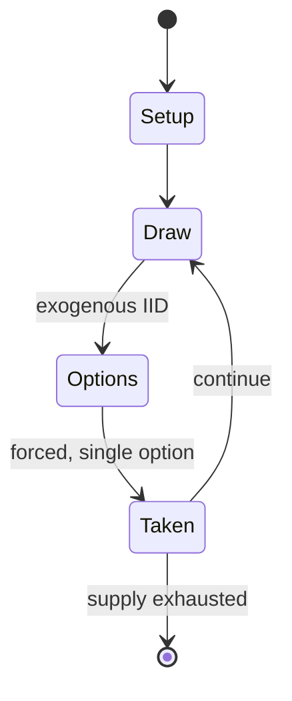

# Shadowrun

*tabletop science fantasy role-playing game*

`shadowrun` &nbsp; state: **DEEPENED** &nbsp; method: **heuristic**

## Found layer (recorded, not trusted)

| field | value |
| --- | --- |
| wikidata | Q1042442 |
| wikipedia | Shadowrun |
| genres (source) | biopunk, cyberpunk, dystopian fiction, fantasy, science fantasy, tabletop role-playing game |
| instance of (source) | fantasy role-playing game, tabletop role-playing game |
| country of origin | United States |

## Declared layer (orders bench work)

| field | value |
| --- | --- |
| year created | 1989 |
| epoch | DIGITAL |
| region | NORTH_AMERICA |
| media | DICE, MINIATURES, RPG |
| players | -- |
| age band | -- |
| exogenous process | IID |
| loss shape | -- |
| live axes | ALLOCATE |
| horizon | -- |
| scoring shape | -- |
| information | -- |
| interaction | -- |
| turn structure | -- |
| tractability | SAMPLING_ONLY |
| randomness | DICE |
| luck factor | 0.58 |
| rules complexity | 3.5 |
| strategic depth | 1.87 |
| novelty | 0.3704 |
| solved status | -- |
| strategies | -- |
| algorithms | -- |

## Object model

```
Episode
  players      : ?
  turn_structure: ?
  horizon       : ?
  scoring       : ?

DicePool       -- n dice, each an iid categorical draw
Roll           -- realised outcome of a pool
Character      -- persistent stat block owned by a player
GameMaster     -- adjudicating agent outside the scoring loop
Scenario       -- authored state the players traverse
ResourcePool   -- divisible capacity committed across slots
```

## State transition diagram



## Research item -- turn trace

```
# Shadowrun -- simulated turn events
# generated from the DECLARED vector, not from a rulebook.
# structure: exo=IID loss=None horizon=None scoring=None axes=ALLOCATE

t=0    SETUP        players=2  pot=0  capacity=7
t=1    DRAW         p1 roll from d6 pool -> outcome #2  (p=0.199)
t=2    FORCED       p1 single legal option taken (pot_gain=+1.9)
t=3    DRAW         p1 roll from d6 pool -> outcome #3  (p=0.221)
t=4    FORCED       p1 single legal option taken (pot_gain=+0.7)
t=5    ALLOCATE     p1 commits 3 of 5 capacity across 2 slots
t=6    ENDTURN      turn passes to p2
t=7    DRAW         p2 roll from d6 pool -> outcome #5  (p=0.058)
t=8    FORCED       p2 single legal option taken (pot_gain=+1.5)
t=9    DRAW         p2 roll from d6 pool -> outcome #2  (p=0.149)
t=10   FORCED       p2 single legal option taken (pot_gain=+0.8)
t=11   DRAW         p2 roll from d6 pool -> outcome #4  (p=0.060)
t=12   FORCED       p2 single legal option taken (pot_gain=+1.5)
t=13   DRAW         p2 roll from d6 pool -> outcome #6  (p=0.076)
t=14   FORCED       p2 single legal option taken (pot_gain=+0.7)
t=15   DRAW         p2 roll from d6 pool -> outcome #5  (p=0.140)
t=16   FORCED       p2 single legal option taken (pot_gain=+1.0)
t=17   ENDTURN      turn passes to p1
t=18   DRAW         p1 roll from d6 pool -> outcome #5  (p=0.197)
t=19   FORCED       p1 single legal option taken (pot_gain=+1.7)
t=20   ALLOCATE     p1 commits 2 of 5 capacity across 4 slots
t=21   DRAW         p1 roll from d6 pool -> outcome #6  (p=0.258)
t=22   FORCED       p1 single legal option taken (pot_gain=+1.5)
t=23   DRAW         p1 roll from d6 pool -> outcome #1  (p=0.023)
t=24   FORCED       p1 single legal option taken (pot_gain=+0.7)
t=25   ALLOCATE     p1 commits 1 of 5 capacity across 4 slots
t=26   DRAW         p1 roll from d6 pool -> outcome #2  (p=0.107)
t=27   FORCED       p1 single legal option taken (pot_gain=+0.5)
t=28   ENDTURN      turn passes to p2

terminal: VARIABLE
```

## Conditions

| kind | threshold | effect | trigger |
| --- | --- | --- | --- |
| ELIMINATE | -- | -- | The AAA corps, as well as numerous minor corporations, fight each other not only in the boardroom or during high-level business negotiations but also with physical destruction, clandestine operations, hostile extraction  |
| BOUNDARY | -- | -- | Target numbers may exceed 6, in which case any dice that show a 6 have to be re-rolled (a target number of, e.g., 9 is reached by rolling a 6 followed by at least a 3; a target number of 6 and one of 7 are identical, exc |
| BOUNDARY | -- | -- | For even higher target numbers, this procedure has to be repeated; thus, an action with a target number of 20 (like attempting to procure military-grade weaponry) will only succeed if three successive dice rolls result i |

## Source extract

Shadowrun is a science fantasy tabletop role-playing game set in an alternate future in which
cybernetics, magic and fantasy creatures co-exist. It combines genres of cyberpunk, urban
fantasy, and crime, with occasional elements of conspiracy, horror, and detective fiction. From
its inception in 1989, it has spawned a franchise that includes a series of novels, a
collectible card game, two miniature-based tabletop wargames, and multiple video games. The
title is taken from the game's main premise – a near-future world damaged by a massive magical
event, where industrial espionage and corporate warfare run rampant. A shadowrun – a successful
data theft or physical break-in at a rival corporation or organization – is one of the main
tools employed by both corporate rivals and underworld figures. Deckers (futuristic hackers) can
tap into an immersive, three-dimensional cyberspace on such missions as they seek access,
physical or remote, to the power structures of rival groups. They are opposed by rival deckers
and lethal, potentially brain-destroying artificial intelligences called "Intrusion
Countermeasures" (IC), while they are protected by street fighters and/or mercenaries, often

<sub>Wikipedia, CC BY-SA. Retained as evidence for the structural
classification above. Every rule inferred from it is HYPOTHESIZED
until audited against a rulebook.</sub>
