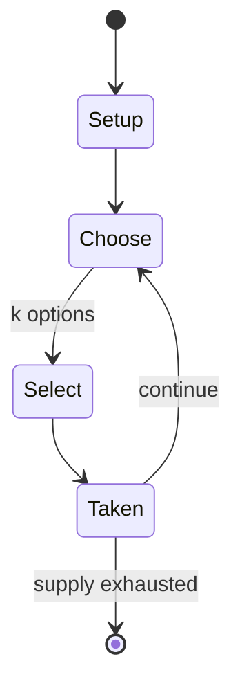

# Shiritori

*word game*

`shiritori` &nbsp; state: **DEEPENED** &nbsp; method: **heuristic**

## Found layer (recorded, not trusted)

| field | value |
| --- | --- |
| wikidata | Q1374115 |
| wikipedia | Shiritori |
| genres (source) | -- |
| instance of (source) | word game |
| country of origin | -- |

## Declared layer (orders bench work)

| field | value |
| --- | --- |
| year created | -- |
| epoch | -- |
| region | -- |
| media | WORD |
| players | -- |
| age band | -- |
| exogenous process | -- |
| loss shape | -- |
| live axes | SELECT |
| horizon | -- |
| scoring shape | -- |
| information | -- |
| interaction | -- |
| turn structure | STRICT_TURN |
| tractability | SAMPLING_ONLY |
| randomness | -- |
| luck factor | 0.35 |
| rules complexity | 2.48 |
| strategic depth | 2.0 |
| novelty | 0.4324 |
| solved status | -- |
| strategies | -- |
| algorithms | -- |

## Object model

```
Episode
  players      : ?
  turn_structure: STRICT_TURN
  horizon       : ?
  scoring       : ?

OptionSet      -- the choices available after an exogenous draw
```

## State transition diagram



## Research item -- turn trace

```
# Shiritori -- simulated turn events
# generated from the DECLARED vector, not from a rulebook.
# structure: exo=None loss=None horizon=None scoring=None axes=SELECT

t=0    SETUP        players=2  pot=0  capacity=3
t=1    SELECT       p1 4 options; take #4  (pot_gain=+2.6, capacity=-2)
t=2    SELECT       p1 3 options; take #1  (pot_gain=+1.6, capacity=-1)
t=3    ENDTURN      turn passes to p2
t=4    SELECT       p2 2 options; take #2  (pot_gain=+3.4, capacity=-0)
t=5    SELECT       p2 1 options; take #1  (pot_gain=+1.5, capacity=-0)
t=6    ENDTURN      turn passes to p1
t=7    SELECT       p1 1 options; take #1  (pot_gain=+1.7, capacity=-2)
t=8    SELECT       p1 3 options; take #3  (pot_gain=+2.4, capacity=-2)
t=9    SELECT       p1 2 options; take #2  (pot_gain=+0.8, capacity=-0)
t=10   SELECT       p1 3 options; take #1  (pot_gain=+3.3, capacity=-1)
t=11   SELECT       p1 3 options; take #3  (pot_gain=+3.2, capacity=-1)
t=12   SELECT       p1 3 options; take #3  (pot_gain=+3.3, capacity=-1)
t=13   SELECT       p1 4 options; take #3  (pot_gain=+0.7, capacity=-1)
t=14   SELECT       p1 3 options; take #2  (pot_gain=+1.0, capacity=-1)
t=15   ENDTURN      turn passes to p2
t=16   SELECT       p2 4 options; take #1  (pot_gain=+0.8, capacity=-1)
t=17   SELECT       p2 2 options; take #1  (pot_gain=+1.7, capacity=-0)
t=18   SELECT       p2 3 options; take #1  (pot_gain=+2.6, capacity=-2)
t=19   SELECT       p2 1 options; take #1  (pot_gain=+1.1, capacity=-1)
t=20   SELECT       p2 1 options; take #1  (pot_gain=+1.0, capacity=-1)
t=21   SELECT       p2 2 options; take #2  (pot_gain=+1.7, capacity=-2)
t=22   SELECT       p2 1 options; take #1  (pot_gain=+1.0, capacity=-0)
t=23   SELECT       p2 2 options; take #2  (pot_gain=+1.3, capacity=-0)
t=24   SELECT       p2 2 options; take #2  (pot_gain=+2.4, capacity=-1)
t=25   SELECT       p2 3 options; take #3  (pot_gain=+2.7, capacity=-1)
t=26   ENDTURN      turn passes to p1

terminal: VARIABLE
```

## Conditions

| kind | threshold | effect | trigger |
| --- | --- | --- | --- |
| LOSE | -- | -- | A player who plays a word ending in the mora "N" (ん) loses the game, as almost no Japanese word begins with that character, except for some loanwords and proper nouns such as ンジャメナ (N'Djamena). |

## Source extract

Shiritori (しりとり; 尻取り) is a Japanese word game in which the players are required to say a word
which begins with the final kana of the previous word. No distinction is made between hiragana,
katakana, and kanji. "Shiritori" literally means "taking the end" or "taking the rear".   ==
Rules == There are various optional and advanced rules, which the players must agree on before
the game begins.   === Standard rules === Two or more people take turns to play. Only nouns are
permitted. A player who plays a word ending in the mora "N" (ん) loses the game, as almost no
Japanese word begins with that character, except for some loanwords and proper nouns such as
ンジャメナ (N'Djamena). Words may not be repeated. For a full official English version of the rules,
see the . Phrases connected by no (の; meaning roughly "of") are permitted, but only in those
cases where the phrase is sufficiently lexicalized to be considered a "word". Example:sakura
(さくら) → rajio (ラジオ) → onigiri (おにぎり) → risu (りす) → sumou (すもう) → udon (うどん).The player who used
the word udon lost this game, because the word ends in N (ん).   === Optional rules === The first
word of the game is shiritori, the name of the game itself. Dakut

<sub>Wikipedia, CC BY-SA. Retained as evidence for the structural
classification above. Every rule inferred from it is HYPOTHESIZED
until audited against a rulebook.</sub>
