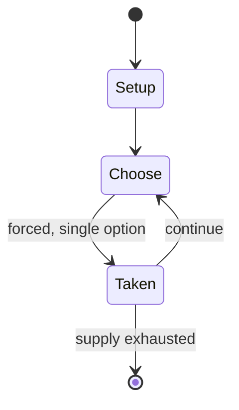

# Shisima

`shisima` &nbsp; state: **DEEPENED** &nbsp; method: **heuristic**

## Found layer (recorded, not trusted)

| field | value |
| --- | --- |
| wikidata | Q7499111 |
| wikipedia | Shisima |
| genres (source) | -- |
| instance of (source) | -- |
| country of origin | -- |

## Declared layer (orders bench work)

| field | value |
| --- | --- |
| year created | -- |
| epoch | -- |
| region | -- |
| media | ABSTRACT |
| players | -- |
| age band | -- |
| exogenous process | NONE |
| loss shape | OPPORTUNITY_ONLY |
| live axes | SPATIAL |
| horizon | -- |
| scoring shape | SET_COLLECTION_CONVEX |
| information | PERFECT |
| interaction | COMPETITIVE |
| turn structure | PHASE_STRUCTURED |
| tractability | SAMPLING_ONLY |
| randomness | NONE |
| luck factor | 0.35 |
| rules complexity | 2.04 |
| strategic depth | 2.25 |
| novelty | 0.4765 |
| solved status | -- |
| strategies | set_collection |
| algorithms | -- |

## Object model

```
Episode
  players      : ?
  turn_structure: PHASE_STRUCTURED
  horizon       : ?
  scoring       : SET_COLLECTION_CONVEX

Placement      -- position subject to geometric legality
```

## State transition diagram



## Research item -- turn trace

```
# Shisima -- simulated turn events
# generated from the DECLARED vector, not from a rulebook.
# structure: exo=NONE loss=OPPORTUNITY_ONLY horizon=None scoring=SET_COLLECTION_CONVEX axes=SPATIAL

t=0    SETUP        players=2  pot=0  capacity=4
t=1    FORCED       p1 single legal option taken (pot_gain=+1.4)
t=2    SPATIAL      p1 places at (7,1); adjacency legal
t=3    FORCED       p1 single legal option taken (pot_gain=+1.9)
t=4    SPATIAL      p1 places at (0,6); adjacency legal
t=5    ENDTURN      turn passes to p2
t=6    FORCED       p2 single legal option taken (pot_gain=+1.8)
t=7    SPATIAL      p2 places at (7,0); adjacency legal
t=8    FORCED       p2 single legal option taken (pot_gain=+1.1)
t=9    FORCED       p2 single legal option taken (pot_gain=+1.2)
t=10   FORCED       p2 single legal option taken (pot_gain=+1.8)
t=11   FORCED       p2 single legal option taken (pot_gain=+1.9)
t=12   FORCED       p2 single legal option taken (pot_gain=+1.0)
t=13   FORCED       p2 single legal option taken (pot_gain=+2.0)
t=14   FORCED       p2 single legal option taken (pot_gain=+1.5)
t=15   SPATIAL      p2 places at (4,1); adjacency legal
t=16   ENDTURN      turn passes to p1
t=17   FORCED       p1 single legal option taken (pot_gain=+0.9)
t=18   ENDTURN      turn passes to p2
t=19   FORCED       p2 single legal option taken (pot_gain=+1.5)
t=20   FORCED       p2 single legal option taken (pot_gain=+1.0)
t=21   SPATIAL      p2 places at (4,2); adjacency legal
t=22   FORCED       p2 single legal option taken (pot_gain=+0.8)
t=23   SPATIAL      p2 places at (5,3); adjacency legal
t=24   FORCED       p2 single legal option taken (pot_gain=+1.6)
t=25   FORCED       p2 single legal option taken (pot_gain=+1.5)
t=26   ENDTURN      turn passes to p1

terminal: VARIABLE
```

## Conditions

| kind | threshold | effect | trigger |
| --- | --- | --- | --- |
| WIN | -- | -- | The first player to make a "three-in-a-row" with one's pieces along a diametrical line wins the game. |

## Source extract

Shisima is a two-player abstract strategy game from Kenya.  It is related to tic-tac-toe, and
even more so to three men's morris, Nine Holes, Achi, Tant Fant, and Dara, because pieces are
moved on the board to create the 3-in-a-row.  Unlike those other games, Shisima uses an
octagonal board. Shisima means "body of water" in some language spoken in Kenya. The pieces are
called imbalavali which translates to "water bugs" as the pieces move quickly on the board as
water bugs do on the surface of a lake.   == Setup == The board consist of an octagon, and four
diametrical lines connecting each corner of the octagon to its opposite corner.  The four
diametrical lines intersect at the middle of the octagon forming the central intersection point
of the board.  Each of the eight corners of the octagon is also an intersection point, therefore
there is a total of 9 intersection points (here-in-forth called "points"). Each player has 3
pieces.  One plays the black pieces, and the other plays the white pieces. Alternatively, any
two colors or small objects differentiated in another way will suffice. Each player places their
3 pieces on three successive vacant points along the octagon's perimete

<sub>Wikipedia, CC BY-SA. Retained as evidence for the structural
classification above. Every rule inferred from it is HYPOTHESIZED
until audited against a rulebook.</sub>
