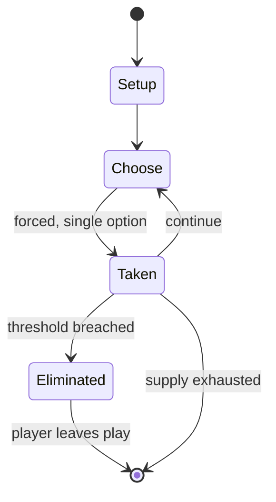

# Sho shogi

*shogi variant; direct ancestor of modern shogi*

`sho_shogi` &nbsp; state: **DEEPENED** &nbsp; method: **heuristic**

## Found layer (recorded, not trusted)

| field | value |
| --- | --- |
| wikidata | Q850901 |
| wikipedia | Sho shogi |
| genres (source) | -- |
| instance of (source) | shogi variant |
| country of origin | Japan |

## Declared layer (orders bench work)

| field | value |
| --- | --- |
| year created | -- |
| epoch | -- |
| region | EAST_ASIA |
| media | - |
| players | 2 |
| age band | -- |
| exogenous process | NONE |
| loss shape | ELIMINATION |
| live axes | SPATIAL |
| horizon | -- |
| scoring shape | SET_COLLECTION_CONVEX |
| information | PERFECT |
| interaction | COMPETITIVE |
| turn structure | -- |
| tractability | EXACT_WITH_CUT |
| randomness | NONE |
| luck factor | 0.02 |
| rules complexity | 2.33 |
| strategic depth | 2.9 |
| novelty | 0.7435 |
| solved status | -- |
| strategies | set_collection, signalling |
| algorithms | -- |

## Object model

```
Episode
  players      : 2
  turn_structure: ?
  horizon       : ?
  scoring       : SET_COLLECTION_CONVEX

Placement      -- position subject to geometric legality
```

## State transition diagram



## Research item -- turn trace

```
# Sho shogi -- simulated turn events
# generated from the DECLARED vector, not from a rulebook.
# structure: exo=NONE loss=ELIMINATION horizon=None scoring=SET_COLLECTION_CONVEX axes=SPATIAL

t=0    SETUP        players=2  pot=0  capacity=7
t=1    FORCED       p1 single legal option taken (pot_gain=+1.5)
t=2    SPATIAL      p1 places at (3,4); adjacency legal
t=3    FORCED       p1 single legal option taken (pot_gain=+0.5)
t=4    FORCED       p1 single legal option taken (pot_gain=+0.7)
t=5    SPATIAL      p1 places at (6,1); adjacency legal
t=6    FORCED       p1 single legal option taken (pot_gain=+0.8)
t=7    SPATIAL      p1 places at (7,1); adjacency legal
t=8    ENDTURN      turn passes to p2
t=9    FORCED       p2 single legal option taken (pot_gain=+0.7)
t=10   SPATIAL      p2 places at (1,1); adjacency legal
t=11   ENDTURN      turn passes to p1
t=12   FORCED       p1 single legal option taken (pot_gain=+0.8)
t=13   SPATIAL      p1 places at (5,1); adjacency legal
t=14   FORCED       p1 single legal option taken (pot_gain=+1.6)
t=15   FORCED       p1 single legal option taken (pot_gain=+1.9)
t=16   SPATIAL      p1 places at (2,3); adjacency legal
t=17   FORCED       p1 single legal option taken (pot_gain=+0.6)
t=18   ENDTURN      turn passes to p2
t=19   FORCED       p2 single legal option taken (pot_gain=+1.1)
t=20   FORCED       p2 single legal option taken (pot_gain=+1.7)
t=21   FORCED       p2 single legal option taken (pot_gain=+1.9)
t=22   SPATIAL      p2 places at (4,3); adjacency legal
t=23   FORCED       p2 single legal option taken (pot_gain=+0.6)
t=24   FORCED       p2 single legal option taken (pot_gain=+0.6)
t=25   SPATIAL      p2 places at (3,1); adjacency legal
t=26   ENDTURN      turn passes to p1

terminal: VARIABLE
```

## Conditions

| kind | threshold | effect | trigger |
| --- | --- | --- | --- |
| ELIMINATE | -- | -- | According to the Sho Shōgi Zushiki, the drunk elephant was eliminated by the Emperor Go-Nara (reigned 1526–1557), and it is assumed that the drop rule was introduced at about the same time, giving rise to shogi as it is  |
| WIN | -- | -- | If a player's king or crown prince (sole one in play) is in check and no legal move by that player will get the king or crown prince out of check, the checking move is also mate, and can effectively win the game. |
| WIN | -- | -- | A player who captures the opponent's king and crown prince (if present) wins the game, as does a player who captures everything else, leaving a "bare" (or lone) king or crown prince. |

## Source extract

Shō shōgi (小将棋 'small chess') is a 16th-century form of shogi (Japanese chess), and the
immediate predecessor of the modern game. It is played on a 9×9 board with the same setup as in
modern shogi, except that an extra piece is placed in front of the king: a 'drunk elephant' that
promoted into a prince, which acts like a second king. According to the Sho Shōgi Zushiki, the
drunk elephant was eliminated by the Emperor Go-Nara (reigned 1526–1557), and it is assumed that
the drop rule was introduced at about the same time, giving rise to shogi as it is known today.
== Rules of the game ==   === Objective === The objective of the game is to capture your
opponent's king and crown prince (if present) or all other pieces.   === Game equipment === Two
players, Black and White (or 先手 sente and 後手 gote), play on a board ruled into a grid of 9 ranks
(rows) by 9 files (columns).  The squares are undifferentiated by marking or color. Each player
has a set of 21 wedge-shaped pieces, of slightly different sizes. From largest to smallest (most
to least powerful) they are:  1 king 1 drunken elephant 1 rook 1 bishop 2 gold generals 2 silver
generals 2 knights 2 lances 9 pawns Most of the English n

<sub>Wikipedia, CC BY-SA. Retained as evidence for the structural
classification above. Every rule inferred from it is HYPOTHESIZED
until audited against a rulebook.</sub>
