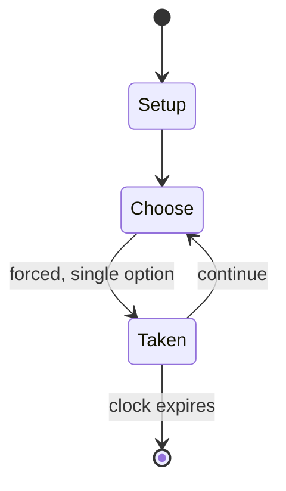

# Shogi

`shogi` &nbsp; state: **DEEPENED** &nbsp; method: **heuristic**

## Found layer (recorded, not trusted)

| field | value |
| --- | --- |
| wikidata | Q131375 |
| wikipedia | Shogi |
| genres (source) | -- |
| instance of (source) | -- |
| country of origin | -- |

## Declared layer (orders bench work)

| field | value |
| --- | --- |
| year created | -- |
| epoch | -- |
| region | -- |
| media | BOARD |
| players | 2 |
| age band | -- |
| exogenous process | NONE |
| loss shape | OPPORTUNITY_ONLY |
| live axes | SPATIAL |
| horizon | CLOCK_LIMITED |
| scoring shape | SET_COLLECTION_CONVEX |
| information | PERFECT |
| interaction | SOLITAIRE |
| turn structure | PHASE_STRUCTURED |
| tractability | EXACT_WITH_CUT |
| randomness | NONE |
| luck factor | 0.02 |
| rules complexity | 3.4 |
| strategic depth | 2.9 |
| novelty | 0.7516 |
| solved status | -- |
| strategies | set_collection, signalling |
| algorithms | -- |

## Object model

```
Episode
  players      : 2
  turn_structure: PHASE_STRUCTURED
  horizon       : CLOCK_LIMITED
  scoring       : SET_COLLECTION_CONVEX

Board          -- spatial substrate; cells carry position and occupancy
Piece          -- movable token owned by a player
Placement      -- position subject to geometric legality
```

## State transition diagram



## Research item -- turn trace

```
# Shogi -- simulated turn events
# generated from the DECLARED vector, not from a rulebook.
# structure: exo=NONE loss=OPPORTUNITY_ONLY horizon=CLOCK_LIMITED scoring=SET_COLLECTION_CONVEX axes=SPATIAL

t=0    SETUP        players=2  pot=0  capacity=3
t=1    FORCED       p1 single legal option taken (pot_gain=+1.1)
t=2    SPATIAL      p1 places at (3,3); adjacency legal
t=3    FORCED       p1 single legal option taken (pot_gain=+2.0)
t=4    FORCED       p1 single legal option taken (pot_gain=+1.0)
t=5    ENDTURN      turn passes to p2
t=6    FORCED       p2 single legal option taken (pot_gain=+1.1)
t=7    FORCED       p2 single legal option taken (pot_gain=+1.3)
t=8    FORCED       p2 single legal option taken (pot_gain=+0.6)
t=9    SPATIAL      p2 places at (4,4); adjacency legal
t=10   FORCED       p2 single legal option taken (pot_gain=+1.5)
t=11   FORCED       p2 single legal option taken (pot_gain=+1.5)
t=12   FORCED       p2 single legal option taken (pot_gain=+1.1)
t=13   FORCED       p2 single legal option taken (pot_gain=+1.8)
t=14   SPATIAL      p2 places at (7,2); adjacency legal
t=15   FORCED       p2 single legal option taken (pot_gain=+1.5)
t=16   SPATIAL      p2 places at (3,2); adjacency legal
t=17   FORCED       p2 single legal option taken (pot_gain=+1.7)
t=18   ENDTURN      turn passes to p1
t=19   FORCED       p1 single legal option taken (pot_gain=+1.6)
t=20   SPATIAL      p1 places at (3,5); adjacency legal
t=21   FORCED       p1 single legal option taken (pot_gain=+0.8)
t=22   ENDTURN      turn passes to p2
t=23   FORCED       p2 single legal option taken (pot_gain=+1.0)
t=24   ENDTURN      turn passes to p1
t=25   FORCED       p1 single legal option taken (pot_gain=+1.1)
t=26   SPATIAL      p1 places at (3,7); adjacency legal

terminal: CLOCK_LIMITED
```

## Conditions

| kind | threshold | effect | trigger |
| --- | --- | --- | --- |
| LOSE | 10 seconds | -- | The final ten seconds are counted down, and if the time expires the player to move loses the game immediately. |
| WIN | -- | -- | Checkmate effectively means that the opponent wins the game as the player would have no remaining legal moves. |
| WIN | -- | -- | As an Impasse needs to be agreed on for the rule to be invoked, a player may refuse to do so and attempt to win the game in future moves. |
| WIN | -- | -- | One version of this is simply the player who has 27 or more points is the winner of the Impasse. |
| WIN | -- | -- | If all of these conditions are met, then the Impasse declarer will win the game regardless of whether the opponent objects. |
| TERMINATE | -- | -- | If the same game position occurs four times with the same player to move and the same pieces in hand for each player, then the game ends in a repetition draw (千日手 sennichite, lit. |
| TERMINATE | -- | -- | Fairbairn reports a practice in the 1980s (considered a rule by the now defunct Shogi Association for The West) where the dispute is resolved by either player moving all friendly pieces into the promotion zone and then t |
| TERMINATE | -- | -- | This phase ends when the armies begin to engage. |
| PENALTY | -- | -- | In professional and serious (tournament) amateur games, a player who makes an infraction, such as an illegal move, loses immediately. |
| PENALTY | -- | -- | Time forfeiture (failing to complete a move within the allotted main time or countdown). |

## Source extract

Shogi (将棋, shōgi; English: , Japanese: [ɕo̞ːɡʲi]), also known as Japanese chess, is an abstract
strategy board game for two players. It is one of the most popular board games in Japan and is
in the same family of games as Western chess, chaturanga, xiangqi, Indian chess, makruk, and
janggi. Shōgi means general's (shō 将) board game (gi 棋). The term shōgi is most commonly used to
describe hon-shōgi ("standard shogi"), a term used to distinguish the most popular form of the
game (with an 81-square board and 40 pieces) from other forms like ko-shogi (ancient shogi
variants like chu shogi), modern shogi variants, and related games. A distinctive feature of
shogi is that after a player has captured an opponent's piece, they retain these as "pieces in
hand" (mochigoma), which can be dropped back into the game on a future turn. Shogi was the
earliest historical chess-like game with this game mechanic. This drop rule is speculated to
have been invented in the 15th century and possibly connected to the practice of 15th-century
mercenary samurai switching loyalties when captured in battle. Due to the larger board and the
drop rule, modern shogi has a significantly higher game tree complexity

<sub>Wikipedia, CC BY-SA. Retained as evidence for the structural
classification above. Every rule inferred from it is HYPOTHESIZED
until audited against a rulebook.</sub>
