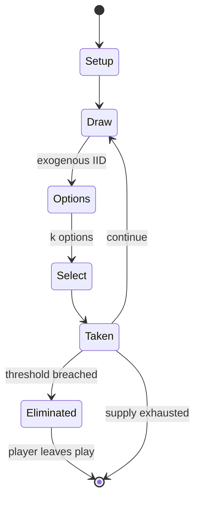

# shut the box

*game of dice*

`shut_the_box` &nbsp; state: **DEEPENED** &nbsp; method: **heuristic**

## Found layer (recorded, not trusted)

| field | value |
| --- | --- |
| wikidata | Q2280396 |
| wikipedia | Shut the box |
| genres (source) | -- |
| instance of (source) | dice game |
| country of origin | -- |

## Declared layer (orders bench work)

| field | value |
| --- | --- |
| year created | -- |
| epoch | -- |
| region | -- |
| media | DICE, TILE |
| players | -- |
| age band | -- |
| exogenous process | IID |
| loss shape | ELIMINATION |
| live axes | SELECT |
| horizon | -- |
| scoring shape | SET_COLLECTION_CONVEX |
| information | -- |
| interaction | -- |
| turn structure | STRICT_TURN |
| tractability | EXACT_WITH_CUT |
| randomness | DICE |
| luck factor | 0.58 |
| rules complexity | 2.12 |
| strategic depth | 2.12 |
| novelty | 0.6793 |
| solved status | -- |
| strategies | set_collection |
| algorithms | -- |

## Object model

```
Episode
  players      : ?
  turn_structure: STRICT_TURN
  horizon       : ?
  scoring       : SET_COLLECTION_CONVEX

DicePool       -- n dice, each an iid categorical draw
Roll           -- realised outcome of a pool
TileBag        -- unordered draw source
Layout         -- placed tiles and their adjacencies
OptionSet      -- the choices available after an exogenous draw
```

## State transition diagram



## Research item -- turn trace

```
# shut the box -- simulated turn events
# generated from the DECLARED vector, not from a rulebook.
# structure: exo=IID loss=ELIMINATION horizon=None scoring=SET_COLLECTION_CONVEX axes=SELECT

t=0    SETUP        players=2  pot=0  capacity=3
t=1    DRAW         p1 roll from d6 pool -> outcome #2  (p=0.157)
t=2    SELECT       p1 3 options; take #2  (pot_gain=+1.0, capacity=-1)
t=3    DRAW         p1 roll from d6 pool -> outcome #6  (p=0.167)
t=4    SELECT       p1 3 options; take #3  (pot_gain=+0.6, capacity=-2)
t=5    ENDTURN      turn passes to p2
t=6    DRAW         p2 roll from d6 pool -> outcome #4  (p=0.271)
t=7    SELECT       p2 3 options; take #2  (pot_gain=+3.1, capacity=-1)
t=8    ENDTURN      turn passes to p1
t=9    DRAW         p1 roll from d6 pool -> outcome #5  (p=0.143)
t=10   SELECT       p1 2 options; take #2  (pot_gain=+2.1, capacity=-1)
t=11   DRAW         p1 roll from d6 pool -> outcome #6  (p=0.161)
t=12   SELECT       p1 3 options; take #3  (pot_gain=+1.0, capacity=-1)
t=13   ENDTURN      turn passes to p2
t=14   DRAW         p2 roll from d6 pool -> outcome #6  (p=0.218)
t=15   SELECT       p2 2 options; take #1  (pot_gain=+1.9, capacity=-2)
t=16   DRAW         p2 roll from d6 pool -> outcome #4  (p=0.255)
t=17   SELECT       p2 4 options; take #2  (pot_gain=+1.8, capacity=-0)
t=18   DRAW         p2 roll from d6 pool -> outcome #2  (p=0.064)
t=19   SELECT       p2 4 options; take #1  (pot_gain=+2.5, capacity=-1)
t=20   DRAW         p2 roll from d6 pool -> outcome #3  (p=0.109)
t=21   SELECT       p2 4 options; take #3  (pot_gain=+1.5, capacity=-1)
t=22   ENDTURN      turn passes to p1
t=23   DRAW         p1 roll from d6 pool -> outcome #4  (p=0.271)
t=24   SELECT       p1 1 options; take #1  (pot_gain=+3.2, capacity=-1)
t=25   DRAW         p1 roll from d6 pool -> outcome #6  (p=0.004)
t=26   SELECT       p1 4 options; take #2  (pot_gain=+3.5, capacity=-1)

terminal: VARIABLE
```

## Conditions

| kind | threshold | effect | trigger |
| --- | --- | --- | --- |
| BOUNDARY | 2 player | -- | Simplified variant for younger players – Needs at least a 2 player box. |
| ELIMINATE | -- | -- | When a player's score reaches 45, the player must drop out of the game. |
| WIN | -- | -- | If a player succeeds in closing all of the numbers, that player is said to have "Shut the Box" – the player wins immediately and the game is over. |
| WIN | -- | -- | The last player remaining wins the game. |
| BOUNDARY | -- | -- | Taylor in "Pub Games" from 1976 mentions a claim that the game dates back to at least Napoleonic times. |

## Source extract

Shut the box (also called ACKPOT, batten down the hatches or trick-track) is a game of dice for
one or more players, commonly played in a group of two to four for stakes. Traditionally, a
counting box is used with tiles numbered 1 to 9 where each can be covered with a hinged or
sliding mechanism, though the game can be played with only a pair of dice, pen, and paper.
Variations exist where the box has 10 or 12 tiles.   == History ==  Unconfirmed histories of the
game suggest a variety of origins, including 12th century Normandy (northern France) as well as
the mid 20th century Channel Islands (Jersey and Guernsey), which one source credits to a man
known as 'Chalky' Towbridge. A 1967 edition of Brewing Review describes the game as being native
to the Channel Islands, and records it being played in Manchester pubs in the mid-1960s. Taylor
in "Pub Games" from 1976 mentions a claim that the game dates back to at least Napoleonic times.
He reports a revival in the United Kingdom in "the last fifteen years or so", that is from the
1960s.  Canada Dry distributed them to many pubs as a publicity novelty "some years" prior to
1976. Shut the box is the basis of the American television quiz

<sub>Wikipedia, CC BY-SA. Retained as evidence for the structural
classification above. Every rule inferred from it is HYPOTHESIZED
until audited against a rulebook.</sub>
