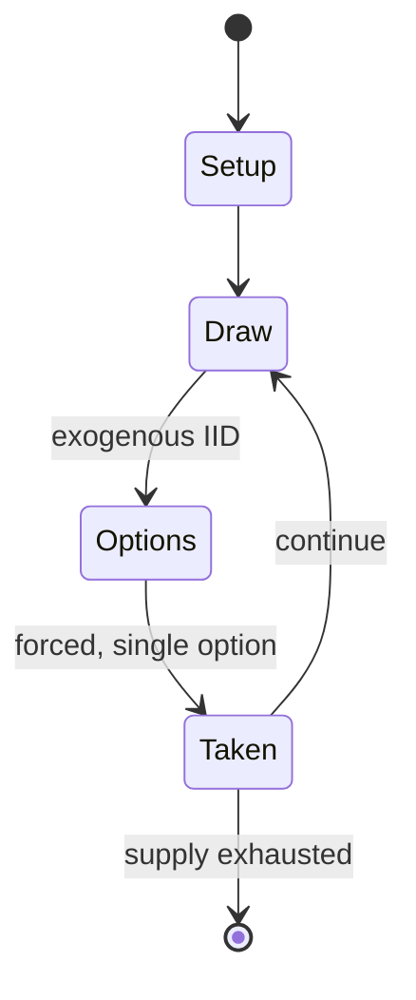

# Sic bo

`sic_bo` &nbsp; state: **DEEPENED** &nbsp; method: **heuristic**

## Found layer (recorded, not trusted)

| field | value |
| --- | --- |
| wikidata | Q2140874 |
| wikipedia | Sic bo |
| genres (source) | -- |
| instance of (source) | -- |
| country of origin | -- |

## Declared layer (orders bench work)

| field | value |
| --- | --- |
| year created | -- |
| epoch | -- |
| region | -- |
| media | DICE, GAMBLING |
| players | -- |
| age band | -- |
| exogenous process | IID |
| loss shape | -- |
| live axes | - |
| horizon | -- |
| scoring shape | -- |
| information | -- |
| interaction | -- |
| turn structure | -- |
| tractability | EXACT_WITH_CUT |
| randomness | DICE |
| luck factor | 0.58 |
| rules complexity | 1.71 |
| strategic depth | 1.87 |
| novelty | 0.6405 |
| solved status | -- |
| strategies | -- |
| algorithms | -- |

## Object model

```
Episode
  players      : ?
  turn_structure: ?
  horizon       : ?
  scoring       : ?

DicePool       -- n dice, each an iid categorical draw
Roll           -- realised outcome of a pool
```

## State transition diagram



## Research item -- turn trace

```
# Sic bo -- simulated turn events
# generated from the DECLARED vector, not from a rulebook.
# structure: exo=IID loss=None horizon=None scoring=None axes=-

t=0    SETUP        players=2  pot=0  capacity=7
t=1    DRAW         p1 roll from d6 pool -> outcome #5  (p=0.078)
t=2    FORCED       p1 single legal option taken (pot_gain=+1.1)
t=3    DRAW         p1 roll from d6 pool -> outcome #6  (p=0.111)
t=4    FORCED       p1 single legal option taken (pot_gain=+1.5)
t=5    ENDTURN      turn passes to p2
t=6    DRAW         p2 roll from d6 pool -> outcome #6  (p=0.223)
t=7    FORCED       p2 single legal option taken (pot_gain=+0.9)
t=8    DRAW         p2 roll from d6 pool -> outcome #2  (p=0.199)
t=9    FORCED       p2 single legal option taken (pot_gain=+1.5)
t=10   DRAW         p2 roll from d6 pool -> outcome #3  (p=0.201)
t=11   FORCED       p2 single legal option taken (pot_gain=+1.4)
t=12   DRAW         p2 roll from d6 pool -> outcome #4  (p=0.200)
t=13   FORCED       p2 single legal option taken (pot_gain=+1.6)
t=14   DRAW         p2 roll from d6 pool -> outcome #2  (p=0.195)
t=15   FORCED       p2 single legal option taken (pot_gain=+1.2)
t=16   DRAW         p2 roll from d6 pool -> outcome #5  (p=0.004)
t=17   FORCED       p2 single legal option taken (pot_gain=+1.9)
t=18   ENDTURN      turn passes to p1
t=19   DRAW         p1 roll from d6 pool -> outcome #6  (p=0.106)
t=20   FORCED       p1 single legal option taken (pot_gain=+0.7)
t=21   ENDTURN      turn passes to p2
t=22   DRAW         p2 roll from d6 pool -> outcome #1  (p=0.172)
t=23   FORCED       p2 single legal option taken (pot_gain=+1.0)
t=24   DRAW         p2 roll from d6 pool -> outcome #6  (p=0.071)
t=25   FORCED       p2 single legal option taken (pot_gain=+1.4)
t=26   DRAW         p2 roll from d6 pool -> outcome #1  (p=0.084)
t=27   FORCED       p2 single legal option taken (pot_gain=+1.0)

terminal: VARIABLE
```

## Source extract

Sic bo (Chinese: 骰寶), also known as tai sai (大細), dai siu (大小), big and small or hi-lo, is an
unequal game of chance of ancient Chinese origin played with three dice. Grand hazard and chuck-
a-luck are variants, both of English origin. The literal meaning of sic bo is "precious dice",
while dai siu and dai sai mean "big [or] small". Sic Bo is a casino game, popular in Asia and
widely played (as dai siu) in casinos in Macau. It is played in the Philippines as hi-lo. It was
introduced to the United States by Chinese immigrants in the early 20th century, and can now be
found in most American casinos in the western half of the country. Since 2002, it has been
played legally in licensed casinos in the United Kingdom. Gameplay involves betting that a
certain condition (e.g. that all three dice will roll the same) will be satisfied by a roll of
the dice.   == Gameplay ==  Players place their bets on areas of a table that have been divided
into named scoring boxes. The dealer then picks up a small chest containing the dice, which they
close and shake, before opening the chest to reveal the combination. There are 216 (63) equally
likely possible combinations, though only 56 of them are disti

<sub>Wikipedia, CC BY-SA. Retained as evidence for the structural
classification above. Every rule inferred from it is HYPOTHESIZED
until audited against a rulebook.</sub>
