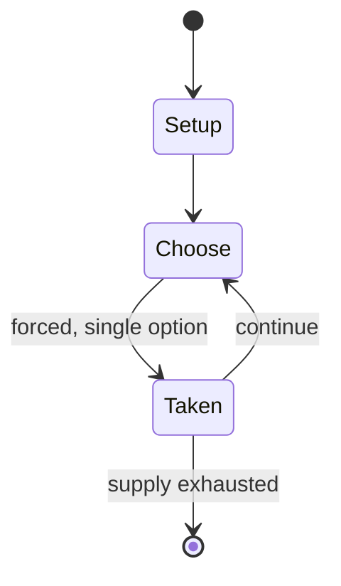

# Sicilian tarot

*tarot card deck*

`sicilian_tarot` &nbsp; state: **DEEPENED** &nbsp; method: **heuristic**

## Found layer (recorded, not trusted)

| field | value |
| --- | --- |
| wikidata | Q24906057 |
| wikipedia | Tarocco Siciliano |
| genres (source) | -- |
| instance of (source) | playing card, tarot card game, tarot deck |
| country of origin | Sicily |

## Declared layer (orders bench work)

| field | value |
| --- | --- |
| year created | -- |
| epoch | -- |
| region | EUROPE_SOUTH |
| media | CARD |
| players | -- |
| age band | -- |
| exogenous process | -- |
| loss shape | -- |
| live axes | - |
| horizon | -- |
| scoring shape | SURVIVAL |
| information | -- |
| interaction | -- |
| turn structure | -- |
| tractability | SAMPLING_ONLY |
| randomness | -- |
| luck factor | 0.35 |
| rules complexity | 1.92 |
| strategic depth | 2.25 |
| novelty | 0.5036 |
| solved status | -- |
| strategies | spatial_packing |
| algorithms | -- |

## Object model

```
Episode
  players      : ?
  turn_structure: ?
  horizon       : ?
  scoring       : SURVIVAL

Deck           -- ordered multiset, drawn without replacement
Hand           -- private multiset held by one player
DiscardPile    -- public accumulation of spent cards
```

## State transition diagram



## Research item -- turn trace

```
# Sicilian tarot -- simulated turn events
# generated from the DECLARED vector, not from a rulebook.
# structure: exo=None loss=None horizon=None scoring=SURVIVAL axes=-

t=0    SETUP        players=2  pot=0  capacity=7
t=1    FORCED       p1 single legal option taken (pot_gain=+0.5)
t=2    FORCED       p1 single legal option taken (pot_gain=+0.7)
t=3    FORCED       p1 single legal option taken (pot_gain=+0.7)
t=4    FORCED       p1 single legal option taken (pot_gain=+1.7)
t=5    FORCED       p1 single legal option taken (pot_gain=+1.7)
t=6    ENDTURN      turn passes to p2
t=7    FORCED       p2 single legal option taken (pot_gain=+1.3)
t=8    FORCED       p2 single legal option taken (pot_gain=+1.1)
t=9    FORCED       p2 single legal option taken (pot_gain=+2.0)
t=10   FORCED       p2 single legal option taken (pot_gain=+1.4)
t=11   FORCED       p2 single legal option taken (pot_gain=+1.6)
t=12   FORCED       p2 single legal option taken (pot_gain=+1.2)
t=13   FORCED       p2 single legal option taken (pot_gain=+1.8)
t=14   FORCED       p2 single legal option taken (pot_gain=+0.9)
t=15   ENDTURN      turn passes to p1
t=16   FORCED       p1 single legal option taken (pot_gain=+0.5)
t=17   ENDTURN      turn passes to p2
t=18   FORCED       p2 single legal option taken (pot_gain=+0.6)
t=19   FORCED       p2 single legal option taken (pot_gain=+1.5)
t=20   FORCED       p2 single legal option taken (pot_gain=+1.3)
t=21   ENDTURN      turn passes to p1
t=22   FORCED       p1 single legal option taken (pot_gain=+1.1)
t=23   FORCED       p1 single legal option taken (pot_gain=+0.8)
t=24   FORCED       p1 single legal option taken (pot_gain=+0.8)
t=25   FORCED       p1 single legal option taken (pot_gain=+1.6)
t=26   FORCED       p1 single legal option taken (pot_gain=+0.9)
t=27   ENDTURN      turn passes to p2

terminal: VARIABLE
```

## Source extract

The Tarocco Siciliano is a tarot deck found in Sicily and is used to play Sicilian tarocchi. It
is one of the three traditional Latin-suited tarot decks still used for games in Italy, the
others being the more prevalent Tarocco Piemontese and the Tarocco Bolognese. The deck was
heavily influenced by the Tarocco Bolognese and the Minchiate. It is also the only surviving
tarot deck to use the Portuguese variation of the Latin suits of cups, coins, swords, and clubs
which died out in the late 19th and early 20th centuries.   == Design ==   === Suits === Tarot
decks were produced in Palermo before 1630. The deck was shortened from 78 cards during the 18th
century. The Tarocco Siciliano currently uses 63 cards, one more than the Tarocco Bolognese.
Despite this, the pack is sold with one unneeded card, the 1 of Coins, which was used to bear
the stamp tax (the only game that uses this 64th card is the four-handed version played in
Barcellona Pozzo di Gotto where it ranks as the lowest in the suit of Coins). The pip cards
contain ranks 5 to 10 with the coins also having a 4. Like modern French tarot, but unlike all
other tarot games, the pip cards of all suits rank in progressive order.  U

<sub>Wikipedia, CC BY-SA. Retained as evidence for the structural
classification above. Every rule inferred from it is HYPOTHESIZED
until audited against a rulebook.</sub>
