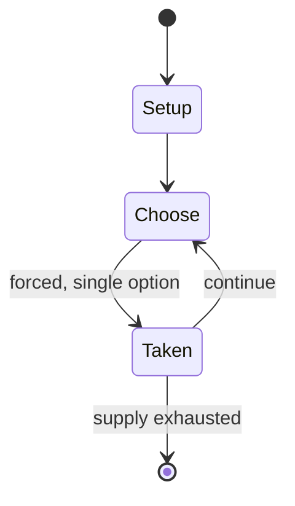

# Signalis

*2022 video game*

`signalis` &nbsp; state: **DEEPENED** &nbsp; method: **heuristic**

## Found layer (recorded, not trusted)

| field | value |
| --- | --- |
| wikidata | Q109828410 |
| wikipedia | Signalis |
| genres (source) | cosmic horror video game, survival horror, third-person shooter |
| instance of (source) | video game |
| country of origin | Germany |

## Declared layer (orders bench work)

| field | value |
| --- | --- |
| year created | 2014 |
| epoch | CONTEMPORARY |
| region | EUROPE_WEST |
| media | PUZZLE, VIDEO |
| players | -- |
| age band | -- |
| exogenous process | -- |
| loss shape | -- |
| live axes | - |
| horizon | -- |
| scoring shape | SURVIVAL |
| information | -- |
| interaction | -- |
| turn structure | -- |
| tractability | SAMPLING_ONLY |
| randomness | DICE |
| luck factor | 0.58 |
| rules complexity | 1.72 |
| strategic depth | 2.12 |
| novelty | 0.505 |
| solved status | -- |
| strategies | signalling |
| algorithms | -- |

## Object model

```
Episode
  players      : ?
  turn_structure: ?
  horizon       : ?
  scoring       : SURVIVAL

Configuration  -- the arrangement to be resolved
Constraint     -- predicate a legal configuration must satisfy
WorldState     -- simulation state advanced by the engine
Avatar         -- player-controlled agent
Clock          -- frame or tick counter
```

## State transition diagram



## Research item -- turn trace

```
# Signalis -- simulated turn events
# generated from the DECLARED vector, not from a rulebook.
# structure: exo=None loss=None horizon=None scoring=SURVIVAL axes=-

t=0    SETUP        players=2  pot=0  capacity=7
t=1    FORCED       p1 single legal option taken (pot_gain=+1.2)
t=2    FORCED       p1 single legal option taken (pot_gain=+0.7)
t=3    ENDTURN      turn passes to p2
t=4    FORCED       p2 single legal option taken (pot_gain=+1.8)
t=5    FORCED       p2 single legal option taken (pot_gain=+1.9)
t=6    FORCED       p2 single legal option taken (pot_gain=+1.4)
t=7    FORCED       p2 single legal option taken (pot_gain=+2.0)
t=8    FORCED       p2 single legal option taken (pot_gain=+0.5)
t=9    FORCED       p2 single legal option taken (pot_gain=+1.5)
t=10   FORCED       p2 single legal option taken (pot_gain=+1.2)
t=11   ENDTURN      turn passes to p1
t=12   FORCED       p1 single legal option taken (pot_gain=+1.4)
t=13   FORCED       p1 single legal option taken (pot_gain=+1.1)
t=14   ENDTURN      turn passes to p2
t=15   FORCED       p2 single legal option taken (pot_gain=+1.7)
t=16   FORCED       p2 single legal option taken (pot_gain=+1.8)
t=17   FORCED       p2 single legal option taken (pot_gain=+0.5)
t=18   ENDTURN      turn passes to p1
t=19   FORCED       p1 single legal option taken (pot_gain=+0.5)
t=20   FORCED       p1 single legal option taken (pot_gain=+0.7)
t=21   FORCED       p1 single legal option taken (pot_gain=+1.7)
t=22   FORCED       p1 single legal option taken (pot_gain=+1.8)
t=23   FORCED       p1 single legal option taken (pot_gain=+1.8)
t=24   FORCED       p1 single legal option taken (pot_gain=+0.8)
t=25   FORCED       p1 single legal option taken (pot_gain=+0.7)
t=26   FORCED       p1 single legal option taken (pot_gain=+0.9)

terminal: VARIABLE
```

## Source extract

Signalis is a 2022 survival horror video game developed by German studio rose-engine and
published by Humble Games and Playism. The player controls an android named Elster/LSTR as she
aims to solve supernatural mysteries after waking up in a hostile mining facility. The game was
designed to replicate the graphics and gameplay of fifth generation video games, drawing
inspiration from the Silent Hill and Resident Evil series. Additional aesthetic influence came
from traditional artworks and films that contain themes of memory. Signalis was released for
Steam, Nintendo Switch, PlayStation 4, and Xbox One on October 27, 2022. It received generally
positive reviews upon release, winning and being nominated for several awards, including Best
Narrative of the year and Best Indie Game of the year at Fear Fest: Horror Games Awards 2023.
== Gameplay ==  The core gameplay consists of top-down shooter elements from a top-down 2.5D
perspective, with occasional puzzle elements. Puzzles vary from manipulating switches and dials,
to searching for certain radio frequencies.  Difficulty and thematic elements are enhanced
through the use of resource management as a gameplay and narrative mechanic.

<sub>Wikipedia, CC BY-SA. Retained as evidence for the structural
classification above. Every rule inferred from it is HYPOTHESIZED
until audited against a rulebook.</sub>
