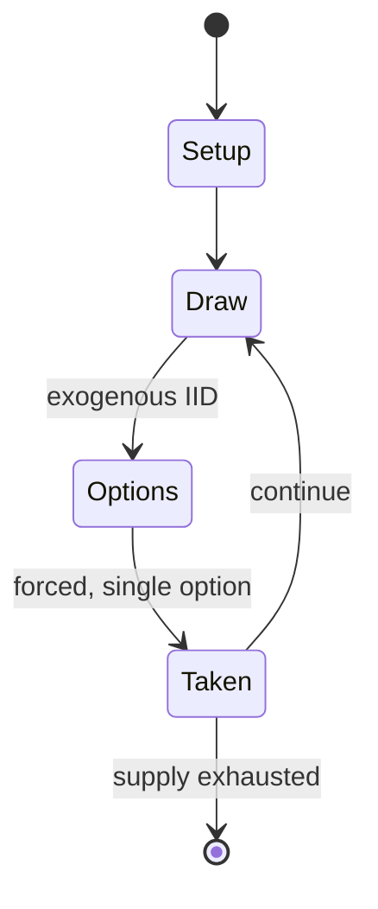

# sittuyin

*Burmese chess variant*

`sittuyin` &nbsp; state: **DEEPENED** &nbsp; method: **heuristic**

## Found layer (recorded, not trusted)

| field | value |
| --- | --- |
| wikidata | Q1360339 |
| wikipedia | Sittuyin |
| genres (source) | -- |
| instance of (source) | chess variant |
| country of origin | Myanmar |

## Declared layer (orders bench work)

| field | value |
| --- | --- |
| year created | -- |
| epoch | -- |
| region | SOUTHEAST_ASIA |
| media | BOARD, DICE |
| players | 2 |
| age band | -- |
| exogenous process | IID |
| loss shape | -- |
| live axes | - |
| horizon | -- |
| scoring shape | WINNER_TAKE_ALL |
| information | -- |
| interaction | COMPETITIVE |
| turn structure | PHASE_STRUCTURED |
| tractability | EXACT_WITH_CUT |
| randomness | DICE |
| luck factor | 0.58 |
| rules complexity | 2.54 |
| strategic depth | 1.87 |
| novelty | 0.7543 |
| solved status | -- |
| strategies | -- |
| algorithms | -- |

## Object model

```
Episode
  players      : 2
  turn_structure: PHASE_STRUCTURED
  horizon       : ?
  scoring       : WINNER_TAKE_ALL

Board          -- spatial substrate; cells carry position and occupancy
Piece          -- movable token owned by a player
DicePool       -- n dice, each an iid categorical draw
Roll           -- realised outcome of a pool
```

## State transition diagram



## Research item -- turn trace

```
# sittuyin -- simulated turn events
# generated from the DECLARED vector, not from a rulebook.
# structure: exo=IID loss=None horizon=None scoring=WINNER_TAKE_ALL axes=-

t=0    SETUP        players=2  pot=0  capacity=3
t=1    DRAW         p1 roll from d6 pool -> outcome #5  (p=0.300)
t=2    FORCED       p1 single legal option taken (pot_gain=+1.9)
t=3    ENDTURN      turn passes to p2
t=4    DRAW         p2 roll from d6 pool -> outcome #6  (p=0.285)
t=5    FORCED       p2 single legal option taken (pot_gain=+1.3)
t=6    DRAW         p2 roll from d6 pool -> outcome #3  (p=0.249)
t=7    FORCED       p2 single legal option taken (pot_gain=+0.5)
t=8    DRAW         p2 roll from d6 pool -> outcome #6  (p=0.214)
t=9    FORCED       p2 single legal option taken (pot_gain=+1.8)
t=10   DRAW         p2 roll from d6 pool -> outcome #1  (p=0.086)
t=11   FORCED       p2 single legal option taken (pot_gain=+1.6)
t=12   DRAW         p2 roll from d6 pool -> outcome #2  (p=0.196)
t=13   FORCED       p2 single legal option taken (pot_gain=+1.1)
t=14   DRAW         p2 roll from d6 pool -> outcome #4  (p=0.055)
t=15   FORCED       p2 single legal option taken (pot_gain=+1.7)
t=16   DRAW         p2 roll from d6 pool -> outcome #6  (p=0.218)
t=17   FORCED       p2 single legal option taken (pot_gain=+1.0)
t=18   DRAW         p2 roll from d6 pool -> outcome #3  (p=0.071)
t=19   FORCED       p2 single legal option taken (pot_gain=+1.9)
t=20   DRAW         p2 roll from d6 pool -> outcome #5  (p=0.001)
t=21   FORCED       p2 single legal option taken (pot_gain=+0.7)
t=22   DRAW         p2 roll from d6 pool -> outcome #1  (p=0.034)
t=23   FORCED       p2 single legal option taken (pot_gain=+2.0)
t=24   DRAW         p2 roll from d6 pool -> outcome #3  (p=0.274)
t=25   FORCED       p2 single legal option taken (pot_gain=+0.9)
t=26   DRAW         p2 roll from d6 pool -> outcome #5  (p=0.037)
t=27   FORCED       p2 single legal option taken (pot_gain=+0.5)

terminal: VARIABLE
```

## Source extract

Sittuyin (Burmese: စစ်တုရင်), also known as Burmese chess, is a strategy board game created in
Myanmar. It is a direct offspring of the Indian game of chaturanga, which arrived in Myanmar in
the 8th century thus it is part of the same family of games such as chess and shogi. Sit is the
modern Burmese word for "army" or "war"; the word sittuyin can be translated as "representation
of the four characteristics of army"—chariot, elephant, cavalry and infantry. In its native
land, the game has been largely overshadowed by Western (international) chess, although it
remains popular in the northwestern regions.   == Board == The sittuyin board consists of 64
squares, 8 rows and 8 columns, without alternating colors. The board also has two diagonal lines
from corner to corner, which are known as sit-ke-myin (Burmese: စစ်ကဲမျဉ်း, general's lines).
== Pieces and their moves == Pieces are commonly made of wood, and sometimes of ivory. The
height of the pieces varies by class. The official colors of the pieces are red and black. Min-
gyi (Burmese: မင်းကြီး, "king", analogous to the king in Western chess)  1 piece per player. It
can move one step in any direction.  Sit-ke (Burmese: စစ်ကဲ, "gene

<sub>Wikipedia, CC BY-SA. Retained as evidence for the structural
classification above. Every rule inferred from it is HYPOTHESIZED
until audited against a rulebook.</sub>
