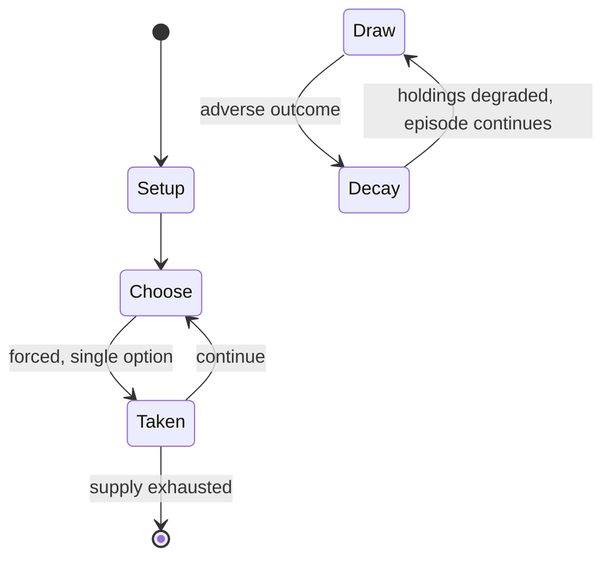

# situation puzzle

*oral guessing game for companies*

`situation_puzzle` &nbsp; state: **DEEPENED** &nbsp; method: **heuristic**

## Found layer (recorded, not trusted)

| field | value |
| --- | --- |
| wikidata | Q1670923 |
| wikipedia | Situation puzzle |
| genres (source) | -- |
| instance of (source) | party game |
| country of origin | -- |

## Declared layer (orders bench work)

| field | value |
| --- | --- |
| year created | -- |
| epoch | -- |
| region | -- |
| media | PUZZLE |
| players | -- |
| age band | -- |
| exogenous process | -- |
| loss shape | PARTIAL_DECAY |
| live axes | COMMIT_BLIND |
| horizon | -- |
| scoring shape | -- |
| information | SIMULTANEOUS |
| interaction | -- |
| turn structure | -- |
| tractability | SAMPLING_ONLY |
| randomness | HIDDEN_INFO, SIMULTANEOUS_CHOICE |
| luck factor | 0.35 |
| rules complexity | 1.79 |
| strategic depth | 2.0 |
| novelty | 0.0938 |
| solved status | -- |
| strategies | deduction |
| algorithms | -- |

## Object model

```
Episode
  players      : ?
  turn_structure: ?
  horizon       : ?
  scoring       : ?

Configuration  -- the arrangement to be resolved
Constraint     -- predicate a legal configuration must satisfy
SealedChoice   -- irrevocable choice made without observation
```

## State transition diagram



## Research item -- turn trace

```
# situation puzzle -- simulated turn events
# generated from the DECLARED vector, not from a rulebook.
# structure: exo=None loss=PARTIAL_DECAY horizon=None scoring=None axes=COMMIT_BLIND

t=0    SETUP        players=2  pot=0  capacity=3
t=1    FORCED       p1 single legal option taken (pot_gain=+0.6)
t=2    FORCED       p1 single legal option taken (pot_gain=+1.9)
t=3    FORCED       p1 single legal option taken (pot_gain=+1.5)
t=4    FORCED       p1 single legal option taken (pot_gain=+1.1)
t=5    ENDTURN      turn passes to p2
t=6    FORCED       p2 single legal option taken (pot_gain=+1.6)
t=7    FORCED       p2 single legal option taken (pot_gain=+1.7)
t=8    FORCED       p2 single legal option taken (pot_gain=+1.3)
t=9    FORCED       p2 single legal option taken (pot_gain=+0.5)
t=10   FORCED       p2 single legal option taken (pot_gain=+0.7)
t=11   FORCED       p2 single legal option taken (pot_gain=+2.0)
t=12   FORCED       p2 single legal option taken (pot_gain=+1.3)
t=13   FORCED       p2 single legal option taken (pot_gain=+1.6)
t=14   ENDTURN      turn passes to p1
t=15   FORCED       p1 single legal option taken (pot_gain=+0.6)
t=16   ENDTURN      turn passes to p2
t=17   FORCED       p2 single legal option taken (pot_gain=+1.5)
t=18   FORCED       p2 single legal option taken (pot_gain=+0.7)
t=19   FORCED       p2 single legal option taken (pot_gain=+1.7)
t=20   ENDTURN      turn passes to p1
t=21   FORCED       p1 single legal option taken (pot_gain=+1.9)
t=22   FORCED       p1 single legal option taken (pot_gain=+1.0)
t=23   FORCED       p1 single legal option taken (pot_gain=+0.5)
t=24   FORCED       p1 single legal option taken (pot_gain=+1.1)
t=25   FORCED       p1 single legal option taken (pot_gain=+0.8)
t=26   FORCED       p1 single legal option taken (pot_gain=+1.0)

terminal: VARIABLE
```

## Conditions

| kind | threshold | effect | trigger |
| --- | --- | --- | --- |
| BOUNDARY | -- | -- | A typical game is played with at least two roles: |

## Source extract

Situation puzzles, often referred to as minute mysteries, lateral thinking puzzles or yes/no
puzzles, are puzzles in which other participants are to construct a story that the host has in
mind, basing on a puzzling situation that is given at the start. These puzzles are inexact and
many puzzle statements have more than one possible fitting answer. The goal however is to find
out the story as the host has it in mind, not just any plausible answer. Critical thinking,
reading, logical thinking, as well as lateral thinking may all be required to solve a situation
puzzle. The term lateral thinking was coined by Edward de Bono in the 1960s and 1970s, to denote
a creative problem-solving style that involves looking at the given situation from unexpected
angles, and is typically necessary to the solution of situation puzzles. The format resembles
traditional riddles but gained popularity in the 20th century through puzzle books and
magazines.  Paul Sloane's Lateral Thinking Puzzlers series and Raymond Smullyan's collections
helped popularize the format in print. In the 1990s, archives such as the rec.puzzles Usenet
group widely disseminated situation puzzles online. Conceptual reviews in E

<sub>Wikipedia, CC BY-SA. Retained as evidence for the structural
classification above. Every rule inferred from it is HYPOTHESIZED
until audited against a rulebook.</sub>
