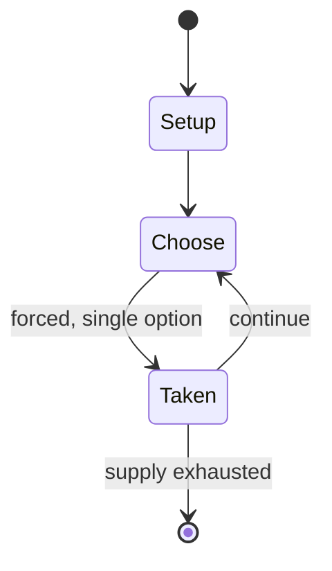

# Skat

`skat` &nbsp; state: **DEEPENED** &nbsp; method: **heuristic**

## Found layer (recorded, not trusted)

| field | value |
| --- | --- |
| wikidata | Q341075 |
| wikipedia | Skat |
| genres (source) | -- |
| instance of (source) | -- |
| country of origin | -- |

## Declared layer (orders bench work)

| field | value |
| --- | --- |
| year created | -- |
| epoch | -- |
| region | -- |
| media | CARD |
| players | -- |
| age band | -- |
| exogenous process | -- |
| loss shape | -- |
| live axes | - |
| horizon | -- |
| scoring shape | -- |
| information | -- |
| interaction | -- |
| turn structure | -- |
| tractability | SAMPLING_ONLY |
| randomness | -- |
| luck factor | 0.35 |
| rules complexity | 1.68 |
| strategic depth | 2.0 |
| novelty | 0.0876 |
| solved status | -- |
| strategies | -- |
| algorithms | -- |

## Object model

```
Episode
  players      : ?
  turn_structure: ?
  horizon       : ?
  scoring       : ?

Deck           -- ordered multiset, drawn without replacement
Hand           -- private multiset held by one player
DiscardPile    -- public accumulation of spent cards
```

## State transition diagram



## Research item -- turn trace

```
# Skat -- simulated turn events
# generated from the DECLARED vector, not from a rulebook.
# structure: exo=None loss=None horizon=None scoring=None axes=-

t=0    SETUP        players=2  pot=0  capacity=8
t=1    FORCED       p1 single legal option taken (pot_gain=+0.7)
t=2    FORCED       p1 single legal option taken (pot_gain=+2.0)
t=3    FORCED       p1 single legal option taken (pot_gain=+1.0)
t=4    ENDTURN      turn passes to p2
t=5    FORCED       p2 single legal option taken (pot_gain=+0.6)
t=6    FORCED       p2 single legal option taken (pot_gain=+2.0)
t=7    FORCED       p2 single legal option taken (pot_gain=+1.0)
t=8    FORCED       p2 single legal option taken (pot_gain=+1.5)
t=9    FORCED       p2 single legal option taken (pot_gain=+1.6)
t=10   FORCED       p2 single legal option taken (pot_gain=+1.2)
t=11   FORCED       p2 single legal option taken (pot_gain=+0.6)
t=12   ENDTURN      turn passes to p1
t=13   FORCED       p1 single legal option taken (pot_gain=+0.6)
t=14   ENDTURN      turn passes to p2
t=15   FORCED       p2 single legal option taken (pot_gain=+1.3)
t=16   FORCED       p2 single legal option taken (pot_gain=+1.3)
t=17   FORCED       p2 single legal option taken (pot_gain=+0.6)
t=18   FORCED       p2 single legal option taken (pot_gain=+1.5)
t=19   FORCED       p2 single legal option taken (pot_gain=+2.0)
t=20   FORCED       p2 single legal option taken (pot_gain=+1.5)
t=21   FORCED       p2 single legal option taken (pot_gain=+0.5)
t=22   FORCED       p2 single legal option taken (pot_gain=+0.7)
t=23   FORCED       p2 single legal option taken (pot_gain=+0.9)
t=24   ENDTURN      turn passes to p1
t=25   FORCED       p1 single legal option taken (pot_gain=+1.0)
t=26   FORCED       p1 single legal option taken (pot_gain=+1.3)

terminal: VARIABLE
```

## Source extract

Skat may refer to:   == Organisations == SKAT (tax agency), the Danish tax authority SKAT
(television) (Bulgarian: Национална телевизия Скат), a Bulgarian national cable television
company, with the channels Skat and Skat+ Skat media (Russian: Скат медиа), a Russian
independent online media; see Vesna (Russia) Surya Kiran Aerobatic Team, an aerobatics display
team of the Indian Air Force. Savanoriškoji krašto apsaugos tarnyba, former name of the
Lithuanian National Defence Volunteer Forces   == Transport == Skat (yacht), a luxury yacht
launched in 2001 Skagit Transit, a bus system in Skagit County, Washington Mikoyan Skat, a
Russian unmanned combat air vehicle (UCAV)   == Card games == Skat (card game), Germany's
national card game Skat (cards), a stack of undealt cards used during game play   == Other uses
== Skat (river), a river in Bulgaria Skat (song), a song by Canadian singer Tory Lanez Skat, the
IAU-approved proper name for the star Delta Aquarii   == See also == Scat (disambiguation)

<sub>Wikipedia, CC BY-SA. Retained as evidence for the structural
classification above. Every rule inferred from it is HYPOTHESIZED
until audited against a rulebook.</sub>
