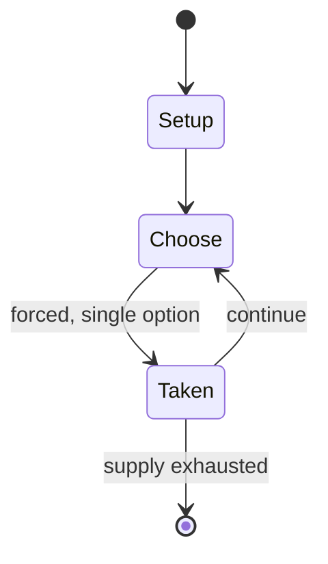

# Skyscope

`skyscope` &nbsp; state: **DEEPENED** &nbsp; method: **heuristic**

## Found layer (recorded, not trusted)

| field | value |
| --- | --- |
| wikidata | Q1456517 |
| wikipedia | Skyscope |
| genres (source) | -- |
| instance of (source) | -- |
| country of origin | -- |

## Declared layer (orders bench work)

| field | value |
| --- | --- |
| year created | -- |
| epoch | -- |
| region | -- |
| media | PLAYGROUND |
| players | -- |
| age band | CHILD |
| exogenous process | -- |
| loss shape | -- |
| live axes | - |
| horizon | -- |
| scoring shape | -- |
| information | -- |
| interaction | -- |
| turn structure | -- |
| tractability | SAMPLING_ONLY |
| randomness | HIDDEN_INFO |
| luck factor | 0.35 |
| rules complexity | 1.69 |
| strategic depth | 2.25 |
| novelty | 0.0914 |
| solved status | -- |
| strategies | spatial_packing |
| algorithms | -- |

## Object model

```
Episode
  players      : ?
  turn_structure: ?
  horizon       : ?
  scoring       : ?

State          -- opaque; no medium or axis evidence was found
Player         -- an agent that selects among legal successors
```

## State transition diagram



## Research item -- turn trace

```
# Skyscope -- simulated turn events
# generated from the DECLARED vector, not from a rulebook.
# structure: exo=None loss=None horizon=None scoring=None axes=-

t=0    SETUP        players=2  pot=0  capacity=6
t=1    FORCED       p1 single legal option taken (pot_gain=+1.7)
t=2    FORCED       p1 single legal option taken (pot_gain=+0.9)
t=3    FORCED       p1 single legal option taken (pot_gain=+1.3)
t=4    FORCED       p1 single legal option taken (pot_gain=+1.7)
t=5    FORCED       p1 single legal option taken (pot_gain=+1.7)
t=6    FORCED       p1 single legal option taken (pot_gain=+1.0)
t=7    FORCED       p1 single legal option taken (pot_gain=+1.2)
t=8    ENDTURN      turn passes to p2
t=9    FORCED       p2 single legal option taken (pot_gain=+1.1)
t=10   FORCED       p2 single legal option taken (pot_gain=+0.6)
t=11   FORCED       p2 single legal option taken (pot_gain=+0.8)
t=12   FORCED       p2 single legal option taken (pot_gain=+1.6)
t=13   ENDTURN      turn passes to p1
t=14   FORCED       p1 single legal option taken (pot_gain=+1.7)
t=15   ENDTURN      turn passes to p2
t=16   FORCED       p2 single legal option taken (pot_gain=+1.1)
t=17   FORCED       p2 single legal option taken (pot_gain=+1.5)
t=18   FORCED       p2 single legal option taken (pot_gain=+1.1)
t=19   FORCED       p2 single legal option taken (pot_gain=+0.6)
t=20   FORCED       p2 single legal option taken (pot_gain=+1.1)
t=21   FORCED       p2 single legal option taken (pot_gain=+1.5)
t=22   FORCED       p2 single legal option taken (pot_gain=+1.8)
t=23   ENDTURN      turn passes to p1
t=24   FORCED       p1 single legal option taken (pot_gain=+1.9)
t=25   FORCED       p1 single legal option taken (pot_gain=+1.1)
t=26   FORCED       p1 single legal option taken (pot_gain=+2.0)

terminal: VARIABLE
```

## Source extract

Skyscope, also known as "The Secret" (Polish: widoczek, niebko, sekret, aniołek - skyview,
secret, little angel), is a creative children's game, popular in Poland, Lithuania, and the
1960s Soviet Union. The activity consists of creating some kind of a collage. In rarely visited
places (often hidden parts of the backyard or school's playground), a hole was dug in the ground
in which the child would put small items creating a visual composition, then cover them with a
glass screen and bury them. The items used were usually common wild flowers, leaves, beads,
pieces of aluminium foil or colourful wrappings and packages. The viewer privy to see Skyscope,
in order to view it, had to clean the glass surface, sometimes using their own saliva. The
colour composition appearing in the hollow, randomly framed during cleansing, viewed through the
thin glass, gives an artistic, often very unexpected and unpredictable effect created by the
contrast with the surroundings. The game was popular in the cities at times when television was
not commonly available.   == References ==   == External links == Leksykon gry i zabawy Nasze-
Wasze Niebko Festiwal Sztuki nad Wisłą Przemiany 2009

<sub>Wikipedia, CC BY-SA. Retained as evidence for the structural
classification above. Every rule inferred from it is HYPOTHESIZED
until audited against a rulebook.</sub>
