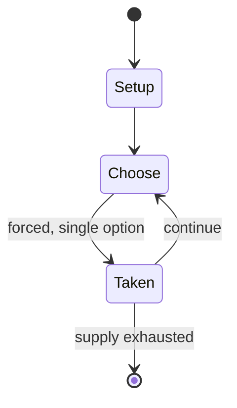

# Slick Chick

*1963 pinball machine*

`slick_chick` &nbsp; state: **DEEPENED** &nbsp; method: **heuristic**

## Found layer (recorded, not trusted)

| field | value |
| --- | --- |
| wikidata | Q21043348 |
| wikipedia | Slick Chick (pinball) |
| genres (source) | -- |
| instance of (source) | video game |
| country of origin | -- |

## Declared layer (orders bench work)

| field | value |
| --- | --- |
| year created | 1963 |
| epoch | MODERN |
| region | -- |
| media | VIDEO |
| players | -- |
| age band | -- |
| exogenous process | -- |
| loss shape | -- |
| live axes | - |
| horizon | -- |
| scoring shape | -- |
| information | -- |
| interaction | -- |
| turn structure | -- |
| tractability | SAMPLING_ONLY |
| randomness | -- |
| luck factor | 0.35 |
| rules complexity | 1.71 |
| strategic depth | 2.0 |
| novelty | 0.0876 |
| solved status | -- |
| strategies | -- |
| algorithms | -- |

## Object model

```
Episode
  players      : ?
  turn_structure: ?
  horizon       : ?
  scoring       : ?

WorldState     -- simulation state advanced by the engine
Avatar         -- player-controlled agent
Clock          -- frame or tick counter
```

## State transition diagram



## Research item -- turn trace

```
# Slick Chick -- simulated turn events
# generated from the DECLARED vector, not from a rulebook.
# structure: exo=None loss=None horizon=None scoring=None axes=-

t=0    SETUP        players=2  pot=0  capacity=3
t=1    FORCED       p1 single legal option taken (pot_gain=+0.7)
t=2    ENDTURN      turn passes to p2
t=3    FORCED       p2 single legal option taken (pot_gain=+0.6)
t=4    ENDTURN      turn passes to p1
t=5    FORCED       p1 single legal option taken (pot_gain=+0.7)
t=6    FORCED       p1 single legal option taken (pot_gain=+0.9)
t=7    FORCED       p1 single legal option taken (pot_gain=+0.9)
t=8    FORCED       p1 single legal option taken (pot_gain=+1.2)
t=9    FORCED       p1 single legal option taken (pot_gain=+0.8)
t=10   FORCED       p1 single legal option taken (pot_gain=+0.6)
t=11   ENDTURN      turn passes to p2
t=12   FORCED       p2 single legal option taken (pot_gain=+1.5)
t=13   FORCED       p2 single legal option taken (pot_gain=+1.6)
t=14   FORCED       p2 single legal option taken (pot_gain=+0.6)
t=15   FORCED       p2 single legal option taken (pot_gain=+1.3)
t=16   FORCED       p2 single legal option taken (pot_gain=+1.1)
t=17   FORCED       p2 single legal option taken (pot_gain=+2.0)
t=18   FORCED       p2 single legal option taken (pot_gain=+1.7)
t=19   ENDTURN      turn passes to p1
t=20   FORCED       p1 single legal option taken (pot_gain=+1.7)
t=21   ENDTURN      turn passes to p2
t=22   FORCED       p2 single legal option taken (pot_gain=+1.3)
t=23   FORCED       p2 single legal option taken (pot_gain=+2.0)
t=24   ENDTURN      turn passes to p1
t=25   FORCED       p1 single legal option taken (pot_gain=+1.4)
t=26   FORCED       p1 single legal option taken (pot_gain=+0.6)
t=27   ENDTURN      turn passes to p2

terminal: VARIABLE
```

## Source extract

Slick Chick is a single player wedge head pinball machine designed by Wayne Neyens and released
by Gottlieb in April 1963.   == Design and layout == The game designer, Wayne Neyens, conceived
of the name "Party Girls" after designing a layout including nine criss-crossing bumpers. Others
thought the name was too risque so Neyens looked for two other five letter words with a common
middle letter; he took inspiration from a Chicago restaurant and called it Slick Chick. The five
central bumpers are pop bumpers, with the four outer ones "simple bumpers". The playfield is
symmetrical. The game uses a deeper cabinet than prior Gottlieb machines, and has a large chrome
coin door. An "auto-clamp" feature was introduced to lock the playfield in position using a
spring-loaded lever. The backglass and playfield include bunny girls.   == Gameplay == The main
objective of the game is to spell S-L-I-C-K C-H-I-C-K by hitting the bumpers in order, or by
hitting various other targets around the playfield. Each time the name is completed a rollover
target is lit, and after all five are lit the player is awarded a replay if they lose the ball
in the gobble hole in the middle of the table. A replay ca

<sub>Wikipedia, CC BY-SA. Retained as evidence for the structural
classification above. Every rule inferred from it is HYPOTHESIZED
until audited against a rulebook.</sub>
