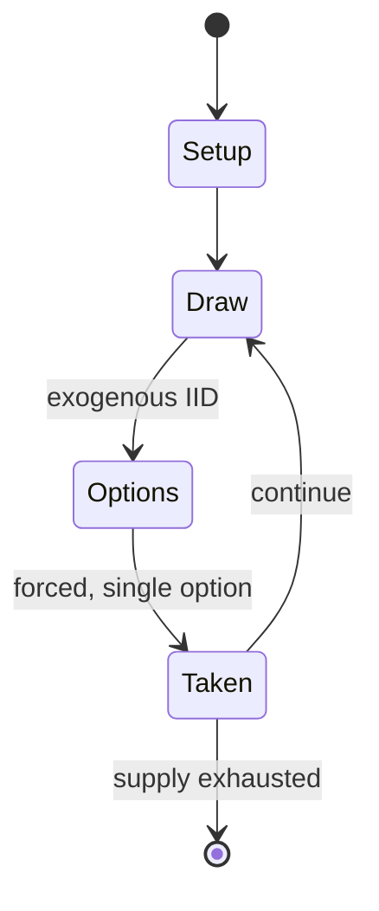

# Snakes and ladders

`snakes_and_ladders` &nbsp; state: **DEEPENED** &nbsp; method: **heuristic**

## Found layer (recorded, not trusted)

| field | value |
| --- | --- |
| wikidata | Q697302 |
| wikipedia | Snakes and ladders |
| genres (source) | -- |
| instance of (source) | -- |
| country of origin | -- |

## Declared layer (orders bench work)

| field | value |
| --- | --- |
| year created | 1892 |
| epoch | INDUSTRIAL |
| region | -- |
| media | BOARD |
| players | -- |
| age band | -- |
| exogenous process | IID |
| loss shape | -- |
| live axes | SPATIAL |
| horizon | -- |
| scoring shape | RACE_POSITION |
| information | -- |
| interaction | SOLITAIRE |
| turn structure | STRICT_TURN |
| tractability | EXACT_WITH_CUT |
| randomness | DICE |
| luck factor | 0.58 |
| rules complexity | 2.12 |
| strategic depth | 2.12 |
| novelty | 0.7209 |
| solved status | -- |
| strategies | route_optimisation |
| algorithms | -- |

## Object model

```
Episode
  players      : ?
  turn_structure: STRICT_TURN
  horizon       : ?
  scoring       : RACE_POSITION

Board          -- spatial substrate; cells carry position and occupancy
Piece          -- movable token owned by a player
Placement      -- position subject to geometric legality
```

## State transition diagram



## Research item -- turn trace

```
# Snakes and ladders -- simulated turn events
# generated from the DECLARED vector, not from a rulebook.
# structure: exo=IID loss=None horizon=None scoring=RACE_POSITION axes=SPATIAL

t=0    SETUP        players=2  pot=0  capacity=4
t=1    DRAW         p1 roll from d6 pool -> outcome #4  (p=0.026)
t=2    FORCED       p1 single legal option taken (pot_gain=+1.1)
t=3    SPATIAL      p1 places at (4,3); adjacency legal
t=4    DRAW         p1 roll from d6 pool -> outcome #4  (p=0.021)
t=5    FORCED       p1 single legal option taken (pot_gain=+1.7)
t=6    DRAW         p1 roll from d6 pool -> outcome #4  (p=0.272)
t=7    FORCED       p1 single legal option taken (pot_gain=+0.8)
t=8    DRAW         p1 roll from d6 pool -> outcome #1  (p=0.250)
t=9    FORCED       p1 single legal option taken (pot_gain=+1.1)
t=10   DRAW         p1 roll from d6 pool -> outcome #5  (p=0.115)
t=11   FORCED       p1 single legal option taken (pot_gain=+1.7)
t=12   SPATIAL      p1 places at (5,3); adjacency legal
t=13   DRAW         p1 roll from d6 pool -> outcome #6  (p=0.054)
t=14   FORCED       p1 single legal option taken (pot_gain=+1.6)
t=15   SPATIAL      p1 places at (3,2); adjacency legal
t=16   DRAW         p1 roll from d6 pool -> outcome #4  (p=0.038)
t=17   FORCED       p1 single legal option taken (pot_gain=+1.1)
t=18   SPATIAL      p1 places at (1,5); adjacency legal
t=19   DRAW         p1 roll from d6 pool -> outcome #2  (p=0.239)
t=20   FORCED       p1 single legal option taken (pot_gain=+1.5)
t=21   DRAW         p1 roll from d6 pool -> outcome #6  (p=0.224)
t=22   FORCED       p1 single legal option taken (pot_gain=+1.6)
t=23   SPATIAL      p1 places at (5,0); adjacency legal
t=24   DRAW         p1 roll from d6 pool -> outcome #3  (p=0.103)
t=25   FORCED       p1 single legal option taken (pot_gain=+1.5)
t=26   SPATIAL      p1 places at (6,1); adjacency legal

terminal: VARIABLE
```

## Conditions

| kind | threshold | effect | trigger |
| --- | --- | --- | --- |
| WIN | -- | -- | The player who is first to bring their token to the last square of the track is the winner. |
| BOUNDARY | -- | -- | The phrase "back to square one" originated in the game of snakes and ladders, or at least was influenced by it – the earliest attestation of the phrase refers to the game: "Withal he has the problem of maintaining the in |

## Source extract

Snakes and ladders is a board game for two or more players regarded today as a worldwide
classic. The game originated in ancient India as Moksha Patam ("liberation lesson"), and was
brought to the United Kingdom in the 1890s. It is played on a game board with numbered, gridded
squares. A number of "ladders"and "snakes" are pictured on the board, each connecting two
specific board squares. The object of the game is to navigate one's game piece, according to die
rolls, from the start (bottom square) to the finish (top square), helped by climbing ladders but
hindered by falling down snakes. The game is a simple race based on sheer luck, and it is
popular with young children. The historic version had its roots in morality lessons, on which a
player's progression up the board represented a life journey complicated by virtues (ladders)
and vices (snakes). The game is also sold under other names, such as the morality themed Chutes
and Ladders, which was published by the Milton Bradley Company starting in 1943.   == Equipment
== The size of the grid varies, but is most commonly 8×8, 10×10 or 12×12 squares. Boards have
snakes and ladders starting and ending on different squares; both facto

<sub>Wikipedia, CC BY-SA. Retained as evidence for the structural
classification above. Every rule inferred from it is HYPOTHESIZED
until audited against a rulebook.</sub>
