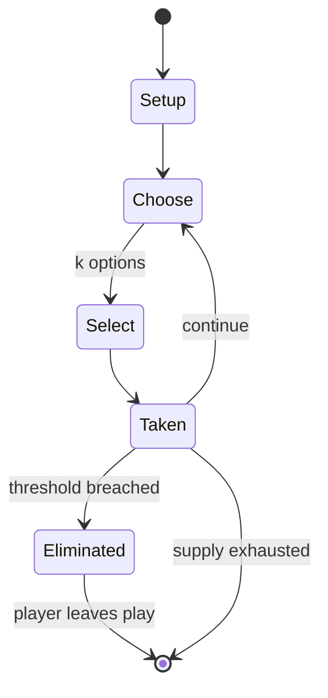

# So Long Sucker

*board game*

`so_long_sucker` &nbsp; state: **DEEPENED** &nbsp; method: **heuristic**

## Found layer (recorded, not trusted)

| field | value |
| --- | --- |
| wikidata | Q3381489 |
| wikipedia | So Long Sucker |
| genres (source) | -- |
| instance of (source) | board game |
| country of origin | -- |

## Declared layer (orders bench work)

| field | value |
| --- | --- |
| year created | 1950 |
| epoch | MODERN |
| region | -- |
| media | BOARD |
| players | -- |
| age band | -- |
| exogenous process | -- |
| loss shape | ELIMINATION |
| live axes | DISCARD, SELECT, TRADE |
| horizon | -- |
| scoring shape | SURVIVAL |
| information | -- |
| interaction | SOLITAIRE |
| turn structure | STRICT_TURN |
| tractability | SAMPLING_ONLY |
| randomness | HIDDEN_INFO |
| luck factor | 0.35 |
| rules complexity | 3.03 |
| strategic depth | 2.25 |
| novelty | 0.6582 |
| solved status | -- |
| strategies | coalition_forming |
| algorithms | -- |

## Object model

```
Episode
  players      : ?
  turn_structure: STRICT_TURN
  horizon       : ?
  scoring       : SURVIVAL

Board          -- spatial substrate; cells carry position and occupancy
Piece          -- movable token owned by a player
DiscardChoice  -- what is given up to satisfy a limit
OptionSet      -- the choices available after an exogenous draw
Offer          -- proposed exchange between two agents
```

## State transition diagram



## Research item -- turn trace

```
# So Long Sucker -- simulated turn events
# generated from the DECLARED vector, not from a rulebook.
# structure: exo=None loss=ELIMINATION horizon=None scoring=SURVIVAL axes=DISCARD,SELECT,TRADE

t=0    SETUP        players=2  pot=0  capacity=4
t=1    SELECT       p1 3 options; take #1  (pot_gain=+1.1, capacity=-2)
t=2    DISCARD      p1 discards to hand limit
t=3    SELECT       p1 2 options; take #1  (pot_gain=+2.0, capacity=-0)
t=4    SELECT       p1 3 options; take #2  (pot_gain=+0.8, capacity=-0)
t=5    DISCARD      p1 discards to hand limit
t=6    SELECT       p1 3 options; take #1  (pot_gain=+1.6, capacity=-2)
t=7    DISCARD      p1 discards to hand limit
t=8    SELECT       p1 1 options; take #1  (pot_gain=+1.7, capacity=-2)
t=9    DISCARD      p1 discards to hand limit
t=10   ENDTURN      turn passes to p2
t=11   SELECT       p2 4 options; take #2  (pot_gain=+3.4, capacity=-1)
t=12   SELECT       p2 4 options; take #3  (pot_gain=+1.2, capacity=-1)
t=13   TRADE        p2 offers 2:1 exchange to p1
t=14   SELECT       p2 4 options; take #1  (pot_gain=+0.7, capacity=-2)
t=15   SELECT       p2 1 options; take #1  (pot_gain=+2.3, capacity=-1)
t=16   DISCARD      p2 discards to hand limit
t=17   SELECT       p2 2 options; take #1  (pot_gain=+0.6, capacity=-2)
t=18   SELECT       p2 1 options; take #1  (pot_gain=+1.3, capacity=-1)
t=19   DISCARD      p2 discards to hand limit
t=20   ENDTURN      turn passes to p1
t=21   SELECT       p1 4 options; take #2  (pot_gain=+0.8, capacity=-1)
t=22   SELECT       p1 2 options; take #2  (pot_gain=+3.1, capacity=-2)
t=23   TRADE        p1 offers 2:1 exchange to p2
t=24   SELECT       p1 4 options; take #1  (pot_gain=+1.4, capacity=-2)
t=25   TRADE        p1 offers 2:1 exchange to p2
t=26   DISCARD      p1 discards to hand limit

terminal: VARIABLE
```

## Conditions

| kind | threshold | effect | trigger |
| --- | --- | --- | --- |
| ELIMINATE | 2 players | eliminated | If someone adds a blue token, then the blue (1st chip from the top, 3 eligible players remaining), red (2nd chip, 2 players remaining), blue (3rd chip, 2 players remaining), red (4th chip, 2 players remaining), and green |
| ELIMINATE | -- | -- | They eliminate one of these chips from the game and they take the next turn. |
| ELIMINATE | -- | -- | At any point, any player may eliminate one or multiple of their prisoners from the game entirely, or give prisoners to other players. |
| ELIMINATE | -- | eliminated | If two consecutive chips of the same color are played and player of that color has been defeated, the whole pile of chips is eliminated from the game. |
| ELIMINATE | -- | -- | If they would add another blue chip to this pile in that turn, there are two consecutive chips of the same color and blue receives all these chips, eliminates one, and takes the next turn. |
| ELIMINATE | -- | -- | Elimination or defeat occurs when a player has the next turn but has no chips left to play. |
| ELIMINATE | -- | -- | The chips of eliminated players that are already in play stay in play, but they are never used to determine the next player. |
| ELIMINATE | -- | eliminated | If two consecutive chips of the same color are played and the original owner of that color has been defeated, the whole pile of chips is eliminated from the game, and the player who played the chip gets another turn. |
| ELIMINATE | -- | -- | Prisoners may be transferred or removed from the game at any time, including immediately before a player is defeated, potentially allowing them to move, and stopping them from being defeated. |
| TERMINATE | -- | -- | The game ends when only one person holds any chips. |
| LOSE | -- | -- | A player is defeated when they cannot play any chips and they leave the game. |
| PENALTY | -- | -- | There is no penalty for failure to live up to an agreement. |

## Source extract

So Long Sucker is a board game invented in 1950 by Mel Hausner, John Nash, Lloyd Shapley, and
Martin Shubik. It is a four-person bargaining/economic strategy game. Each player begins the
game with seven chips of the same color, and in the course of play, attempts to acquire all of
the chips of all the other players. This requires making agreements with the other players,
which are ultimately unenforceable. To win, players must eventually go back on such agreements.
The game takes approximately 60 minutes to play.   == Overview of the game == In this game for
four players, each player starts out with seven chips of their own color. As play goes on,
players exchange chips with other players so it is advised to use an extra chip just to indicate
which player originally owned which color. The game ends when only one person holds any chips. A
player is defeated when they cannot play any chips and they leave the game.   === Gameplay ===
On each turn, a chip is played in the middle of the table, either starting a new pile, or adding
onto an existing pile. Once a chip is added on top of another chip of the same color (so the two
chips of the same color are directly on top of each other), a

<sub>Wikipedia, CC BY-SA. Retained as evidence for the structural
classification above. Every rule inferred from it is HYPOTHESIZED
until audited against a rulebook.</sub>
