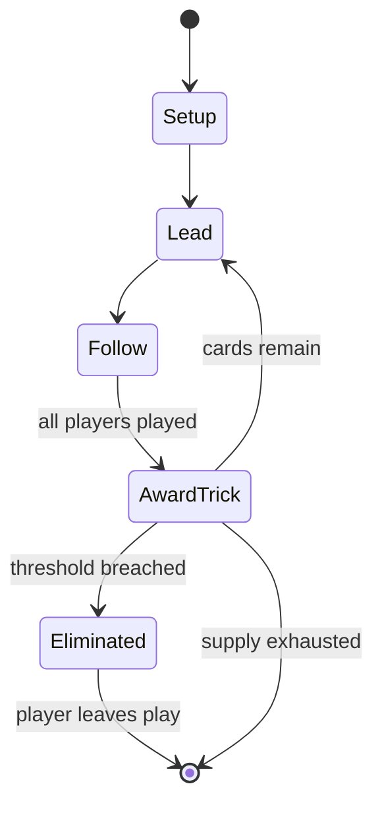

# Solo whist

*trick-taking game*

`solo_whist` &nbsp; state: **DEEPENED** &nbsp; method: **heuristic**

## Found layer (recorded, not trusted)

| field | value |
| --- | --- |
| wikidata | Q142853 |
| wikipedia | Solo whist |
| genres (source) | -- |
| instance of (source) | bidding-based game, card game, trick-taking game |
| country of origin | -- |

## Declared layer (orders bench work)

| field | value |
| --- | --- |
| year created | 1852 |
| epoch | INDUSTRIAL |
| region | -- |
| media | CARD, TRICK_TAKING |
| players | 4 |
| age band | -- |
| exogenous process | DEPLETING_DECK |
| loss shape | ELIMINATION |
| live axes | BID |
| horizon | -- |
| scoring shape | -- |
| information | -- |
| interaction | TEAM |
| turn structure | TRICK_ROUND |
| tractability | EXACT_WITH_CUT |
| randomness | DECK_SHUFFLE |
| luck factor | 0.48 |
| rules complexity | 2.09 |
| strategic depth | 2.0 |
| novelty | 0.7757 |
| solved status | -- |
| strategies | spatial_packing |
| algorithms | -- |

## Object model

```
Episode
  players      : 4
  turn_structure: TRICK_ROUND
  horizon       : ?
  scoring       : ?

Deck           -- ordered multiset, drawn without replacement
Hand           -- private multiset held by one player
DiscardPile    -- public accumulation of spent cards
Trick          -- one card per player; a winner is determined
Trump          -- suit that dominates the ordering
Auction        -- priced competition resolving to one winner
```

## State transition diagram



## Research item -- turn trace

```
# Solo whist -- simulated turn events
# generated from the DECLARED vector, not from a rulebook.
# structure: exo=DEPLETING_DECK loss=ELIMINATION horizon=None scoring=None axes=BID

t=0    SETUP        players=4  pot=0  capacity=6
t=1    DRAW         p1 draw from deck -> outcome #2  (p=0.122)
t=2    FORCED       p1 single legal option taken (pot_gain=+1.2)
t=3    BID          p1 sealed bid of 3 against 3 rivals
t=4    ENDTURN      turn passes to p2
t=5    DRAW         p2 draw from deck -> outcome #5  (p=0.169)
t=6    FORCED       p2 single legal option taken (pot_gain=+0.6)
t=7    BID          p2 sealed bid of 3 against 3 rivals
t=8    DRAW         p2 draw from deck -> outcome #1  (p=0.300)
t=9    FORCED       p2 single legal option taken (pot_gain=+1.5)
t=10   ENDTURN      turn passes to p3
t=11   DRAW         p3 draw from deck -> outcome #2  (p=0.210)
t=12   FORCED       p3 single legal option taken (pot_gain=+0.8)
t=13   BID          p3 sealed bid of 2 against 3 rivals
t=14   DRAW         p3 draw from deck -> outcome #6  (p=0.115)
t=15   FORCED       p3 single legal option taken (pot_gain=+1.3)
t=16   BID          p3 sealed bid of 7 against 3 rivals
t=17   DRAW         p3 draw from deck -> outcome #3  (p=0.146)
t=18   FORCED       p3 single legal option taken (pot_gain=+0.9)
t=19   DRAW         p3 draw from deck -> outcome #6  (p=0.168)
t=20   FORCED       p3 single legal option taken (pot_gain=+1.2)
t=21   DRAW         p3 draw from deck -> outcome #3  (p=0.284)
t=22   FORCED       p3 single legal option taken (pot_gain=+1.6)
t=23   ENDTURN      turn passes to p4
t=24   DRAW         p4 draw from deck -> outcome #6  (p=0.234)
t=25   FORCED       p4 single legal option taken (pot_gain=+0.8)
t=26   BID          p4 sealed bid of 5 against 3 rivals

terminal: VARIABLE
```

## Conditions

| kind | threshold | effect | trigger |
| --- | --- | --- | --- |
| PENALTY | 1 point | -- | This can be enforced with 1 point penalty for shuffling inappropriately. |
| ELIMINATE | -- | eliminated | In this variation, Prop and Cop is eliminated and only individual hands are allowed. |

## Source extract

Solo whist is the English form of Wiezen (Belgian or Ghent Whist), a simple game of the Boston
family played in the Low Countries. It is a trick-taking card game for four players in which
players can bid to make eight tricks in trumps with any partner, or a solo contract playing
against the other three players. Thus it combines both partnership and cut-throat play. Scoring
is with small stakes won or paid out on each hand.   == History == Wiezen or Belgian Whist, a
simple form of Boston, has been played in the Low Countries since the early 19th Century. The
game was introduced to London in 1852 by a family of Dutch Jews. It quickly became popular in
London's Jewish Community and was known as Solo Whist. In the early 1870s Solo Whist was played
as a low stakes gambling game in London's sporting clubs as a replacement for more complex and
slower games like Whist. Solo Whist continued to be played as a social gambling game in homes
and pubs during the 20th Century in Britain, Australia and New Zealand, however, its popularity
declined as Contract Bridge's rose.   == Dealing == The cards are shuffled by the dealer and cut
by the player to dealer's right. Cards are usually dealt 3,3,3,3

<sub>Wikipedia, CC BY-SA. Retained as evidence for the structural
classification above. Every rule inferred from it is HYPOTHESIZED
until audited against a rulebook.</sub>
