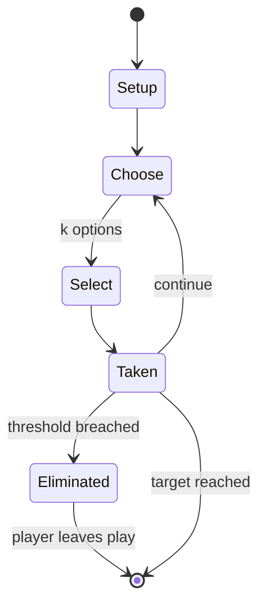

# Sorry! (game)

`sorry_game` &nbsp; state: **DEEPENED** &nbsp; method: **heuristic**

## Found layer (recorded, not trusted)

| field | value |
| --- | --- |
| wikidata | Q2303559 |
| wikipedia | Sorry! (game) |
| genres (source) | -- |
| instance of (source) | -- |
| country of origin | -- |

## Declared layer (orders bench work)

| field | value |
| --- | --- |
| year created | -- |
| epoch | -- |
| region | -- |
| media | BOARD |
| players | -- |
| age band | CHILD |
| exogenous process | -- |
| loss shape | ELIMINATION |
| live axes | SELECT |
| horizon | RACE_TO_TARGET |
| scoring shape | -- |
| information | -- |
| interaction | SOLITAIRE |
| turn structure | STRICT_TURN |
| tractability | SAMPLING_ONLY |
| randomness | -- |
| luck factor | 0.35 |
| rules complexity | 2.48 |
| strategic depth | 2.0 |
| novelty | 0.6759 |
| solved status | -- |
| strategies | -- |
| algorithms | -- |

## Object model

```
Episode
  players      : ?
  turn_structure: STRICT_TURN
  horizon       : RACE_TO_TARGET
  scoring       : ?

Board          -- spatial substrate; cells carry position and occupancy
Piece          -- movable token owned by a player
OptionSet      -- the choices available after an exogenous draw
```

## State transition diagram



## Research item -- turn trace

```
# Sorry! (game) -- simulated turn events
# generated from the DECLARED vector, not from a rulebook.
# structure: exo=None loss=ELIMINATION horizon=RACE_TO_TARGET scoring=None axes=SELECT

t=0    SETUP        players=2  pot=0  capacity=8
t=1    SELECT       p1 1 options; take #1  (pot_gain=+2.6, capacity=-2)
t=2    SELECT       p1 1 options; take #1  (pot_gain=+2.3, capacity=-0)
t=3    ENDTURN      turn passes to p2
t=4    SELECT       p2 3 options; take #3  (pot_gain=+3.3, capacity=-1)
t=5    SELECT       p2 2 options; take #1  (pot_gain=+2.1, capacity=-2)
t=6    SELECT       p2 1 options; take #1  (pot_gain=+2.7, capacity=-0)
t=7    SELECT       p2 2 options; take #1  (pot_gain=+3.4, capacity=-1)
t=8    ENDTURN      turn passes to p1
t=9    SELECT       p1 4 options; take #2  (pot_gain=+3.4, capacity=-2)
t=10   SELECT       p1 2 options; take #2  (pot_gain=+1.5, capacity=-1)
t=11   SELECT       p1 4 options; take #4  (pot_gain=+0.6, capacity=-2)
t=12   SELECT       p1 4 options; take #1  (pot_gain=+1.7, capacity=-0)
t=13   ENDTURN      turn passes to p2
t=14   SELECT       p2 1 options; take #1  (pot_gain=+2.3, capacity=-2)
t=15   SELECT       p2 2 options; take #1  (pot_gain=+3.2, capacity=-0)
t=16   ENDTURN      turn passes to p1
t=17   SELECT       p1 4 options; take #4  (pot_gain=+1.2, capacity=-0)
t=18   SELECT       p1 3 options; take #3  (pot_gain=+3.0, capacity=-2)
t=19   SELECT       p1 4 options; take #2  (pot_gain=+1.5, capacity=-2)
t=20   SELECT       p1 2 options; take #1  (pot_gain=+0.9, capacity=-0)
t=21   SELECT       p1 4 options; take #4  (pot_gain=+2.9, capacity=-1)
t=22   SELECT       p1 2 options; take #1  (pot_gain=+0.5, capacity=-2)
t=23   ENDTURN      turn passes to p2
t=24   SELECT       p2 2 options; take #2  (pot_gain=+2.4, capacity=-0)
t=25   SELECT       p2 3 options; take #1  (pot_gain=+1.4, capacity=-2)
t=26   SELECT       p2 1 options; take #1  (pot_gain=+1.5, capacity=-1)

terminal: RACE_TO_TARGET
```

## Conditions

| kind | threshold | effect | trigger |
| --- | --- | --- | --- |
| BOUNDARY | 7 card | -- | A 7 card could be split between a yellow pawn and a red one but can still be split between no more than two pieces. |
| ELIMINATE | -- | -- | (allowing the player to send virtually any pawn back to its start) cards, the lead in the game can change dramatically in a short amount of time; players are very rarely so far behind as to be completely out of the game. |
| ELIMINATE | -- | -- | In short, fire gives a pawn the ability to move ahead quickly before the player's turn, and ice stops a pawn from being moved (or removed from play) at all. |
| WIN | -- | -- | The objective is to be the first player to get all three (four for the modern version) of their colored pawns from their start space, around the board to their "home" space. |
| WIN | -- | -- | The first player to get all of their pawns in their Home space wins. |
| PENALTY | -- | -- | If there are no available movements, their turn is forfeited. |

## Source extract

Sorry! is a board game that is based on the older game Ludo. Players move their three or four
pieces around the board, attempting to get all of their pieces "home" before any other player.
Originally manufactured by W.H. Storey & Co in England and later by Hasbro, Sorry! is marketed
for two to four players, ages 6 and up. The game title comes from the many ways in which a
player can negate the progress of another, while issuing a sarcastic "Sorry!"   == Objective ==
The objective is to be the first player to get all three (four for the modern version) of their
colored pawns from their start space, around the board to their "home" space. The pawns are
normally moved in a clockwise direction but can be moved backward if directed. Movement of pawns
is directed by the drawing of a card. The board game is laid out in a square with 16 spaces per
side, with each player assigned their own coloured Start location and Home locations offset
towards the centre, one per side. Four five-square paths, one per colour, lead from the common
outer path towards a player's Home and are designated their "Safety Zone". On each side are two
"Slides", grouping four or five spaces each. Older versions of So

<sub>Wikipedia, CC BY-SA. Retained as evidence for the structural
classification above. Every rule inferred from it is HYPOTHESIZED
until audited against a rulebook.</sub>
