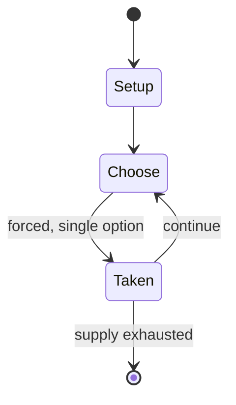

# SOS

*paper-and-pencil game*

`sos` &nbsp; state: **DEEPENED** &nbsp; method: **heuristic**

## Found layer (recorded, not trusted)

| field | value |
| --- | --- |
| wikidata | Q1087576 |
| wikipedia | SOS (paper-and-pencil game) |
| genres (source) | -- |
| instance of (source) | abstract strategy game, paper-and-pencil game |
| country of origin | -- |

## Declared layer (orders bench work)

| field | value |
| --- | --- |
| year created | -- |
| epoch | -- |
| region | -- |
| media | PAPER_AND_PENCIL |
| players | -- |
| age band | -- |
| exogenous process | NONE |
| loss shape | -- |
| live axes | ORDER, SPATIAL |
| horizon | -- |
| scoring shape | -- |
| information | PERFECT |
| interaction | SOLITAIRE |
| turn structure | STRICT_TURN |
| tractability | EXACT_WITH_CUT |
| randomness | NONE |
| luck factor | 0.02 |
| rules complexity | 2.33 |
| strategic depth | 2.4 |
| novelty | 0.746 |
| solved status | -- |
| strategies | -- |
| algorithms | -- |

## Object model

```
Episode
  players      : ?
  turn_structure: STRICT_TURN
  horizon       : ?
  scoring       : ?

Sequence       -- the permutation under the player's control
Placement      -- position subject to geometric legality
```

## State transition diagram



## Research item -- turn trace

```
# SOS -- simulated turn events
# generated from the DECLARED vector, not from a rulebook.
# structure: exo=NONE loss=None horizon=None scoring=None axes=ORDER,SPATIAL

t=0    SETUP        players=2  pot=0  capacity=3
t=1    FORCED       p1 single legal option taken (pot_gain=+1.4)
t=2    FORCED       p1 single legal option taken (pot_gain=+0.8)
t=3    FORCED       p1 single legal option taken (pot_gain=+1.7)
t=4    SPATIAL      p1 places at (1,7); adjacency legal
t=5    FORCED       p1 single legal option taken (pot_gain=+0.6)
t=6    FORCED       p1 single legal option taken (pot_gain=+1.2)
t=7    SPATIAL      p1 places at (2,2); adjacency legal
t=8    FORCED       p1 single legal option taken (pot_gain=+1.2)
t=9    SPATIAL      p1 places at (6,7); adjacency legal
t=10   FORCED       p1 single legal option taken (pot_gain=+1.5)
t=11   SPATIAL      p1 places at (3,1); adjacency legal
t=12   FORCED       p1 single legal option taken (pot_gain=+0.9)
t=13   SPATIAL      p1 places at (7,1); adjacency legal
t=14   FORCED       p1 single legal option taken (pot_gain=+1.0)
t=15   SPATIAL      p1 places at (1,0); adjacency legal
t=16   FORCED       p1 single legal option taken (pot_gain=+1.3)
t=17   FORCED       p1 single legal option taken (pot_gain=+0.6)
t=18   FORCED       p1 single legal option taken (pot_gain=+1.1)
t=19   FORCED       p1 single legal option taken (pot_gain=+1.7)
t=20   SPATIAL      p1 places at (0,5); adjacency legal
t=21   FORCED       p1 single legal option taken (pot_gain=+2.0)
t=22   SPATIAL      p1 places at (1,5); adjacency legal
t=23   FORCED       p1 single legal option taken (pot_gain=+0.6)
t=24   ENDTURN      turn passes to p2
t=25   FORCED       p2 single legal option taken (pot_gain=+1.3)
t=26   SPATIAL      p2 places at (2,1); adjacency legal
t=27   ENDTURN      turn passes to p1

terminal: VARIABLE
```

## Conditions

| kind | threshold | effect | trigger |
| --- | --- | --- | --- |
| WIN | -- | -- | The game can also be played where the player who creates an SOS is the winner and if no SOSs are created the game is a draw. |
| BOUNDARY | -- | -- | Before play begins, a square grid of at least 3×3 squares in size is drawn. |

## Source extract

SOS is a paper and pencil game for two or more players. It is similar to tic-tac-toe and dots
and boxes. SOS is a combinatorial game when played with two players. In terms of game theory, it
is a zero-sum, sequential game with perfect information.   == Gameplay == Before play begins, a
square grid of at least 3×3 squares in size is drawn. Players take turns to add either an "S" or
an "O" to any square, with no requirement to use the same letter each turn. The object of the
game is for each player to attempt to create the straight sequence S-O-S among connected squares
(either diagonally, horizontally, or vertically), and to create as many such sequences as they
can. If a player succeeds in creating an SOS, that player immediately takes another turn, and
continues to do so until no SOS can be created on their turn. Otherwise turns alternate between
players after each move. Keeping track of who made which SOSs can be done by, e.g., one player
circling their SOSs and the other player drawing a line through theirs. Once the grid has been
filled up, the winner is the player who made the most SOSs. If the grid is filled up and the
number of SOSs for each player is the same, then the game

<sub>Wikipedia, CC BY-SA. Retained as evidence for the structural
classification above. Every rule inferred from it is HYPOTHESIZED
until audited against a rulebook.</sub>
