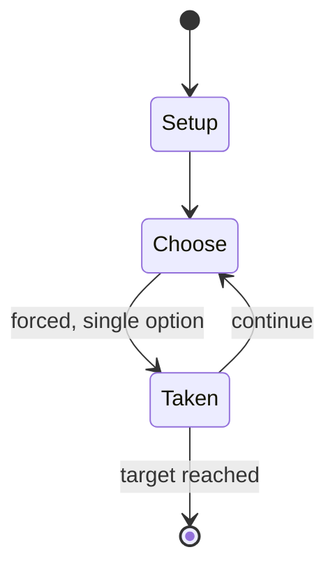

# Space Opera

*tabletop role-playing game*

`space_opera` &nbsp; state: **DEEPENED** &nbsp; method: **heuristic**

## Found layer (recorded, not trusted)

| field | value |
| --- | --- |
| wikidata | Q1042462 |
| wikipedia | Space Opera (role-playing game) |
| genres (source) | tabletop role-playing game |
| instance of (source) | tabletop role-playing game |
| country of origin | United States |

## Declared layer (orders bench work)

| field | value |
| --- | --- |
| year created | 1988 |
| epoch | DIGITAL |
| region | NORTH_AMERICA |
| media | RPG |
| players | -- |
| age band | -- |
| exogenous process | -- |
| loss shape | -- |
| live axes | ALLOCATE |
| horizon | RACE_TO_TARGET |
| scoring shape | RACE_POSITION |
| information | -- |
| interaction | -- |
| turn structure | -- |
| tractability | SAMPLING_ONLY |
| randomness | -- |
| luck factor | 0.35 |
| rules complexity | 4.3 |
| strategic depth | 2.0 |
| novelty | 0.6418 |
| solved status | -- |
| strategies | -- |
| algorithms | -- |

## Object model

```
Episode
  players      : ?
  turn_structure: ?
  horizon       : RACE_TO_TARGET
  scoring       : RACE_POSITION

Character      -- persistent stat block owned by a player
GameMaster     -- adjudicating agent outside the scoring loop
Scenario       -- authored state the players traverse
ResourcePool   -- divisible capacity committed across slots
```

## State transition diagram



## Research item -- turn trace

```
# Space Opera -- simulated turn events
# generated from the DECLARED vector, not from a rulebook.
# structure: exo=None loss=None horizon=RACE_TO_TARGET scoring=RACE_POSITION axes=ALLOCATE

t=0    SETUP        players=2  pot=0  capacity=8
t=1    FORCED       p1 single legal option taken (pot_gain=+1.0)
t=2    FORCED       p1 single legal option taken (pot_gain=+1.5)
t=3    ALLOCATE     p1 commits 3 of 5 capacity across 2 slots
t=4    ENDTURN      turn passes to p2
t=5    FORCED       p2 single legal option taken (pot_gain=+1.5)
t=6    ALLOCATE     p2 commits 3 of 5 capacity across 2 slots
t=7    FORCED       p2 single legal option taken (pot_gain=+1.2)
t=8    ALLOCATE     p2 commits 1 of 5 capacity across 4 slots
t=9    FORCED       p2 single legal option taken (pot_gain=+1.3)
t=10   ALLOCATE     p2 commits 2 of 5 capacity across 2 slots
t=11   FORCED       p2 single legal option taken (pot_gain=+0.8)
t=12   ENDTURN      turn passes to p1
t=13   FORCED       p1 single legal option taken (pot_gain=+1.6)
t=14   FORCED       p1 single legal option taken (pot_gain=+1.3)
t=15   FORCED       p1 single legal option taken (pot_gain=+1.3)
t=16   FORCED       p1 single legal option taken (pot_gain=+1.9)
t=17   FORCED       p1 single legal option taken (pot_gain=+1.1)
t=18   ALLOCATE     p1 commits 1 of 5 capacity across 3 slots
t=19   ENDTURN      turn passes to p2
t=20   FORCED       p2 single legal option taken (pot_gain=+1.7)
t=21   FORCED       p2 single legal option taken (pot_gain=+0.7)
t=22   FORCED       p2 single legal option taken (pot_gain=+1.0)
t=23   FORCED       p2 single legal option taken (pot_gain=+1.7)
t=24   ALLOCATE     p2 commits 3 of 5 capacity across 4 slots
t=25   FORCED       p2 single legal option taken (pot_gain=+1.5)
t=26   FORCED       p2 single legal option taken (pot_gain=+1.0)

terminal: RACE_TO_TARGET
```

## Conditions

| kind | threshold | effect | trigger |
| --- | --- | --- | --- |
| PENALTY | -- | -- | These are Physique, Strength, Constitution, Agility, Dexterity, Empathy, Intelligence, Psionics, Intuition, Bravery, Leadership, General Technical Aptitude (GTA), Mechanical Aptitude, and Electronics Aptitude. |

## Source extract

Space Opera is a science-fiction role-playing game created by Edward E. Simbalist, A. Mark
Ratner, and Phil McGregor in 1980 for Fantasy Games Unlimited (FGU). While the game's system can
be used to create any science fiction genre, Space Opera has a default setting focused on
creating space opera themed adventures.   == Development == According to the Scott Bizar, the
founder of FGU, "I wanted a SF rpg and I gave the job to Ed Simbalist. During the process I’ve
never met Ed, nor Phil McGregor and Mark Ratner, who lived in the Canadian west, Australia and
the east of the USA, respectively. The project was completed over more than two years entirely
by correspondence." Simbalist was responsible for all the editing and coordination. Phil
McGregor sent some technology and space ship related stuff which Simbalist liked so much that he
incorporated it in the finished product. While the background universe was based on Mark
Ratner's Space Marines, Ratner had little input into Space Opera itself.  Part of the Volume One
introduction by Bizar describes this undertaking:  The original concept was to create a game
that would not need the usual innumerable supplements to its rules but that wo

<sub>Wikipedia, CC BY-SA. Retained as evidence for the structural
classification above. Every rule inferred from it is HYPOTHESIZED
until audited against a rulebook.</sub>
