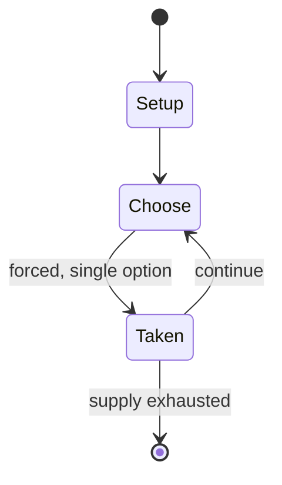

# SpaceEngine

*3D universe simulator written in OpenGL*

`spaceengine` &nbsp; state: **DEEPENED** &nbsp; method: **heuristic**

## Found layer (recorded, not trusted)

| field | value |
| --- | --- |
| wikidata | Q1503177 |
| wikipedia | SpaceEngine |
| genres (source) | simulation video game |
| instance of (source) | video game |
| country of origin | Russia |

## Declared layer (orders bench work)

| field | value |
| --- | --- |
| year created | 2010 |
| epoch | CONTEMPORARY |
| region | EUROPE_EAST |
| media | VIDEO |
| players | -- |
| age band | -- |
| exogenous process | -- |
| loss shape | -- |
| live axes | - |
| horizon | -- |
| scoring shape | -- |
| information | -- |
| interaction | -- |
| turn structure | -- |
| tractability | SAMPLING_ONLY |
| randomness | PROCEDURAL_GENERATION |
| luck factor | 0.3 |
| rules complexity | 1.71 |
| strategic depth | 2.0 |
| novelty | 0.0896 |
| solved status | -- |
| strategies | -- |
| algorithms | -- |

## Object model

```
Episode
  players      : ?
  turn_structure: ?
  horizon       : ?
  scoring       : ?

WorldState     -- simulation state advanced by the engine
Avatar         -- player-controlled agent
Clock          -- frame or tick counter
```

## State transition diagram



## Research item -- turn trace

```
# SpaceEngine -- simulated turn events
# generated from the DECLARED vector, not from a rulebook.
# structure: exo=None loss=None horizon=None scoring=None axes=-

t=0    SETUP        players=2  pot=0  capacity=3
t=1    FORCED       p1 single legal option taken (pot_gain=+1.9)
t=2    FORCED       p1 single legal option taken (pot_gain=+0.6)
t=3    FORCED       p1 single legal option taken (pot_gain=+0.6)
t=4    FORCED       p1 single legal option taken (pot_gain=+1.7)
t=5    FORCED       p1 single legal option taken (pot_gain=+1.6)
t=6    ENDTURN      turn passes to p2
t=7    FORCED       p2 single legal option taken (pot_gain=+1.0)
t=8    FORCED       p2 single legal option taken (pot_gain=+0.6)
t=9    FORCED       p2 single legal option taken (pot_gain=+1.8)
t=10   ENDTURN      turn passes to p1
t=11   FORCED       p1 single legal option taken (pot_gain=+1.6)
t=12   FORCED       p1 single legal option taken (pot_gain=+1.6)
t=13   FORCED       p1 single legal option taken (pot_gain=+1.4)
t=14   FORCED       p1 single legal option taken (pot_gain=+1.4)
t=15   FORCED       p1 single legal option taken (pot_gain=+2.0)
t=16   FORCED       p1 single legal option taken (pot_gain=+1.4)
t=17   FORCED       p1 single legal option taken (pot_gain=+0.6)
t=18   FORCED       p1 single legal option taken (pot_gain=+1.2)
t=19   FORCED       p1 single legal option taken (pot_gain=+0.6)
t=20   FORCED       p1 single legal option taken (pot_gain=+1.6)
t=21   ENDTURN      turn passes to p2
t=22   FORCED       p2 single legal option taken (pot_gain=+0.6)
t=23   FORCED       p2 single legal option taken (pot_gain=+1.5)
t=24   ENDTURN      turn passes to p1
t=25   FORCED       p1 single legal option taken (pot_gain=+0.7)
t=26   FORCED       p1 single legal option taken (pot_gain=+1.8)

terminal: VARIABLE
```

## Source extract

SpaceEngine is an interactive 3D planetarium and astronomy software initially developed by
Russian astronomer and programmer Vladimir Romanyuk and released in June 2010. Romanyuk and the
SpaceEngine team later founded the American game studio Cosmographic Software in Connecticut in
February 2022 to continue development. SpaceEngine creates a 1:1 scale three-dimensional
planetarium representing the entire observable universe, combining real astronomical data with
scientifically accurate procedural generation algorithms. Users can travel through space in any
direction or at any speed and can move forwards or backwards in time. SpaceEngine is currently
in beta status. Up to version 0.9.8.0E, released in August 2017, it was available as freeware
for Microsoft Windows. Version 0.990 beta, the first paid edition, was released on Steam in June
2019. The program fully supports VR headsets. Properties of objects, such as temperature, mass,
radius, and spectrum, are presented on the HUD and in an accessible information window. Users
can observe a wide range of celestial objects, from small asteroids and moons to large galaxy
clusters, similar to other simulators like Celestia, OpenSpace, Gai

<sub>Wikipedia, CC BY-SA. Retained as evidence for the structural
classification above. Every rule inferred from it is HYPOTHESIZED
until audited against a rulebook.</sub>
