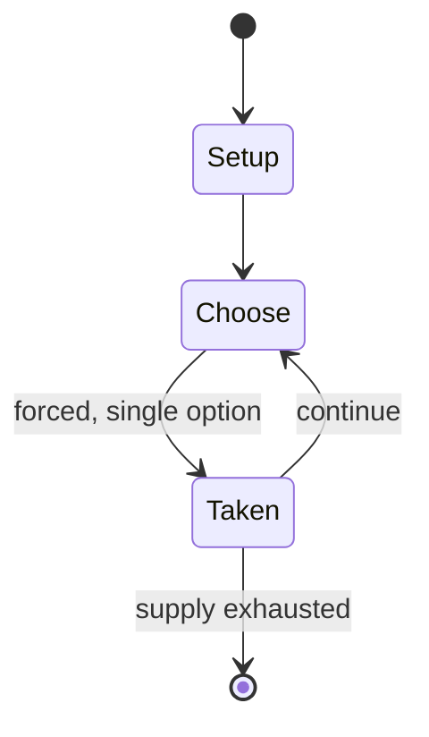

# Spellfire

*collectible card game*

`spellfire` &nbsp; state: **DEEPENED** &nbsp; method: **heuristic**

## Found layer (recorded, not trusted)

| field | value |
| --- | --- |
| wikidata | Q1759218 |
| wikipedia | Spellfire |
| genres (source) | -- |
| instance of (source) | collectible card game |
| country of origin | -- |

## Declared layer (orders bench work)

| field | value |
| --- | --- |
| year created | 1997 |
| epoch | DIGITAL |
| region | -- |
| media | CARD, COLLECTIBLE |
| players | -- |
| age band | -- |
| exogenous process | -- |
| loss shape | -- |
| live axes | TRADE |
| horizon | -- |
| scoring shape | -- |
| information | -- |
| interaction | COMPETITIVE |
| turn structure | -- |
| tractability | SAMPLING_ONLY |
| randomness | -- |
| luck factor | 0.35 |
| rules complexity | 2.52 |
| strategic depth | 2.0 |
| novelty | 0.3499 |
| solved status | -- |
| strategies | -- |
| algorithms | -- |

## Object model

```
Episode
  players      : ?
  turn_structure: ?
  horizon       : ?
  scoring       : ?

Deck           -- ordered multiset, drawn without replacement
Hand           -- private multiset held by one player
DiscardPile    -- public accumulation of spent cards
Offer          -- proposed exchange between two agents
```

## State transition diagram



## Research item -- turn trace

```
# Spellfire -- simulated turn events
# generated from the DECLARED vector, not from a rulebook.
# structure: exo=None loss=None horizon=None scoring=None axes=TRADE

t=0    SETUP        players=2  pot=0  capacity=5
t=1    FORCED       p1 single legal option taken (pot_gain=+1.4)
t=2    FORCED       p1 single legal option taken (pot_gain=+1.0)
t=3    FORCED       p1 single legal option taken (pot_gain=+1.8)
t=4    FORCED       p1 single legal option taken (pot_gain=+1.7)
t=5    TRADE        p1 offers 2:1 exchange to p2
t=6    FORCED       p1 single legal option taken (pot_gain=+1.8)
t=7    FORCED       p1 single legal option taken (pot_gain=+0.7)
t=8    TRADE        p1 offers 2:1 exchange to p2
t=9    FORCED       p1 single legal option taken (pot_gain=+0.9)
t=10   TRADE        p1 offers 2:1 exchange to p2
t=11   FORCED       p1 single legal option taken (pot_gain=+1.7)
t=12   TRADE        p1 offers 2:1 exchange to p2
t=13   FORCED       p1 single legal option taken (pot_gain=+1.9)
t=14   TRADE        p1 offers 2:1 exchange to p2
t=15   FORCED       p1 single legal option taken (pot_gain=+0.9)
t=16   TRADE        p1 offers 2:1 exchange to p2
t=17   FORCED       p1 single legal option taken (pot_gain=+2.0)
t=18   FORCED       p1 single legal option taken (pot_gain=+0.9)
t=19   TRADE        p1 offers 2:1 exchange to p2
t=20   FORCED       p1 single legal option taken (pot_gain=+0.5)
t=21   TRADE        p1 offers 2:1 exchange to p2
t=22   FORCED       p1 single legal option taken (pot_gain=+1.6)
t=23   FORCED       p1 single legal option taken (pot_gain=+1.2)
t=24   TRADE        p1 offers 2:1 exchange to p2
t=25   FORCED       p1 single legal option taken (pot_gain=+1.0)
t=26   TRADE        p1 offers 2:1 exchange to p2

terminal: VARIABLE
```

## Source extract

Spellfire: Master the Magic is an out-of-print collectible card game (CCG) created by TSR, Inc.
and based on their popular Dungeons & Dragons role playing game. The game appeared first in
April 1994, shortly after the introduction of Magic: The Gathering, in the wake of the success
enjoyed by trading card games. It was the second CCG to be released, preceding Wizards of the
Coast's second CCG Jyhad by two months. More than one dozen expansions for the game were
released, and the final expansion was released in October 1997.   == History == After the
successful launch of Wizards of the Coast's Magic: The Gathering card game in 1993, TSR entered
the fledgling CCG market with their take on a fantasy-themed card game in June 1994. Spellfire
was designed by Steve Winter, Jim Ward, Dave Cook, and Tim Brown. Spellfire used characters,
locations, magic items, artifacts, monsters, events, and spells from the intellectual properties
of TSR's Dungeons & Dragons gaming worlds. However, it faced criticism immediately after
release. One concern was TSR's use of artwork on Spellfire cards that had already been used on
TSR's products like AD&D and Dragon Magazine. Another source of debate was Spel

<sub>Wikipedia, CC BY-SA. Retained as evidence for the structural
classification above. Every rule inferred from it is HYPOTHESIZED
until audited against a rulebook.</sub>
