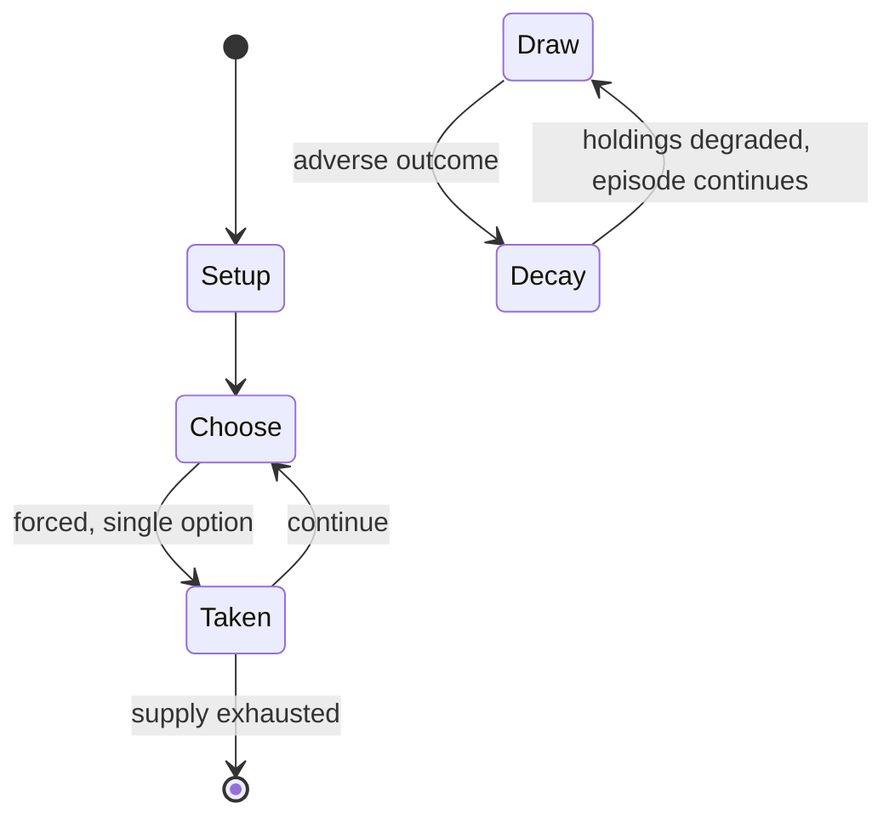

# Spider fighting

`spider_fighting` &nbsp; state: **DEEPENED** &nbsp; method: **heuristic**

## Found layer (recorded, not trusted)

| field | value |
| --- | --- |
| wikidata | Q7577058 |
| wikipedia | Spider fighting |
| genres (source) | -- |
| instance of (source) | -- |
| country of origin | -- |

## Declared layer (orders bench work)

| field | value |
| --- | --- |
| year created | -- |
| epoch | -- |
| region | -- |
| media | SPORT |
| players | -- |
| age band | -- |
| exogenous process | -- |
| loss shape | PARTIAL_DECAY |
| live axes | - |
| horizon | -- |
| scoring shape | -- |
| information | -- |
| interaction | -- |
| turn structure | -- |
| tractability | SAMPLING_ONLY |
| randomness | -- |
| luck factor | 0.35 |
| rules complexity | 1.71 |
| strategic depth | 2.0 |
| novelty | 0.4733 |
| solved status | -- |
| strategies | -- |
| algorithms | -- |

## Object model

```
Episode
  players      : ?
  turn_structure: ?
  horizon       : ?
  scoring       : ?

Pitch          -- bounded physical region
Player         -- embodied agent with a foul count
Clock          -- counts down; stoppages are rule events
Official       -- detects infractions and applies penalties
```

## State transition diagram



## Research item -- turn trace

```
# Spider fighting -- simulated turn events
# generated from the DECLARED vector, not from a rulebook.
# structure: exo=None loss=PARTIAL_DECAY horizon=None scoring=None axes=-

t=0    SETUP        players=2  pot=0  capacity=5
t=1    FORCED       p1 single legal option taken (pot_gain=+0.9)
t=2    FORCED       p1 single legal option taken (pot_gain=+1.9)
t=3    FORCED       p1 single legal option taken (pot_gain=+1.4)
t=4    ENDTURN      turn passes to p2
t=5    FORCED       p2 single legal option taken (pot_gain=+0.6)
t=6    FORCED       p2 single legal option taken (pot_gain=+0.7)
t=7    ENDTURN      turn passes to p1
t=8    FORCED       p1 single legal option taken (pot_gain=+1.1)
t=9    FORCED       p1 single legal option taken (pot_gain=+1.1)
t=10   FORCED       p1 single legal option taken (pot_gain=+1.9)
t=11   ENDTURN      turn passes to p2
t=12   FORCED       p2 single legal option taken (pot_gain=+1.6)
t=13   FORCED       p2 single legal option taken (pot_gain=+0.7)
t=14   FORCED       p2 single legal option taken (pot_gain=+1.9)
t=15   ENDTURN      turn passes to p1
t=16   FORCED       p1 single legal option taken (pot_gain=+1.5)
t=17   ENDTURN      turn passes to p2
t=18   FORCED       p2 single legal option taken (pot_gain=+0.9)
t=19   FORCED       p2 single legal option taken (pot_gain=+1.3)
t=20   FORCED       p2 single legal option taken (pot_gain=+0.7)
t=21   FORCED       p2 single legal option taken (pot_gain=+1.2)
t=22   ENDTURN      turn passes to p1
t=23   FORCED       p1 single legal option taken (pot_gain=+1.1)
t=24   FORCED       p1 single legal option taken (pot_gain=+1.4)
t=25   FORCED       p1 single legal option taken (pot_gain=+1.8)
t=26   FORCED       p1 single legal option taken (pot_gain=+1.0)

terminal: VARIABLE
```

## Source extract

Spider fighting or spider derby is a sport involving spiders that occurs in different forms in
several areas of the world. Among them are the Philippines, Japan, Singapore and Malaysia. The
fights that occur in the Philippines and in Japan are staged between females of various species
of web weavers. Female spiders will kill a rival if the loser does not quickly flee or receive
the aid of a human handler. The contests that are staged in Malaysia and Singapore are fights
between male jumping spiders. The males fight only for dominance, and ordinarily the loser will
flee, though sometimes they will lose a leg in the fight. In the Philippines, spider fighting
(Hiligaynon: paupas sang damang; Cebuano: paaway kaka or sabong sa kaka) is staged between
female orb-weavers from the genus Neoscona.  In Japan, the contests occur at an annual festival
and use females of the genus Argiope. In Japanese these contests are called Kumo Gassen (spider
battles). In Malaysia, they use males of the genus Thiania - most commonly the species Thiania
bhamoensis - although another species of that genus may sometimes be used. Like cockfighting,
spider fighting is a sport that usually involves betting and ev

<sub>Wikipedia, CC BY-SA. Retained as evidence for the structural
classification above. Every rule inferred from it is HYPOTHESIZED
until audited against a rulebook.</sub>
