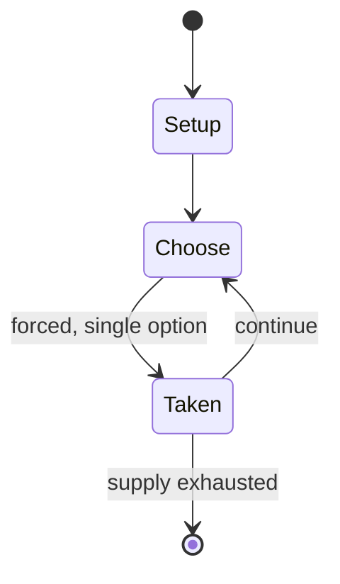

# Spirit of 76

*Pinball game designed by Ed Krynski*

`spirit_of_76` &nbsp; state: **DEEPENED** &nbsp; method: **heuristic**

## Found layer (recorded, not trusted)

| field | value |
| --- | --- |
| wikidata | Q20874688 |
| wikipedia | Spirit of 76 (pinball) |
| genres (source) | -- |
| instance of (source) | video game |
| country of origin | -- |

## Declared layer (orders bench work)

| field | value |
| --- | --- |
| year created | 1975 |
| epoch | DIGITAL |
| region | -- |
| media | VIDEO, WORD |
| players | -- |
| age band | -- |
| exogenous process | -- |
| loss shape | -- |
| live axes | - |
| horizon | -- |
| scoring shape | -- |
| information | -- |
| interaction | COMPETITIVE |
| turn structure | -- |
| tractability | SAMPLING_ONLY |
| randomness | -- |
| luck factor | 0.35 |
| rules complexity | 1.76 |
| strategic depth | 2.0 |
| novelty | 0.3553 |
| solved status | -- |
| strategies | -- |
| algorithms | -- |

## Object model

```
Episode
  players      : ?
  turn_structure: ?
  horizon       : ?
  scoring       : ?

WorldState     -- simulation state advanced by the engine
Avatar         -- player-controlled agent
Clock          -- frame or tick counter
```

## State transition diagram



## Research item -- turn trace

```
# Spirit of 76 -- simulated turn events
# generated from the DECLARED vector, not from a rulebook.
# structure: exo=None loss=None horizon=None scoring=None axes=-

t=0    SETUP        players=2  pot=0  capacity=4
t=1    FORCED       p1 single legal option taken (pot_gain=+1.8)
t=2    ENDTURN      turn passes to p2
t=3    FORCED       p2 single legal option taken (pot_gain=+0.9)
t=4    FORCED       p2 single legal option taken (pot_gain=+1.0)
t=5    FORCED       p2 single legal option taken (pot_gain=+0.6)
t=6    FORCED       p2 single legal option taken (pot_gain=+1.5)
t=7    FORCED       p2 single legal option taken (pot_gain=+1.2)
t=8    FORCED       p2 single legal option taken (pot_gain=+1.9)
t=9    ENDTURN      turn passes to p1
t=10   FORCED       p1 single legal option taken (pot_gain=+1.8)
t=11   FORCED       p1 single legal option taken (pot_gain=+0.8)
t=12   ENDTURN      turn passes to p2
t=13   FORCED       p2 single legal option taken (pot_gain=+1.2)
t=14   FORCED       p2 single legal option taken (pot_gain=+1.7)
t=15   FORCED       p2 single legal option taken (pot_gain=+1.1)
t=16   FORCED       p2 single legal option taken (pot_gain=+0.8)
t=17   FORCED       p2 single legal option taken (pot_gain=+0.6)
t=18   FORCED       p2 single legal option taken (pot_gain=+1.5)
t=19   FORCED       p2 single legal option taken (pot_gain=+1.0)
t=20   FORCED       p2 single legal option taken (pot_gain=+1.1)
t=21   FORCED       p2 single legal option taken (pot_gain=+1.4)
t=22   FORCED       p2 single legal option taken (pot_gain=+0.7)
t=23   FORCED       p2 single legal option taken (pot_gain=+1.7)
t=24   FORCED       p2 single legal option taken (pot_gain=+0.5)
t=25   ENDTURN      turn passes to p1
t=26   FORCED       p1 single legal option taken (pot_gain=+1.4)
t=27   ENDTURN      turn passes to p2

terminal: VARIABLE
```

## Source extract

Spirit of 76 is a pinball game designed by Ed Krynski and Wayne Neyens and released in 1975 by
Gottlieb. It is the last game designed by Wayne Neyens. The pinball machine should not be
confused with the pinball machine The Spirit of '76 by Mirco Games, Inc. Two other versions of
this pinball machine were released in 1976: Pioneer - a two-player version and New York - a
special 2-player Add-a-ball version in celebration of the 1976 lifting of the ban of pinball in
New York City.   == Design == The pinball game Spirit of 76 was made to celebrate the 200th
birthday of the United States. Competing manufacturers made similar machines, with Williams
releasing Liberty Bell, and Bally releasing Freedom. One of the designers, Wayne Neyens,
received the 10,000th machine; due to the serial numbering starting at 3,001, this game had the
serial number 13,000. This was later donated to the Pacific Pinball Museum. The artwork uses
predominantly red, white and blue, with stars throughout the game. The backbox includes an
astronaut (representing John Glenn), Gemini and Apollo spacecraft, Spirit of St. Louis, a
frontierman (bearing a strong resemblance to Daniel Boone), two drummers and a fifer. Min

<sub>Wikipedia, CC BY-SA. Retained as evidence for the structural
classification above. Every rule inferred from it is HYPOTHESIZED
until audited against a rulebook.</sub>
