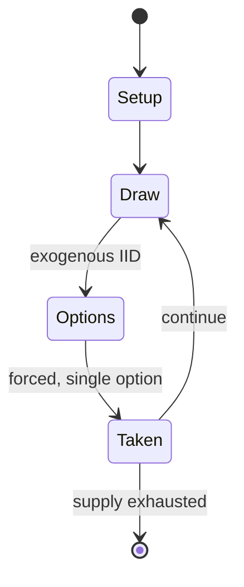

# Splendor (game)

`splendor_game` &nbsp; state: **DEEPENED** &nbsp; method: **heuristic**

## Found layer (recorded, not trusted)

| field | value |
| --- | --- |
| wikidata | Q20037103 |
| wikipedia | Splendor (game) |
| genres (source) | -- |
| instance of (source) | -- |
| country of origin | -- |

## Declared layer (orders bench work)

| field | value |
| --- | --- |
| year created | 2014 |
| epoch | CONTEMPORARY |
| region | -- |
| media | BOARD, CARD, TILE |
| players | -- |
| age band | -- |
| exogenous process | IID |
| loss shape | -- |
| live axes | TRADE |
| horizon | -- |
| scoring shape | LINEAR_ACCUMULATION |
| information | -- |
| interaction | COMPETITIVE |
| turn structure | -- |
| tractability | SAMPLING_ONLY |
| randomness | DICE |
| luck factor | 0.35 |
| rules complexity | 2.26 |
| strategic depth | 2.25 |
| novelty | 0.5345 |
| solved status | -- |
| strategies | engine_building |
| algorithms | -- |

## Object model

```
Episode
  players      : ?
  turn_structure: ?
  horizon       : ?
  scoring       : LINEAR_ACCUMULATION

Board          -- spatial substrate; cells carry position and occupancy
Piece          -- movable token owned by a player
Deck           -- ordered multiset, drawn without replacement
Hand           -- private multiset held by one player
DiscardPile    -- public accumulation of spent cards
TileBag        -- unordered draw source
Layout         -- placed tiles and their adjacencies
Offer          -- proposed exchange between two agents
```

## State transition diagram



## Research item -- turn trace

```
# Splendor (game) -- simulated turn events
# generated from the DECLARED vector, not from a rulebook.
# structure: exo=IID loss=None horizon=None scoring=LINEAR_ACCUMULATION axes=TRADE

t=0    SETUP        players=2  pot=0  capacity=3
t=1    DRAW         p1 roll from d6 pool -> outcome #5  (p=0.017)
t=2    FORCED       p1 single legal option taken (pot_gain=+0.6)
t=3    DRAW         p1 roll from d6 pool -> outcome #2  (p=0.161)
t=4    FORCED       p1 single legal option taken (pot_gain=+1.7)
t=5    DRAW         p1 roll from d6 pool -> outcome #5  (p=0.176)
t=6    FORCED       p1 single legal option taken (pot_gain=+1.6)
t=7    TRADE        p1 offers 2:1 exchange to p2
t=8    DRAW         p1 roll from d6 pool -> outcome #1  (p=0.064)
t=9    FORCED       p1 single legal option taken (pot_gain=+1.9)
t=10   TRADE        p1 offers 2:1 exchange to p2
t=11   DRAW         p1 roll from d6 pool -> outcome #6  (p=0.182)
t=12   FORCED       p1 single legal option taken (pot_gain=+0.8)
t=13   DRAW         p1 roll from d6 pool -> outcome #1  (p=0.176)
t=14   FORCED       p1 single legal option taken (pot_gain=+1.2)
t=15   DRAW         p1 roll from d6 pool -> outcome #1  (p=0.129)
t=16   FORCED       p1 single legal option taken (pot_gain=+1.8)
t=17   TRADE        p1 offers 2:1 exchange to p2
t=18   DRAW         p1 roll from d6 pool -> outcome #6  (p=0.253)
t=19   FORCED       p1 single legal option taken (pot_gain=+1.0)
t=20   TRADE        p1 offers 2:1 exchange to p2
t=21   DRAW         p1 roll from d6 pool -> outcome #4  (p=0.127)
t=22   FORCED       p1 single legal option taken (pot_gain=+1.4)
t=23   TRADE        p1 offers 2:1 exchange to p2
t=24   ENDTURN      turn passes to p2
t=25   DRAW         p2 roll from d6 pool -> outcome #1  (p=0.074)
t=26   FORCED       p2 single legal option taken (pot_gain=+1.8)
t=27   TRADE        p2 offers 2:1 exchange to p1

terminal: VARIABLE
```

## Conditions

| kind | threshold | effect | trigger |
| --- | --- | --- | --- |
| BOUNDARY | 4 tokens | -- | Take two gem tokens of the same color from the pool (provided, before the turn, there are at least four tokens left of that color). |
| TERMINATE | -- | -- | Once this occurs, the game ends. |
| TERMINATE | -- | -- | Once the game ends, whoever has the most prestige points wins; in case of a tie, whoever purchased the fewest development cards wins. |

## Source extract

Splendor is a multiplayer card-based board game, designed by Marc André and illustrated by
Pascal Quidault. It was published in 2014 by Space Cowboys (Asmodee). Players are gem merchants
of the Renaissance, developing gem mines, transportation, and shops to accumulate prestige
points. Splendor received positive reviews and received numerous awards, including winner of
Golden Geek Best Family Board Game. It was nominated for the Spiel des Jahres Game of the Year
in 2014. The game also received a mobile application and an expansion released in 2017.   ==
Gameplay == Splendor is an engine-building and resource management game in which two to four
players compete to collect the most prestige points. The game has the following components:  40
gem tokens - seven each of emerald, sapphire, ruby, diamond, onyx, and five gold (wild). These
are represented by poker-style chips. 90 development cards 10 noble tiles Each development card
falls into one of three levels (•, ••, •••) indicating the difficulty to purchase that card.
Every development card also contains a gem bonus (emerald, sapphire, ruby, diamond, or onyx),
which may be used for future development card purchases. Before the game b

<sub>Wikipedia, CC BY-SA. Retained as evidence for the structural
classification above. Every rule inferred from it is HYPOTHESIZED
until audited against a rulebook.</sub>
