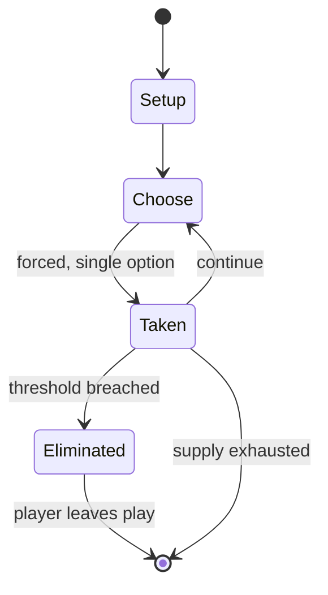

# spoof

*guessing game played with coins*

`spoof` &nbsp; state: **DEEPENED** &nbsp; method: **heuristic**

## Found layer (recorded, not trusted)

| field | value |
| --- | --- |
| wikidata | Q7579069 |
| wikipedia | Spoof (game) |
| genres (source) | -- |
| instance of (source) | party game |
| country of origin | -- |

## Declared layer (orders bench work)

| field | value |
| --- | --- |
| year created | -- |
| epoch | -- |
| region | -- |
| media | GAMBLING, PARTY |
| players | -- |
| age band | -- |
| exogenous process | -- |
| loss shape | ELIMINATION |
| live axes | - |
| horizon | VARIABLE |
| scoring shape | -- |
| information | -- |
| interaction | COMPETITIVE |
| turn structure | -- |
| tractability | SAMPLING_ONLY |
| randomness | DICE |
| luck factor | 0.35 |
| rules complexity | 1.82 |
| strategic depth | 2.0 |
| novelty | 0.5892 |
| solved status | -- |
| strategies | -- |
| algorithms | -- |

## Object model

```
Episode
  players      : ?
  turn_structure: ?
  horizon       : VARIABLE
  scoring       : ?

State          -- opaque; no medium or axis evidence was found
Player         -- an agent that selects among legal successors
```

## State transition diagram



## Research item -- turn trace

```
# spoof -- simulated turn events
# generated from the DECLARED vector, not from a rulebook.
# structure: exo=None loss=ELIMINATION horizon=VARIABLE scoring=None axes=-

t=0    SETUP        players=2  pot=0  capacity=5
t=1    FORCED       p1 single legal option taken (pot_gain=+1.1)
t=2    FORCED       p1 single legal option taken (pot_gain=+1.1)
t=3    FORCED       p1 single legal option taken (pot_gain=+1.1)
t=4    ENDTURN      turn passes to p2
t=5    FORCED       p2 single legal option taken (pot_gain=+1.2)
t=6    ENDTURN      turn passes to p1
t=7    FORCED       p1 single legal option taken (pot_gain=+1.8)
t=8    FORCED       p1 single legal option taken (pot_gain=+1.5)
t=9    FORCED       p1 single legal option taken (pot_gain=+1.3)
t=10   FORCED       p1 single legal option taken (pot_gain=+1.8)
t=11   FORCED       p1 single legal option taken (pot_gain=+1.6)
t=12   FORCED       p1 single legal option taken (pot_gain=+1.3)
t=13   FORCED       p1 single legal option taken (pot_gain=+0.8)
t=14   FORCED       p1 single legal option taken (pot_gain=+1.2)
t=15   FORCED       p1 single legal option taken (pot_gain=+1.6)
t=16   FORCED       p1 single legal option taken (pot_gain=+0.5)
t=17   FORCED       p1 single legal option taken (pot_gain=+0.6)
t=18   FORCED       p1 single legal option taken (pot_gain=+1.2)
t=19   FORCED       p1 single legal option taken (pot_gain=+1.5)
t=20   FORCED       p1 single legal option taken (pot_gain=+0.8)
t=21   ENDTURN      turn passes to p2
t=22   FORCED       p2 single legal option taken (pot_gain=+0.6)
t=23   FORCED       p2 single legal option taken (pot_gain=+1.0)
t=24   FORCED       p2 single legal option taken (pot_gain=+1.6)
t=25   ENDTURN      turn passes to p1
t=26   FORCED       p1 single legal option taken (pot_gain=+1.6)

terminal: VARIABLE
```

## Conditions

| kind | threshold | effect | trigger |
| --- | --- | --- | --- |
| BOUNDARY | 5 players | -- | Some variants also have a 'no bum shouts' or 'impossible call' rule whereby a player cannot call more than the total number of coins possible taking into account what they have in their hand (e.g. if there are 5 players  |
| ELIMINATE | -- | -- | Play continues until all players have been eliminated except for one, whereupon that last remaining player pays the stipulated stakes to each other player. |
| BOUNDARY | -- | -- | It was shown that for every n ≥ 1 this game is a "fair game", i.e. each player has a mixed strategy that guarantees their expected payout is at most zero to his or her opponent. |

## Source extract

Spoof is a strategy game, typically played as a gambling game, often in bars and pubs where the
loser buys the other participants a round of drinks. Each player conceals between zero and three
coins in their hand, then each makes a guess of the total held. The exact origin of the game is
unknown, but one scholarly paper addressed it, and more general n-coin games, in 1959.  It is an
example of a zero-sum game. The version with three coins is sometimes known under the name Three
Coin.   == Gameplay == Spoof is played by any number of players in a series of rounds.  In each
round the objective is to guess the aggregate number of coins held in concealment by all the
players, with each player being allowed to conceal up to three coins in their hand, without the
other players seeing the amount. (Some versions of the game may vary this number.) The coins may
be of any denomination, and the values of the coins are irrelevant: in fact, any suitable
objects could be used in place of coins, e.g. matches. For the first round an initial player is
selected in some fashion, such as spinning a burnt match to see who it points at. At the
beginning of every round each player conceals a quantity of

<sub>Wikipedia, CC BY-SA. Retained as evidence for the structural
classification above. Every rule inferred from it is HYPOTHESIZED
until audited against a rulebook.</sub>
