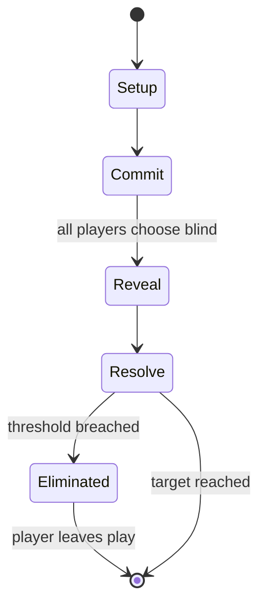

# Spoons (card game)

`spoons_card_game` &nbsp; state: **DEEPENED** &nbsp; method: **heuristic**

## Found layer (recorded, not trusted)

| field | value |
| --- | --- |
| wikidata | -- |
| wikipedia | Spoons (card game) |
| genres (source) | -- |
| instance of (source) | -- |
| country of origin | -- |

## Declared layer (orders bench work)

| field | value |
| --- | --- |
| year created | -- |
| epoch | -- |
| region | -- |
| media | CARD |
| players | 4 |
| age band | CHILD |
| exogenous process | DEPLETING_DECK |
| loss shape | ELIMINATION |
| live axes | BLUFF, DISCARD, TRADE |
| horizon | RACE_TO_TARGET |
| scoring shape | WINNER_TAKE_ALL |
| information | IMPERFECT |
| interaction | SOLITAIRE |
| turn structure | SIMULTANEOUS |
| tractability | SAMPLING_ONLY |
| randomness | DECK_SHUFFLE, DICE, HIDDEN_INFO, SIMULTANEOUS_CHOICE |
| luck factor | 0.81 |
| rules complexity | 3.21 |
| strategic depth | 2.0 |
| novelty | 0.7595 |
| solved status | -- |
| strategies | bluffing, spatial_packing |
| algorithms | -- |

## Object model

```
Episode
  players      : 4
  turn_structure: SIMULTANEOUS
  horizon       : RACE_TO_TARGET
  scoring       : WINNER_TAKE_ALL

Deck           -- ordered multiset, drawn without replacement
Hand           -- private multiset held by one player
DiscardPile    -- public accumulation of spent cards
Belief         -- what an observer is induced to think is true
DiscardChoice  -- what is given up to satisfy a limit
Offer          -- proposed exchange between two agents
```

## State transition diagram



## Research item -- turn trace

```
# Spoons (card game) -- simulated turn events
# generated from the DECLARED vector, not from a rulebook.
# structure: exo=DEPLETING_DECK loss=ELIMINATION horizon=RACE_TO_TARGET scoring=WINNER_TAKE_ALL axes=BLUFF,DISCARD,TRADE

t=0    SETUP        players=4  pot=0  capacity=3
t=1    DRAW         p1 draw from deck -> outcome #2  (p=0.295)
t=2    FORCED       p1 single legal option taken (pot_gain=+0.9)
t=3    DRAW         p1 draw from deck -> outcome #1  (p=0.056)
t=4    FORCED       p1 single legal option taken (pot_gain=+1.0)
t=5    DRAW         p1 draw from deck -> outcome #1  (p=0.025)
t=6    FORCED       p1 single legal option taken (pot_gain=+0.6)
t=7    BLUFF        p1 represents a holding it does not have
t=8    DRAW         p1 draw from deck -> outcome #6  (p=0.287)
t=9    FORCED       p1 single legal option taken (pot_gain=+0.6)
t=10   TRADE        p1 offers 2:1 exchange to p2
t=11   BLUFF        p1 represents a holding it does not have
t=12   DRAW         p1 draw from deck -> outcome #4  (p=0.004)
t=13   FORCED       p1 single legal option taken (pot_gain=+1.8)
t=14   ENDTURN      turn passes to p2
t=15   DRAW         p2 draw from deck -> outcome #2  (p=0.283)
t=16   FORCED       p2 single legal option taken (pot_gain=+0.8)
t=17   DRAW         p2 draw from deck -> outcome #6  (p=0.212)
t=18   FORCED       p2 single legal option taken (pot_gain=+1.8)
t=19   DISCARD      p2 discards to hand limit
t=20   DRAW         p2 draw from deck -> outcome #1  (p=0.267)
t=21   FORCED       p2 single legal option taken (pot_gain=+1.8)
t=22   DRAW         p2 draw from deck -> outcome #3  (p=0.068)
t=23   FORCED       p2 single legal option taken (pot_gain=+1.5)
t=24   TRADE        p2 offers 2:1 exchange to p3
t=25   DISCARD      p2 discards to hand limit
t=26   BLUFF        p2 represents a holding it does not have
t=27   ENDTURN      turn passes to p3

terminal: RACE_TO_TARGET
```

## Conditions

| kind | threshold | effect | trigger |
| --- | --- | --- | --- |
| ELIMINATE | 1 player | -- | Series: As its name implies, it is a series of games with one player eliminated each time, and the last player standing is the overall winner. |
| WIN | 13 cards | -- | Frey, the ancestor of pig was an old, four-player game called Vive l'Amour in which the aim was to be first to collect all 13 cards of one suit. |
| WIN | 4 cards | -- | The aim is to be first to collect a quartet, i.e. four cards of the same rank, known as a book. |
| ELIMINATE | -- | eliminated | Alternatively, whoever is assigned P-I-G is eliminated from the game so that the last player standing is the overall winner. |
| ELIMINATE | -- | eliminated | The player who gets S-P-O-O-N-S is eliminated from the game, and the game continues. |
| ELIMINATE | -- | -- | This may distract the others or even cause players to grab a spoon prematurely which may result in their elimination. |
| ELIMINATE | -- | -- | Musical chairs – elimination game involving players, chairs and music |
| WIN | -- | -- | Pig is first recorded in 1911 where it is called "a rather noisy game" in which the first player to collect a quartet (four of a kind) laid their cards down "either quietly or violently, as he may choose" and the last on |
| WIN | -- | -- | The last player standing is the winner. |
| LOSE | -- | -- | The others now also pick up a chip if they can and the player left without a chip is the donkey and loses the game. |
| BOUNDARY | -- | -- | The following is a summary of its earliest rules (1821), which were reprinted until at least 1889. |

## Source extract

Pig is a simple, collecting card game of early 20th century American origin suitable for three
to thirteen players that is played with a 52-card French-suited pack. It has two very similar
and well known variants – donkey and spoons. It is often classed as a children's game. It may be
descended from an old game called vive l'amour. In the Philippines, a similar game variant known
as 1-2-3 Pass has developed where the players have to put their hand on the center of the table
once someone got a four-of-a-kind.   == History == According to Richard L. Frey, the ancestor of
pig was an old, four-player game called Vive l'Amour in which the aim was to be first to collect
all 13 cards of one suit. The rules of vive l'amour first appear in 1821 and it continued to
feature until the early 20th century. Despite the name it only ever appears in German
literature. Later sources say that, on going out, the winner shouts "Vive l'amour!" which
explains the story that when the Patriarch of Venice, Jacques Monico was playing cards, he
called "Vive Marie!" whenever the rules required him to shout "Vive l'amour!" Frey thus sees pig
as a "modern simplification" of vive l'amour, its name being simply a

<sub>Wikipedia, CC BY-SA. Retained as evidence for the structural
classification above. Every rule inferred from it is HYPOTHESIZED
until audited against a rulebook.</sub>
