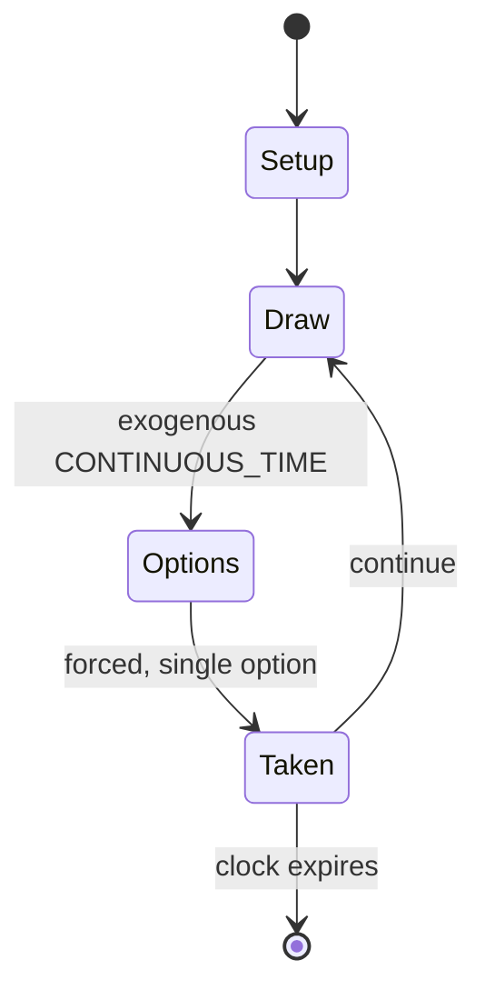

# Spyfall (card game)

`spyfall_card_game` &nbsp; state: **DEEPENED** &nbsp; method: **heuristic**

## Found layer (recorded, not trusted)

| field | value |
| --- | --- |
| wikidata | Q42391157 |
| wikipedia | Spyfall (card game) |
| genres (source) | -- |
| instance of (source) | -- |
| country of origin | -- |

## Declared layer (orders bench work)

| field | value |
| --- | --- |
| year created | 2017 |
| epoch | CONTEMPORARY |
| region | -- |
| media | CARD |
| players | 3-8 |
| age band | -- |
| exogenous process | CONTINUOUS_TIME |
| loss shape | -- |
| live axes | - |
| horizon | CLOCK_LIMITED |
| scoring shape | -- |
| information | -- |
| interaction | SOLITAIRE |
| turn structure | STRICT_TURN |
| tractability | SAMPLING_ONLY |
| randomness | HIDDEN_INFO, REAL_TIME_PHYSICAL |
| luck factor | 0.35 |
| rules complexity | 2.11 |
| strategic depth | 2.0 |
| novelty | 0.6812 |
| solved status | -- |
| strategies | -- |
| algorithms | -- |

## Object model

```
Episode
  players      : 3-8
  turn_structure: STRICT_TURN
  horizon       : CLOCK_LIMITED
  scoring       : ?

Deck           -- ordered multiset, drawn without replacement
Hand           -- private multiset held by one player
DiscardPile    -- public accumulation of spent cards
```

## State transition diagram



## Research item -- turn trace

```
# Spyfall (card game) -- simulated turn events
# generated from the DECLARED vector, not from a rulebook.
# structure: exo=CONTINUOUS_TIME loss=None horizon=CLOCK_LIMITED scoring=None axes=-

t=0    SETUP        players=3  pot=0  capacity=5
t=1    DRAW         p1 tick from clock -> outcome #5  (p=0.112)
t=2    FORCED       p1 single legal option taken (pot_gain=+1.9)
t=3    ENDTURN      turn passes to p2
t=4    DRAW         p2 tick from clock -> outcome #6  (p=0.272)
t=5    FORCED       p2 single legal option taken (pot_gain=+0.7)
t=6    DRAW         p2 tick from clock -> outcome #5  (p=0.268)
t=7    FORCED       p2 single legal option taken (pot_gain=+1.9)
t=8    DRAW         p2 tick from clock -> outcome #5  (p=0.072)
t=9    FORCED       p2 single legal option taken (pot_gain=+1.7)
t=10   DRAW         p2 tick from clock -> outcome #5  (p=0.145)
t=11   FORCED       p2 single legal option taken (pot_gain=+1.0)
t=12   DRAW         p2 tick from clock -> outcome #4  (p=0.086)
t=13   FORCED       p2 single legal option taken (pot_gain=+1.7)
t=14   ENDTURN      turn passes to p3
t=15   DRAW         p3 tick from clock -> outcome #1  (p=0.040)
t=16   FORCED       p3 single legal option taken (pot_gain=+1.9)
t=17   DRAW         p3 tick from clock -> outcome #2  (p=0.151)
t=18   FORCED       p3 single legal option taken (pot_gain=+1.1)
t=19   DRAW         p3 tick from clock -> outcome #2  (p=0.130)
t=20   FORCED       p3 single legal option taken (pot_gain=+1.4)
t=21   DRAW         p3 tick from clock -> outcome #5  (p=0.041)
t=22   FORCED       p3 single legal option taken (pot_gain=+0.8)
t=23   DRAW         p3 tick from clock -> outcome #6  (p=0.112)
t=24   FORCED       p3 single legal option taken (pot_gain=+0.6)
t=25   DRAW         p3 tick from clock -> outcome #2  (p=0.005)
t=26   FORCED       p3 single legal option taken (pot_gain=+0.6)

terminal: CLOCK_LIMITED
```

## Source extract

Spyfall is a 2014 card game for 3–8 players designed by Alexander Ushan and published by Hobby
World. A sequel, Spyfall 2, was published in 2017. A superhero themed variant, DC Spyfall, was
published in 2018. The game's core premise revolves around uncovering the spy hidden among the
players. As the game has evolved, new variations and "advanced rules" have emerged, introducing
elements like multiple spies.   == Gameplay == A typical game of Spyfall lasts for between 6 and
10 minutes, depending on the time control. Each player receives a card representing the same
location, except one player who receives a "spy" card. The spy has to guess the location, while
other players have to identify the spy. On their turn, players ask each other questions, trying
to lure the spy out without giving them too much information about what the location is. At any
time during the game, or at its end when the timer runs out, one player can accuse another of
being the spy; if there is a consensus and the spy is identified, the spy loses; otherwise, the
spy wins. Additionally, at any time the spy can announce that they are the spy, and try to guess
the location. If successful, the spy wins, otherwise t

<sub>Wikipedia, CC BY-SA. Retained as evidence for the structural
classification above. Every rule inferred from it is HYPOTHESIZED
until audited against a rulebook.</sub>
