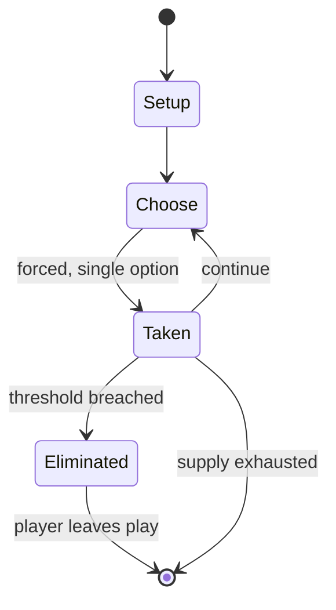

# squid game

*Korean children's game*

`squid_game` &nbsp; state: **DEEPENED** &nbsp; method: **heuristic**

## Found layer (recorded, not trusted)

| field | value |
| --- | --- |
| wikidata | Q12608079 |
| wikipedia | Squid (game) |
| genres (source) | -- |
| instance of (source) | children's game |
| country of origin | Korea |

## Declared layer (orders bench work)

| field | value |
| --- | --- |
| year created | -- |
| epoch | -- |
| region | EAST_ASIA |
| media | - |
| players | -- |
| age band | CHILD |
| exogenous process | -- |
| loss shape | ELIMINATION |
| live axes | - |
| horizon | -- |
| scoring shape | -- |
| information | -- |
| interaction | COMPETITIVE |
| turn structure | -- |
| tractability | SAMPLING_ONLY |
| randomness | -- |
| luck factor | 0.35 |
| rules complexity | 1.86 |
| strategic depth | 2.0 |
| novelty | 0.5098 |
| solved status | -- |
| strategies | -- |
| algorithms | -- |

## Object model

```
Episode
  players      : ?
  turn_structure: ?
  horizon       : ?
  scoring       : ?

State          -- opaque; no medium or axis evidence was found
Player         -- an agent that selects among legal successors
```

## State transition diagram



## Research item -- turn trace

```
# squid game -- simulated turn events
# generated from the DECLARED vector, not from a rulebook.
# structure: exo=None loss=ELIMINATION horizon=None scoring=None axes=-

t=0    SETUP        players=2  pot=0  capacity=3
t=1    FORCED       p1 single legal option taken (pot_gain=+2.0)
t=2    FORCED       p1 single legal option taken (pot_gain=+1.0)
t=3    ENDTURN      turn passes to p2
t=4    FORCED       p2 single legal option taken (pot_gain=+1.0)
t=5    ENDTURN      turn passes to p1
t=6    FORCED       p1 single legal option taken (pot_gain=+1.8)
t=7    FORCED       p1 single legal option taken (pot_gain=+0.9)
t=8    FORCED       p1 single legal option taken (pot_gain=+1.0)
t=9    FORCED       p1 single legal option taken (pot_gain=+0.5)
t=10   FORCED       p1 single legal option taken (pot_gain=+1.5)
t=11   ENDTURN      turn passes to p2
t=12   FORCED       p2 single legal option taken (pot_gain=+1.4)
t=13   FORCED       p2 single legal option taken (pot_gain=+1.3)
t=14   FORCED       p2 single legal option taken (pot_gain=+1.3)
t=15   ENDTURN      turn passes to p1
t=16   FORCED       p1 single legal option taken (pot_gain=+0.8)
t=17   FORCED       p1 single legal option taken (pot_gain=+1.4)
t=18   FORCED       p1 single legal option taken (pot_gain=+0.6)
t=19   FORCED       p1 single legal option taken (pot_gain=+1.3)
t=20   FORCED       p1 single legal option taken (pot_gain=+1.2)
t=21   FORCED       p1 single legal option taken (pot_gain=+1.9)
t=22   FORCED       p1 single legal option taken (pot_gain=+1.0)
t=23   FORCED       p1 single legal option taken (pot_gain=+1.0)
t=24   FORCED       p1 single legal option taken (pot_gain=+1.3)
t=25   FORCED       p1 single legal option taken (pot_gain=+1.9)
t=26   FORCED       p1 single legal option taken (pot_gain=+1.9)

terminal: VARIABLE
```

## Conditions

| kind | threshold | effect | trigger |
| --- | --- | --- | --- |
| ELIMINATE | -- | -- | The objective for the defenders is to eliminate all attacking players before the attackers can accomplish this goal. |
| ELIMINATE | -- | eliminated | Players are eliminated when they enter or exit the squid at any location other than the gate. |
| ELIMINATE | -- | -- | Players are allowed to reach over the boundary of the squid, but eliminated if any part of their body touches the ground on the other side of the boundary (including touching the boundary itself). |
| ELIMINATE | -- | -- | Players are also eliminated if they use two feet when they are only allowed to use one, or if they touch the ground with any other body part (i.e., fall down). |
| BOUNDARY | -- | -- | The game starts by dividing two teams, with at least ten people per team. |

## Source extract

Squid (Korean: 오징어, ojingŏ) is a children's game played in South Korea. The game is named as
such because the shape of the playing field drawn on the ground somewhat resembles the shape of
a squid. There are regional variations of the name such as "squid gaisan" (with gaisan thought
to be a variation of the Japanese word kaisen 開戦, 'to start a war'), or "squid takkari". It is a
multiplayer game, and the game is divided into two teams, offensive and defensive. There are two
main purposes, either for the attackers to achieve the purpose of the attack, or for the teams
to annihilate each other. There are many versions of the rules for different areas and groups.
Regional names differ.   == General rule elements == The homes for each of the teams are called
"houses" (집 jib). The top circle is the house for the offensive team (area 1), while the middle
triangle and bottom rectangle are the house for the defensive team (area 3). The figure that
makes up the game court, excluding area 1, is called the "squid". The objective for the
offensive team is to leave their house and move outside the squid around to the bottom "gate" of
the defensive house (shown open on the diagram at the bottom o

<sub>Wikipedia, CC BY-SA. Retained as evidence for the structural
classification above. Every rule inferred from it is HYPOTHESIZED
until audited against a rulebook.</sub>
