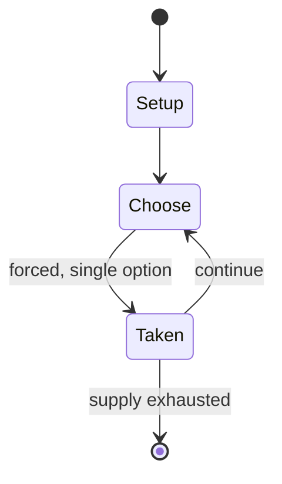

# Star of the Guardians

*collectible card game*

`star_of_the_guardians` &nbsp; state: **DEEPENED** &nbsp; method: **heuristic**

## Found layer (recorded, not trusted)

| field | value |
| --- | --- |
| wikidata | Q117354700 |
| wikipedia | Star of the Guardians (collectible card game) |
| genres (source) | -- |
| instance of (source) | collectible card game |
| country of origin | -- |

## Declared layer (orders bench work)

| field | value |
| --- | --- |
| year created | 1995 |
| epoch | DIGITAL |
| region | -- |
| media | CARD, COLLECTIBLE |
| players | -- |
| age band | -- |
| exogenous process | -- |
| loss shape | -- |
| live axes | - |
| horizon | -- |
| scoring shape | -- |
| information | -- |
| interaction | -- |
| turn structure | -- |
| tractability | SAMPLING_ONLY |
| randomness | -- |
| luck factor | 0.35 |
| rules complexity | 1.63 |
| strategic depth | 2.0 |
| novelty | 0.0877 |
| solved status | -- |
| strategies | -- |
| algorithms | -- |

## Object model

```
Episode
  players      : ?
  turn_structure: ?
  horizon       : ?
  scoring       : ?

Deck           -- ordered multiset, drawn without replacement
Hand           -- private multiset held by one player
DiscardPile    -- public accumulation of spent cards
```

## State transition diagram



## Research item -- turn trace

```
# Star of the Guardians -- simulated turn events
# generated from the DECLARED vector, not from a rulebook.
# structure: exo=None loss=None horizon=None scoring=None axes=-

t=0    SETUP        players=2  pot=0  capacity=8
t=1    FORCED       p1 single legal option taken (pot_gain=+1.5)
t=2    FORCED       p1 single legal option taken (pot_gain=+0.9)
t=3    FORCED       p1 single legal option taken (pot_gain=+0.7)
t=4    FORCED       p1 single legal option taken (pot_gain=+1.9)
t=5    ENDTURN      turn passes to p2
t=6    FORCED       p2 single legal option taken (pot_gain=+1.1)
t=7    FORCED       p2 single legal option taken (pot_gain=+1.6)
t=8    FORCED       p2 single legal option taken (pot_gain=+1.5)
t=9    FORCED       p2 single legal option taken (pot_gain=+1.5)
t=10   FORCED       p2 single legal option taken (pot_gain=+1.4)
t=11   FORCED       p2 single legal option taken (pot_gain=+1.4)
t=12   ENDTURN      turn passes to p1
t=13   FORCED       p1 single legal option taken (pot_gain=+1.8)
t=14   FORCED       p1 single legal option taken (pot_gain=+1.6)
t=15   FORCED       p1 single legal option taken (pot_gain=+1.3)
t=16   ENDTURN      turn passes to p2
t=17   FORCED       p2 single legal option taken (pot_gain=+1.5)
t=18   FORCED       p2 single legal option taken (pot_gain=+1.1)
t=19   ENDTURN      turn passes to p1
t=20   FORCED       p1 single legal option taken (pot_gain=+1.9)
t=21   FORCED       p1 single legal option taken (pot_gain=+1.5)
t=22   ENDTURN      turn passes to p2
t=23   FORCED       p2 single legal option taken (pot_gain=+1.3)
t=24   ENDTURN      turn passes to p1
t=25   FORCED       p1 single legal option taken (pot_gain=+1.8)
t=26   FORCED       p1 single legal option taken (pot_gain=+1.5)

terminal: VARIABLE
```

## Source extract

Star of the Guardians is a collectible card game based on the Star of the Guardians novel
series, and was published by Mag Force 7 in 1995.   == Gameplay == Star of the Guardians is a
science fiction collectible card game.   == Reception == M. Craig Stockwell reviewed Star of the
Guardians for Pyramid magazine and stated that "In the ever-burgeoning field of trading card
games, consumers have developed higher standards by which to judge new products. Mag Force 7's
premiere offering, Star of the Guardians, earns high marks in most every category."   == Reviews
== Dragon #218   == Further reading == "Starship of the Guardians Collectible Card Game". Scrye.
No. 4. February 1995. pp. 66–67. Grubb, Jeff (May–June 1995). "Starship manufacturers of the
Guardians". Scrye. No. 7. pp. 83–84. Pack, Janet (July–August 1995). "Warlords". Scrye. No. 8.
pp. 136–137.   == References ==   == External links == Star of the Guardians   at BoardGameGeek

<sub>Wikipedia, CC BY-SA. Retained as evidence for the structural
classification above. Every rule inferred from it is HYPOTHESIZED
until audited against a rulebook.</sub>
