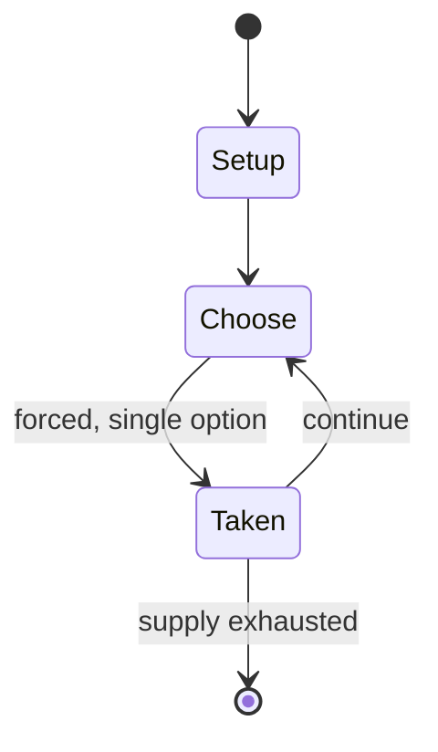

# Star Trek: The Enterprise 4 Encounter

*board game*

`star_trek_the_enterprise_4_encounter` &nbsp; state: **DEEPENED** &nbsp; method: **heuristic**

## Found layer (recorded, not trusted)

| field | value |
| --- | --- |
| wikidata | Q102227156 |
| wikipedia | Star Trek: The Enterprise 4 Encounter |
| genres (source) | -- |
| instance of (source) | board game |
| country of origin | -- |

## Declared layer (orders bench work)

| field | value |
| --- | --- |
| year created | 1985 |
| epoch | DIGITAL |
| region | -- |
| media | BOARD |
| players | 2-4 |
| age band | -- |
| exogenous process | -- |
| loss shape | -- |
| live axes | - |
| horizon | -- |
| scoring shape | -- |
| information | -- |
| interaction | -- |
| turn structure | -- |
| tractability | SAMPLING_ONLY |
| randomness | DICE |
| luck factor | 0.58 |
| rules complexity | 1.76 |
| strategic depth | 1.87 |
| novelty | 0.0866 |
| solved status | -- |
| strategies | -- |
| algorithms | -- |

## Object model

```
Episode
  players      : 2-4
  turn_structure: ?
  horizon       : ?
  scoring       : ?

Board          -- spatial substrate; cells carry position and occupancy
Piece          -- movable token owned by a player
```

## State transition diagram



## Research item -- turn trace

```
# Star Trek: The Enterprise 4 Encounter -- simulated turn events
# generated from the DECLARED vector, not from a rulebook.
# structure: exo=None loss=None horizon=None scoring=None axes=-

t=0    SETUP        players=2  pot=0  capacity=8
t=1    FORCED       p1 single legal option taken (pot_gain=+1.3)
t=2    ENDTURN      turn passes to p2
t=3    FORCED       p2 single legal option taken (pot_gain=+1.5)
t=4    FORCED       p2 single legal option taken (pot_gain=+0.6)
t=5    FORCED       p2 single legal option taken (pot_gain=+0.9)
t=6    FORCED       p2 single legal option taken (pot_gain=+1.7)
t=7    FORCED       p2 single legal option taken (pot_gain=+0.6)
t=8    FORCED       p2 single legal option taken (pot_gain=+1.6)
t=9    FORCED       p2 single legal option taken (pot_gain=+1.9)
t=10   FORCED       p2 single legal option taken (pot_gain=+0.8)
t=11   FORCED       p2 single legal option taken (pot_gain=+1.8)
t=12   FORCED       p2 single legal option taken (pot_gain=+0.7)
t=13   FORCED       p2 single legal option taken (pot_gain=+0.8)
t=14   FORCED       p2 single legal option taken (pot_gain=+1.8)
t=15   FORCED       p2 single legal option taken (pot_gain=+0.7)
t=16   ENDTURN      turn passes to p1
t=17   FORCED       p1 single legal option taken (pot_gain=+0.6)
t=18   FORCED       p1 single legal option taken (pot_gain=+1.1)
t=19   FORCED       p1 single legal option taken (pot_gain=+0.8)
t=20   FORCED       p1 single legal option taken (pot_gain=+1.2)
t=21   FORCED       p1 single legal option taken (pot_gain=+1.2)
t=22   FORCED       p1 single legal option taken (pot_gain=+0.6)
t=23   FORCED       p1 single legal option taken (pot_gain=+1.7)
t=24   FORCED       p1 single legal option taken (pot_gain=+0.7)
t=25   ENDTURN      turn passes to p2
t=26   FORCED       p2 single legal option taken (pot_gain=+1.4)

terminal: VARIABLE
```

## Conditions

| kind | threshold | effect | trigger |
| --- | --- | --- | --- |
| WIN | -- | -- | If the other players are unsuccessful, the player with all six crew members is the winner. |
| TERMINATE | -- | -- | The other players engage in a final round of combat to try to steal at least one crew member. |
| BOUNDARY | -- | -- | If the other players steal at least one crew member, the game continues. |

## Source extract

Star Trek: The Enterprise 4 Encounter is a combat board game for 2–4 players published by West
End Games in 1985 that is based on the TV series Star Trek.   == Gameplay ==   === Setting ===
The players, representing the crew of the USS Enterprise, are sent to re-establish communication
with Trelane, a powerful being from the Star Trek episode "The Squire of Gothos". Trelane sends
each player to a copy of the Enterprise, and scatters the rest of the crew to various planets.
It is a board game that mixes combat and set collection.   === Components === 22" × 17"
gameboard 28 playing pieces: 4 Enterprises and 24 crew members 4-page rule sheet 4-page
"Captain's Log", a short story written by Douglas Kaufman 25 Adventure cards 43 Battle cards a
Reference card 4 cardboard Bridge racks a 6-sided die   === Set-up === Each player places their
Enterprise token on one of the four home planets.   === Objective === Using die rolls for
movement, each player must travel around the board, searching planets for marooned crew members,
seeking to collect one crew member for each of the six ship Divisions (Command, Science,
Medical, Security, Navigation and Communications).   === Combat === Trelane has

<sub>Wikipedia, CC BY-SA. Retained as evidence for the structural
classification above. Every rule inferred from it is HYPOTHESIZED
until audited against a rulebook.</sub>
