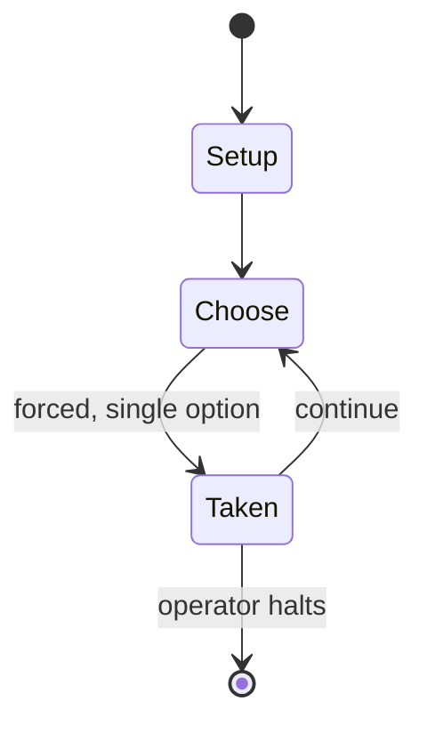

# Star Wars: The Roleplaying Game

*tabletop role-playing game by West End Games*

`star_wars_the_roleplaying_game` &nbsp; state: **DEEPENED** &nbsp; method: **heuristic**

## Found layer (recorded, not trusted)

| field | value |
| --- | --- |
| wikidata | Q1034771 |
| wikipedia | Star Wars: The Roleplaying Game |
| genres (source) | tabletop role-playing game |
| instance of (source) | tabletop role-playing game |
| country of origin | United States |

## Declared layer (orders bench work)

| field | value |
| --- | --- |
| year created | 1987 |
| epoch | DIGITAL |
| region | NORTH_AMERICA |
| media | RPG |
| players | -- |
| age band | -- |
| exogenous process | -- |
| loss shape | -- |
| live axes | - |
| horizon | OPEN_ENDED |
| scoring shape | -- |
| information | -- |
| interaction | -- |
| turn structure | -- |
| tractability | SAMPLING_ONLY |
| randomness | DICE |
| luck factor | 0.58 |
| rules complexity | 3.59 |
| strategic depth | 2.37 |
| novelty | 0.4677 |
| solved status | -- |
| strategies | coalition_forming, spatial_packing |
| algorithms | -- |

## Object model

```
Episode
  players      : ?
  turn_structure: ?
  horizon       : OPEN_ENDED
  scoring       : ?

Character      -- persistent stat block owned by a player
GameMaster     -- adjudicating agent outside the scoring loop
Scenario       -- authored state the players traverse
```

## State transition diagram



## Research item -- turn trace

```
# Star Wars: The Roleplaying Game -- simulated turn events
# generated from the DECLARED vector, not from a rulebook.
# structure: exo=None loss=None horizon=OPEN_ENDED scoring=None axes=-

t=0    SETUP        players=2  pot=0  capacity=5
t=1    FORCED       p1 single legal option taken (pot_gain=+0.6)
t=2    FORCED       p1 single legal option taken (pot_gain=+1.0)
t=3    FORCED       p1 single legal option taken (pot_gain=+1.8)
t=4    ENDTURN      turn passes to p2
t=5    FORCED       p2 single legal option taken (pot_gain=+1.4)
t=6    ENDTURN      turn passes to p1
t=7    FORCED       p1 single legal option taken (pot_gain=+0.7)
t=8    FORCED       p1 single legal option taken (pot_gain=+1.7)
t=9    FORCED       p1 single legal option taken (pot_gain=+1.7)
t=10   FORCED       p1 single legal option taken (pot_gain=+1.4)
t=11   FORCED       p1 single legal option taken (pot_gain=+0.7)
t=12   FORCED       p1 single legal option taken (pot_gain=+1.8)
t=13   FORCED       p1 single legal option taken (pot_gain=+1.7)
t=14   ENDTURN      turn passes to p2
t=15   FORCED       p2 single legal option taken (pot_gain=+1.6)
t=16   ENDTURN      turn passes to p1
t=17   FORCED       p1 single legal option taken (pot_gain=+1.2)
t=18   FORCED       p1 single legal option taken (pot_gain=+2.0)
t=19   ENDTURN      turn passes to p2
t=20   FORCED       p2 single legal option taken (pot_gain=+1.5)
t=21   FORCED       p2 single legal option taken (pot_gain=+1.9)
t=22   FORCED       p2 single legal option taken (pot_gain=+0.7)
t=23   FORCED       p2 single legal option taken (pot_gain=+1.2)
t=24   FORCED       p2 single legal option taken (pot_gain=+0.7)
t=25   FORCED       p2 single legal option taken (pot_gain=+0.6)
t=26   ENDTURN      turn passes to p1

terminal: OPEN_ENDED
```

## Conditions

| kind | threshold | effect | trigger |
| --- | --- | --- | --- |
| PENALTY | -- | -- | Death Star Technical Companion (1991) |

## Source extract

Star Wars: The Roleplaying Game is a role-playing game set in the Star Wars universe, written
and published by West End Games (WEG) between 1987 and 1999. The game system was slightly
modified and rereleased in 2004 as D6 Space, which used a generic space opera setting. An
unrelated Star Wars RPG was published by Wizards of the Coast from 2000 to 2010. From 2012 to
2020, the official Star Wars role-playing game is another unrelated game, the Star Wars
Roleplaying Game, published by Fantasy Flight Games 2020). Since 2020, EDGE Studio have held the
games's license.   == Development == The game, based on WEG's earlier Ghostbusters RPG,
established much of the groundwork of what later became the Star Wars expanded universe, and its
sourcebooks are still frequently cited by Star Wars fans as reference material. Lucasfilm
considered the West End Games' Star Wars sourcebooks so authoritative that when Timothy Zahn was
hired to write what became the Thrawn trilogy, he was sent a box of West End Games Star Wars
books and directed to base his novel on the background material presented within. Many of the
first uses of Star Wars alien names (such as the Twi'lek, Rodian, and Quarren) appeared

<sub>Wikipedia, CC BY-SA. Retained as evidence for the structural
classification above. Every rule inferred from it is HYPOTHESIZED
until audited against a rulebook.</sub>
