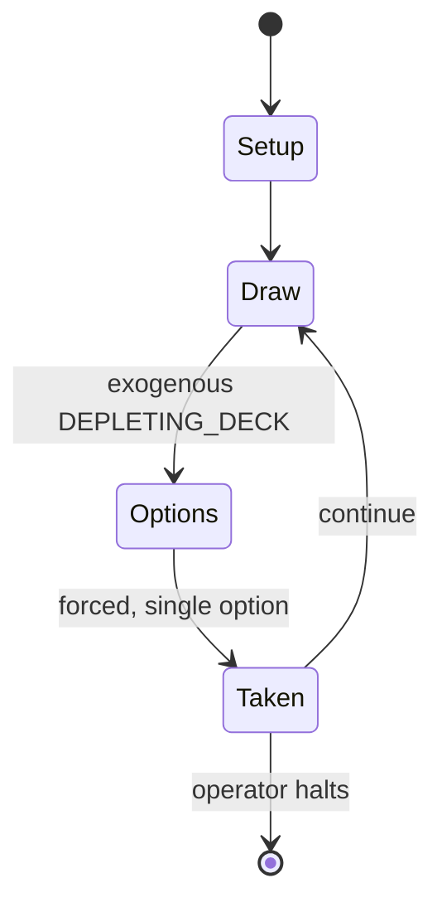

# Star Wars Trading Card Game

*out-of-print trading card game*

`star_wars_trading_card_game` &nbsp; state: **DEEPENED** &nbsp; method: **heuristic**

## Found layer (recorded, not trusted)

| field | value |
| --- | --- |
| wikidata | Q7601169 |
| wikipedia | Star Wars Trading Card Game |
| genres (source) | science fiction |
| instance of (source) | collectible card game, deck-building game, game |
| country of origin | United States |

## Declared layer (orders bench work)

| field | value |
| --- | --- |
| year created | 2002 |
| epoch | CONTEMPORARY |
| region | NORTH_AMERICA |
| media | CARD, COLLECTIBLE |
| players | -- |
| age band | -- |
| exogenous process | DEPLETING_DECK |
| loss shape | -- |
| live axes | TRADE |
| horizon | OPEN_ENDED |
| scoring shape | -- |
| information | -- |
| interaction | COMPETITIVE |
| turn structure | -- |
| tractability | EXACT_WITH_CUT |
| randomness | DECK_SHUFFLE, DICE |
| luck factor | 0.76 |
| rules complexity | 2.18 |
| strategic depth | 1.58 |
| novelty | 0.7033 |
| solved status | -- |
| strategies | -- |
| algorithms | -- |

## Object model

```
Episode
  players      : ?
  turn_structure: ?
  horizon       : OPEN_ENDED
  scoring       : ?

Deck           -- ordered multiset, drawn without replacement
Hand           -- private multiset held by one player
DiscardPile    -- public accumulation of spent cards
Offer          -- proposed exchange between two agents
```

## State transition diagram



## Research item -- turn trace

```
# Star Wars Trading Card Game -- simulated turn events
# generated from the DECLARED vector, not from a rulebook.
# structure: exo=DEPLETING_DECK loss=None horizon=OPEN_ENDED scoring=None axes=TRADE

t=0    SETUP        players=2  pot=0  capacity=6
t=1    DRAW         p1 draw from deck -> outcome #5  (p=0.179)
t=2    FORCED       p1 single legal option taken (pot_gain=+1.5)
t=3    TRADE        p1 offers 2:1 exchange to p2
t=4    DRAW         p1 draw from deck -> outcome #4  (p=0.176)
t=5    FORCED       p1 single legal option taken (pot_gain=+1.5)
t=6    DRAW         p1 draw from deck -> outcome #1  (p=0.174)
t=7    FORCED       p1 single legal option taken (pot_gain=+1.4)
t=8    DRAW         p1 draw from deck -> outcome #2  (p=0.012)
t=9    FORCED       p1 single legal option taken (pot_gain=+1.1)
t=10   DRAW         p1 draw from deck -> outcome #6  (p=0.037)
t=11   FORCED       p1 single legal option taken (pot_gain=+1.6)
t=12   TRADE        p1 offers 2:1 exchange to p2
t=13   DRAW         p1 draw from deck -> outcome #2  (p=0.133)
t=14   FORCED       p1 single legal option taken (pot_gain=+1.9)
t=15   ENDTURN      turn passes to p2
t=16   DRAW         p2 draw from deck -> outcome #6  (p=0.116)
t=17   FORCED       p2 single legal option taken (pot_gain=+2.0)
t=18   TRADE        p2 offers 2:1 exchange to p1
t=19   DRAW         p2 draw from deck -> outcome #4  (p=0.038)
t=20   FORCED       p2 single legal option taken (pot_gain=+1.1)
t=21   DRAW         p2 draw from deck -> outcome #3  (p=0.018)
t=22   FORCED       p2 single legal option taken (pot_gain=+1.1)
t=23   DRAW         p2 draw from deck -> outcome #3  (p=0.116)
t=24   FORCED       p2 single legal option taken (pot_gain=+1.3)
t=25   DRAW         p2 draw from deck -> outcome #2  (p=0.289)
t=26   FORCED       p2 single legal option taken (pot_gain=+1.6)

terminal: OPEN_ENDED
```

## Source extract

Star Wars: The Trading Card Game is an out-of-print collectible card game produced by Wizards of
the Coast (WotC). The original game was created by game designer Richard Garfield, the creator
of the first modern trading card game, Magic: The Gathering. After its initial release in April
2002, the game was 'put on indefinite hold' by WotC in late 2005. The Star Wars Trading Card
Game Independent Development Committee was created by a group of fans to continue development of
the game. They design new cards that are available as free downloads at their website.   ==
Gameplay == The Star Wars: TCG focuses on gaining control of in-game arenas. In this two-player
game, each player controls units which battle in the arenas. The main way to win is to take
control of two of the three arenas. Some cards also add new win conditions for the game.  The
three arenas are Space, Ground and Character, and feature units from the Star Wars films, such
as Star Destroyers, starfighters, AT-ATs, armies, and characters like Luke Skywalker, Anakin
Skywalker, Padmé Amidala, Mara Jade, and Darth Vader. There is also a build zone, a draw pile
(for your deck), and a discard pile. The two sides to the game are

<sub>Wikipedia, CC BY-SA. Retained as evidence for the structural
classification above. Every rule inferred from it is HYPOTHESIZED
until audited against a rulebook.</sub>
