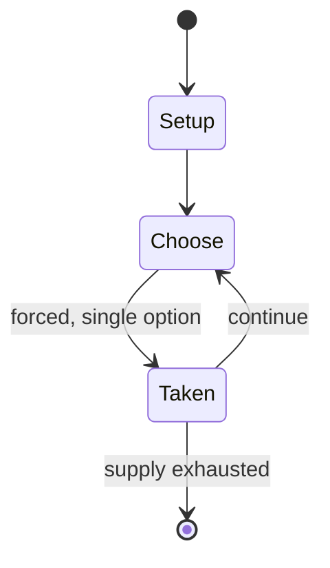

# Star Wars: Unlimited

*Fantasy Flight Games trading card game*

`star_wars_unlimited` &nbsp; state: **DEEPENED** &nbsp; method: **heuristic**

## Found layer (recorded, not trusted)

| field | value |
| --- | --- |
| wikidata | Q123694242 |
| wikipedia | Star Wars: Unlimited |
| genres (source) | -- |
| instance of (source) | collectible card game |
| country of origin | -- |

## Declared layer (orders bench work)

| field | value |
| --- | --- |
| year created | 2024 |
| epoch | CONTEMPORARY |
| region | -- |
| media | CARD, COLLECTIBLE |
| players | -- |
| age band | -- |
| exogenous process | -- |
| loss shape | -- |
| live axes | TRADE |
| horizon | -- |
| scoring shape | -- |
| information | -- |
| interaction | COMPETITIVE |
| turn structure | PHASE_STRUCTURED |
| tractability | SAMPLING_ONLY |
| randomness | -- |
| luck factor | 0.35 |
| rules complexity | 2.75 |
| strategic depth | 2.0 |
| novelty | 0.537 |
| solved status | -- |
| strategies | -- |
| algorithms | -- |

## Object model

```
Episode
  players      : ?
  turn_structure: PHASE_STRUCTURED
  horizon       : ?
  scoring       : ?

Deck           -- ordered multiset, drawn without replacement
Hand           -- private multiset held by one player
DiscardPile    -- public accumulation of spent cards
Offer          -- proposed exchange between two agents
```

## State transition diagram



## Research item -- turn trace

```
# Star Wars: Unlimited -- simulated turn events
# generated from the DECLARED vector, not from a rulebook.
# structure: exo=None loss=None horizon=None scoring=None axes=TRADE

t=0    SETUP        players=2  pot=0  capacity=6
t=1    FORCED       p1 single legal option taken (pot_gain=+0.9)
t=2    FORCED       p1 single legal option taken (pot_gain=+1.1)
t=3    TRADE        p1 offers 2:1 exchange to p2
t=4    FORCED       p1 single legal option taken (pot_gain=+1.1)
t=5    FORCED       p1 single legal option taken (pot_gain=+1.1)
t=6    TRADE        p1 offers 2:1 exchange to p2
t=7    FORCED       p1 single legal option taken (pot_gain=+1.9)
t=8    ENDTURN      turn passes to p2
t=9    FORCED       p2 single legal option taken (pot_gain=+0.9)
t=10   FORCED       p2 single legal option taken (pot_gain=+1.0)
t=11   ENDTURN      turn passes to p1
t=12   FORCED       p1 single legal option taken (pot_gain=+1.7)
t=13   FORCED       p1 single legal option taken (pot_gain=+0.8)
t=14   TRADE        p1 offers 2:1 exchange to p2
t=15   FORCED       p1 single legal option taken (pot_gain=+0.7)
t=16   TRADE        p1 offers 2:1 exchange to p2
t=17   ENDTURN      turn passes to p2
t=18   FORCED       p2 single legal option taken (pot_gain=+1.5)
t=19   TRADE        p2 offers 2:1 exchange to p1
t=20   FORCED       p2 single legal option taken (pot_gain=+1.6)
t=21   TRADE        p2 offers 2:1 exchange to p1
t=22   ENDTURN      turn passes to p1
t=23   FORCED       p1 single legal option taken (pot_gain=+1.7)
t=24   FORCED       p1 single legal option taken (pot_gain=+1.5)
t=25   TRADE        p1 offers 2:1 exchange to p2
t=26   ENDTURN      turn passes to p2

terminal: VARIABLE
```

## Conditions

| kind | threshold | effect | trigger |
| --- | --- | --- | --- |
| BOUNDARY | 50 cards | -- | Each player needs a deck consisting of at least 50 cards plus a leader and a base card. |
| LOSE | -- | -- | If the HP of a base drops to zero, the respective player loses the game. |
| PENALTY | -- | -- | Upgrade - a card that is attached to a unit to provide some form of bonus or penalty. |

## Source extract

Star Wars: Unlimited is a trading card game published by Fantasy Flight Games. Its first set,
Spark of Rebellion, was released on March 8, 2024. It includes a wide variety of unique art on
the cards instead of using film stills. Like many other TCGs, it shares design elements with
Magic: The Gathering, and also shares aspects with Disney Lorcana.   == Gameplay == The main way
to play Star Wars: Unlimited is called Premier, where two players compete against each other in
a best-of-three format. Each player needs a deck consisting of at least 50 cards plus a leader
and a base card. To win one of the three games, a player needs to destroy their opponent's base.
The game is structured into rounds, with each round divided into an Action Phase and a Regroup
Phase. During the Action Phase, players alternate taking individual actions, such as playing
units, events, or upgrades, attacking with units, or using card abilities. The Action Phase
continues until both players pass consecutively. During the Regroup Phase, players draw cards,
may place a card from their hand into their resource area, and ready their exhausted cards
before the next round begins. This structure allows players to alte

<sub>Wikipedia, CC BY-SA. Retained as evidence for the structural
classification above. Every rule inferred from it is HYPOTHESIZED
until audited against a rulebook.</sub>
