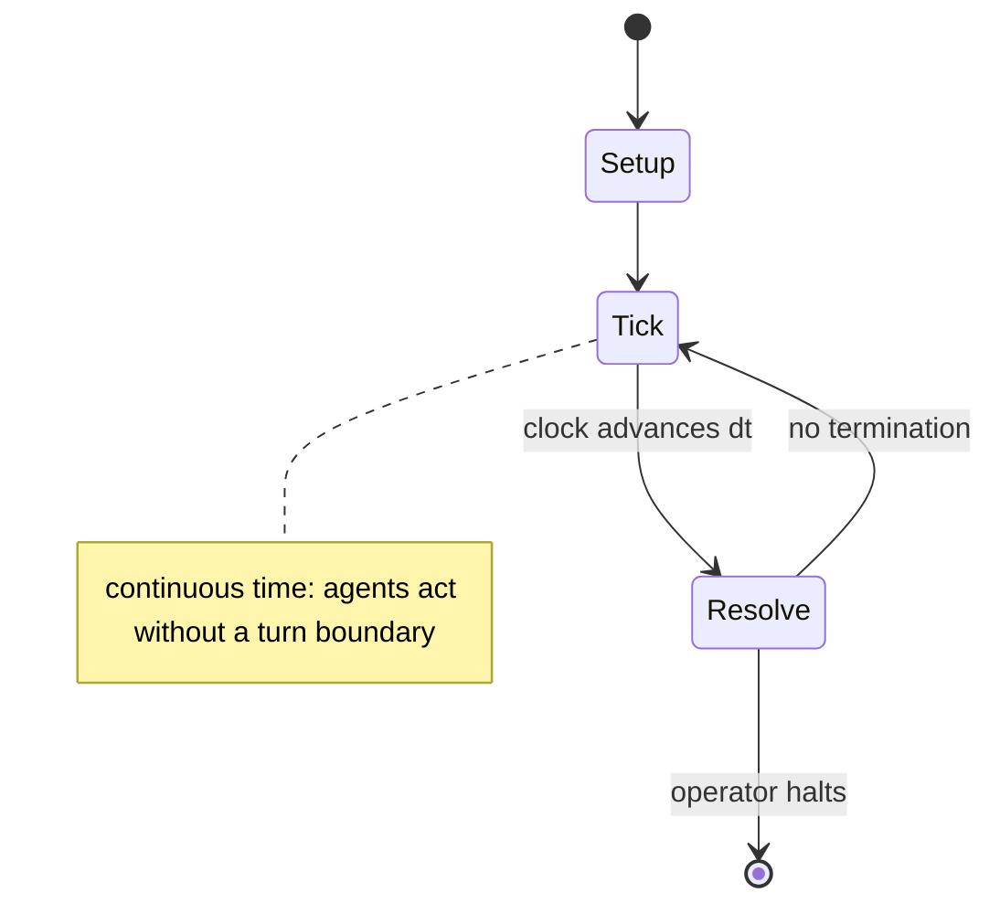

# StarCraft

`starcraft` &nbsp; state: **DEEPENED** &nbsp; method: **heuristic**

## Found layer (recorded, not trusted)

| field | value |
| --- | --- |
| wikidata | Q290106 |
| wikipedia | StarCraft |
| genres (source) | -- |
| instance of (source) | -- |
| country of origin | -- |

## Declared layer (orders bench work)

| field | value |
| --- | --- |
| year created | 2010 |
| epoch | CONTEMPORARY |
| region | -- |
| media | BOARD, SOLITAIRE, VIDEO |
| players | -- |
| age band | -- |
| exogenous process | CONTINUOUS_TIME |
| loss shape | -- |
| live axes | BID |
| horizon | OPEN_ENDED |
| scoring shape | RACE_POSITION |
| information | -- |
| interaction | SOLITAIRE |
| turn structure | REAL_TIME |
| tractability | SAMPLING_ONLY |
| randomness | REAL_TIME_PHYSICAL |
| luck factor | 0.3 |
| rules complexity | 2.24 |
| strategic depth | 2.25 |
| novelty | 0.7304 |
| solved status | -- |
| strategies | spatial_packing |
| algorithms | -- |

## Object model

```
Episode
  players      : ?
  turn_structure: REAL_TIME
  horizon       : OPEN_ENDED
  scoring       : RACE_POSITION

Board          -- spatial substrate; cells carry position and occupancy
Piece          -- movable token owned by a player
WorldState     -- simulation state advanced by the engine
Avatar         -- player-controlled agent
Clock          -- frame or tick counter
Auction        -- priced competition resolving to one winner
```

## State transition diagram



## Research item -- clock trace

```
# StarCraft -- simulated clock trace (no turn boundary)
# generated from the DECLARED vector, not from a rulebook.
# structure: exo=CONTINUOUS_TIME loss=None horizon=OPEN_ENDED scoring=RACE_POSITION axes=BID

clk=0.000s  START        agents=4  clock=free running
clk=2.599s  ACTION       a3 acts continuously; no turn boundary crossed
clk=4.318s  STOPPAGE     clock halts; state frozen
clk=6.637s  SCORE        a3 scores (+1)
clk=8.910s  ACTION       a3 acts continuously; no turn boundary crossed
clk=11.172s  ACTION       a3 acts continuously; no turn boundary crossed
clk=13.251s  SCORE        a1 scores (+1)
clk=15.564s  SCORE        a1 scores (+2)
clk=17.303s  CONTEST      a4 and a1 contend for the same resource
clk=19.081s  ACTION       a4 acts continuously; no turn boundary crossed
clk=21.645s  CONTEST      a1 and a2 contend for the same resource
clk=23.788s  CONTEST      a3 and a4 contend for the same resource
clk=25.271s  CONTEST      a2 and a3 contend for the same resource
clk=25.779s  CONTEST      a4 and a1 contend for the same resource
clk=26.693s  ACTION       a2 acts continuously; no turn boundary crossed
clk=27.115s  STOPPAGE     clock halts; state frozen
clk=28.885s  ACTION       a2 acts continuously; no turn boundary crossed
clk=30.232s  ACTION       a3 acts continuously; no turn boundary crossed
clk=30.515s  SCORE        a2 scores (+1)
clk=33.476s  ACTION       a2 acts continuously; no turn boundary crossed
clk=36.212s  INFRACTION   a4 commits infraction (count=1)
clk=37.903s  SCORE        a3 scores (+3)
clk=39.959s  ACTION       a1 acts continuously; no turn boundary crossed
clk=42.951s  ACTION       a1 acts continuously; no turn boundary crossed
clk=45.708s  ACTION       a3 acts continuously; no turn boundary crossed
clk=46.538s  CONTEST      a4 and a1 contend for the same resource
clk=47.971s  ACTION       a2 acts continuously; no turn boundary crossed

note: elapsed time, not move count, is the episode's ordering variable.
```

## Conditions

| kind | threshold | effect | trigger |
| --- | --- | --- | --- |
| BOUNDARY | -- | -- | The add-on was not well received by reviewers, and instead it was regarded as "average", but at least challenging. |
| BOUNDARY | -- | -- | The StarCraft series is supported by at least 12 novelizations and an anthology, all published by Simon & Schuster, two short stories, and two graphic novels. |
| PENALTY | -- | -- | It was completed in 2019 and has since received minor technical updates. |

## Source extract

StarCraft is a military science fiction media franchise created by Chris Metzen and James
Phinney and owned by Blizzard Entertainment. The series, set in the beginning of the 26th
century, centers on a galactic struggle for dominance among four species—the adaptable and
mobile Terrans, the ever-evolving insectoid Zerg, the powerful and enigmatic Protoss, and the
godlike Xel'Naga creator race—in a distant part of the Milky Way galaxy known as the Koprulu
Sector. The series debuted with the video game StarCraft in 1998. It has grown to include a
number of other games as well as eight novelizations, two Amazing Stories articles, a board game
and other licensed merchandise, such as collectible statues and toys. Blizzard Entertainment
began planning StarCraft in 1995 with a development team led by Metzen and Phinney. The game
debuted at the 1996 Electronic Entertainment Expo and used a modified Warcraft II game engine.
StarCraft also marked the creation of Blizzard Entertainment's film department; the game
introduced high quality cinematics integral to the storyline of the series. Most of the original
development team for StarCraft returned to work on the game's expansion pack, Brood Wa

<sub>Wikipedia, CC BY-SA. Retained as evidence for the structural
classification above. Every rule inferred from it is HYPOTHESIZED
until audited against a rulebook.</sub>
