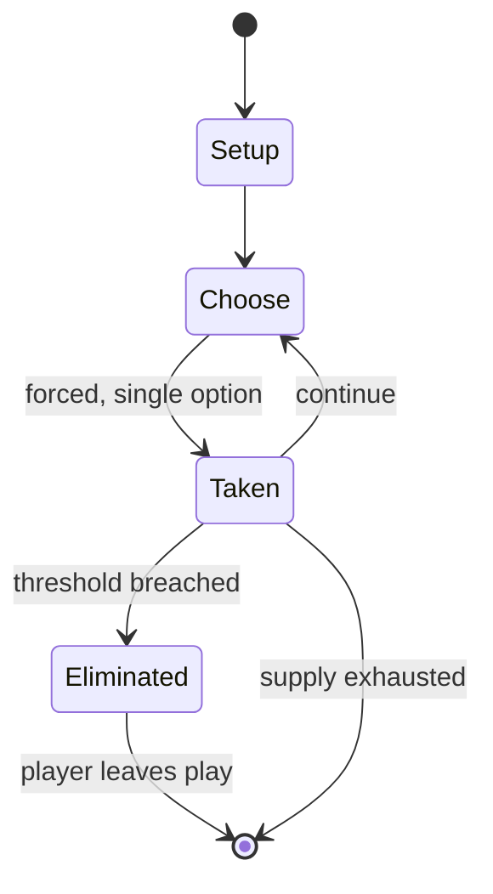

# Statues

*children's game*

`statues` &nbsp; state: **DEEPENED** &nbsp; method: **heuristic**

## Found layer (recorded, not trusted)

| field | value |
| --- | --- |
| wikidata | Q1140288 |
| wikipedia | Statues (game) |
| genres (source) | -- |
| instance of (source) | children's game |
| country of origin | Finland |

## Declared layer (orders bench work)

| field | value |
| --- | --- |
| year created | -- |
| epoch | -- |
| region | EUROPE_NORTH |
| media | - |
| players | -- |
| age band | CHILD |
| exogenous process | NONE |
| loss shape | ELIMINATION |
| live axes | - |
| horizon | -- |
| scoring shape | RACE_POSITION |
| information | PERFECT |
| interaction | -- |
| turn structure | -- |
| tractability | EXACT_WITH_CUT |
| randomness | NONE |
| luck factor | 0.02 |
| rules complexity | 2.23 |
| strategic depth | 2.4 |
| novelty | 0.8093 |
| solved status | -- |
| strategies | -- |
| algorithms | -- |

## Object model

```
Episode
  players      : ?
  turn_structure: ?
  horizon       : ?
  scoring       : RACE_POSITION

State          -- opaque; no medium or axis evidence was found
Player         -- an agent that selects among legal successors
```

## State transition diagram



## Research item -- turn trace

```
# Statues -- simulated turn events
# generated from the DECLARED vector, not from a rulebook.
# structure: exo=NONE loss=ELIMINATION horizon=None scoring=RACE_POSITION axes=-

t=0    SETUP        players=2  pot=0  capacity=8
t=1    FORCED       p1 single legal option taken (pot_gain=+0.5)
t=2    FORCED       p1 single legal option taken (pot_gain=+0.8)
t=3    FORCED       p1 single legal option taken (pot_gain=+1.1)
t=4    ENDTURN      turn passes to p2
t=5    FORCED       p2 single legal option taken (pot_gain=+1.9)
t=6    FORCED       p2 single legal option taken (pot_gain=+0.7)
t=7    ENDTURN      turn passes to p1
t=8    FORCED       p1 single legal option taken (pot_gain=+1.9)
t=9    FORCED       p1 single legal option taken (pot_gain=+0.9)
t=10   ENDTURN      turn passes to p2
t=11   FORCED       p2 single legal option taken (pot_gain=+1.3)
t=12   ENDTURN      turn passes to p1
t=13   FORCED       p1 single legal option taken (pot_gain=+1.0)
t=14   FORCED       p1 single legal option taken (pot_gain=+2.0)
t=15   ENDTURN      turn passes to p2
t=16   FORCED       p2 single legal option taken (pot_gain=+0.5)
t=17   ENDTURN      turn passes to p1
t=18   FORCED       p1 single legal option taken (pot_gain=+1.2)
t=19   ENDTURN      turn passes to p2
t=20   FORCED       p2 single legal option taken (pot_gain=+1.8)
t=21   ENDTURN      turn passes to p1
t=22   FORCED       p1 single legal option taken (pot_gain=+0.8)
t=23   FORCED       p1 single legal option taken (pot_gain=+2.0)
t=24   FORCED       p1 single legal option taken (pot_gain=+0.9)
t=25   FORCED       p1 single legal option taken (pot_gain=+2.0)
t=26   FORCED       p1 single legal option taken (pot_gain=+0.8)

terminal: VARIABLE
```

## Conditions

| kind | threshold | effect | trigger |
| --- | --- | --- | --- |
| ELIMINATE | -- | -- | If a statue is caught moving they are sent back to the starting line to begin again, or, in some versions of the game, eliminated. |

## Source extract

Statues (also known as Red Light, Green Light in North America, and Sly Fox,
Grandma's/Grandmother's Footsteps or Fairy Footsteps in the United Kingdom) is a children's
game. There are variations of play throughout different regions of the world.   == General rules
==  One person starts the game in the "curator" role (It, Granny, Pooh, etc.) and stands at the
end of a field. Everyone else playing stands at the far end (distance depends upon playing area
selected). The objective of the game is for a "statue" to tag the curator, thereby becoming the
curator and resetting the game. The curator turns their back to the field, and the "statues"
attempt to race across and tag the curator. Whenever the curator turns around, the statues must
freeze in position and hold that for as long as the curator looks at them. The curator may even
be allowed to walk around the statues, examining them. The curator needs to be careful –
whenever the curator's back is turned, statues are allowed to move. If a statue is caught moving
they are sent back to the starting line to begin again, or, in some versions of the game,
eliminated.   == Variations ==   === Red Light, Green Light === Red Light, Green Ligh

<sub>Wikipedia, CC BY-SA. Retained as evidence for the structural
classification above. Every rule inferred from it is HYPOTHESIZED
until audited against a rulebook.</sub>
