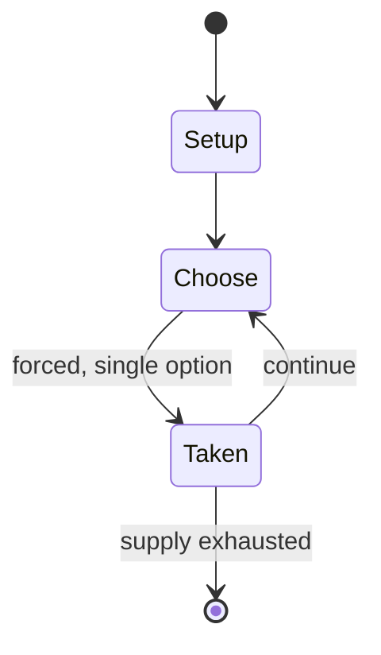

# StepMania

*open source music video game engine*

`stepmania` &nbsp; state: **DEEPENED** &nbsp; method: **heuristic**

## Found layer (recorded, not trusted)

| field | value |
| --- | --- |
| wikidata | Q1750824 |
| wikipedia | StepMania |
| genres (source) | music video game, rhythm game |
| instance of (source) | video game |
| country of origin | United States |

## Declared layer (orders bench work)

| field | value |
| --- | --- |
| year created | 2001 |
| epoch | CONTEMPORARY |
| region | NORTH_AMERICA |
| media | VIDEO |
| players | -- |
| age band | -- |
| exogenous process | -- |
| loss shape | -- |
| live axes | TIMING |
| horizon | -- |
| scoring shape | SET_COLLECTION_CONVEX |
| information | -- |
| interaction | -- |
| turn structure | -- |
| tractability | SAMPLING_ONLY |
| randomness | -- |
| luck factor | 0.35 |
| rules complexity | 2.14 |
| strategic depth | 2.5 |
| novelty | 0.4137 |
| solved status | -- |
| strategies | opponent_modelling, set_collection |
| algorithms | -- |

## Object model

```
Episode
  players      : ?
  turn_structure: ?
  horizon       : ?
  scoring       : SET_COLLECTION_CONVEX

WorldState     -- simulation state advanced by the engine
Avatar         -- player-controlled agent
Clock          -- frame or tick counter
Initiative     -- who acts, and when, relative to others
```

## State transition diagram



## Research item -- turn trace

```
# StepMania -- simulated turn events
# generated from the DECLARED vector, not from a rulebook.
# structure: exo=None loss=None horizon=None scoring=SET_COLLECTION_CONVEX axes=TIMING

t=0    SETUP        players=2  pot=0  capacity=4
t=1    FORCED       p1 single legal option taken (pot_gain=+0.8)
t=2    FORCED       p1 single legal option taken (pot_gain=+1.0)
t=3    FORCED       p1 single legal option taken (pot_gain=+0.8)
t=4    FORCED       p1 single legal option taken (pot_gain=+1.2)
t=5    FORCED       p1 single legal option taken (pot_gain=+1.6)
t=6    FORCED       p1 single legal option taken (pot_gain=+1.9)
t=7    ENDTURN      turn passes to p2
t=8    FORCED       p2 single legal option taken (pot_gain=+1.6)
t=9    FORCED       p2 single legal option taken (pot_gain=+1.3)
t=10   FORCED       p2 single legal option taken (pot_gain=+1.1)
t=11   ENDTURN      turn passes to p1
t=12   FORCED       p1 single legal option taken (pot_gain=+1.9)
t=13   FORCED       p1 single legal option taken (pot_gain=+0.9)
t=14   FORCED       p1 single legal option taken (pot_gain=+1.9)
t=15   FORCED       p1 single legal option taken (pot_gain=+1.0)
t=16   FORCED       p1 single legal option taken (pot_gain=+1.9)
t=17   FORCED       p1 single legal option taken (pot_gain=+1.7)
t=18   FORCED       p1 single legal option taken (pot_gain=+1.7)
t=19   ENDTURN      turn passes to p2
t=20   FORCED       p2 single legal option taken (pot_gain=+1.8)
t=21   ENDTURN      turn passes to p1
t=22   FORCED       p1 single legal option taken (pot_gain=+1.9)
t=23   FORCED       p1 single legal option taken (pot_gain=+0.9)
t=24   FORCED       p1 single legal option taken (pot_gain=+1.0)
t=25   FORCED       p1 single legal option taken (pot_gain=+1.9)
t=26   FORCED       p1 single legal option taken (pot_gain=+0.7)

terminal: VARIABLE
```

## Conditions

| kind | threshold | effect | trigger |
| --- | --- | --- | --- |
| ELIMINATE | -- | -- | The song must be under a compatible license for distribution or be authorized for use in StepMix 4, or the entry is automatically disqualified. |
| ELIMINATE | -- | -- | Additionally, if the graphics used in the entry are found to have been copied from another artist and used without their authorization (as happened once in StepMix 2), the entry may be disqualified. |

## Source extract

StepMania is a cross-platform rhythm video game and engine. It was originally developed as a
clone of Konami's arcade game series Dance Dance Revolution, and has since evolved into an
extensible rhythm game engine capable of supporting a variety of rhythm-based game types.
Released under the MIT License, StepMania is open-source free software. Several video game
series use StepMania as their game engines. This includes In the Groove, Pump It Up Pro, Pump It
Up Infinity, and StepManiaX. StepMania was included in a video game exhibition at New York's
Museum of the Moving Image in 2005.   == Development == StepMania was originally developed as an
open-source clone of Konami's arcade game series Dance Dance Revolution (DDR). During the first
three major versions, the Interface was based heavily on DDR's. New versions were released
relatively quickly at first, culminating in version 3.9 in 2005. In 2010, after almost 5 years
of work without a stable release, StepMania creator Chris Danford forked a 2006 build of
StepMania, paused development on the bleeding edge branch, and labeled the new branch StepMania
4 beta. A separate development team called the Spinal Shark Collective forked the

<sub>Wikipedia, CC BY-SA. Retained as evidence for the structural
classification above. Every rule inferred from it is HYPOTHESIZED
until audited against a rulebook.</sub>
