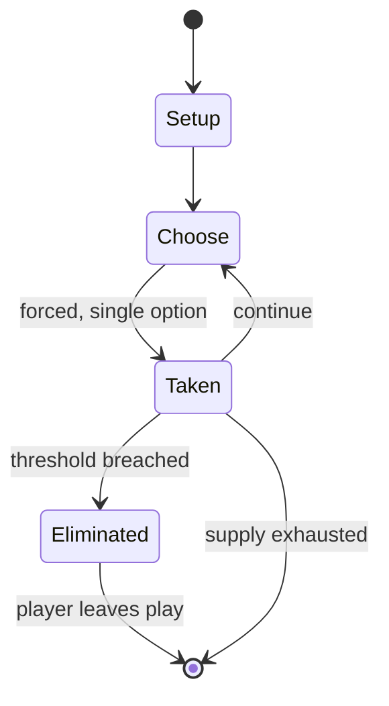

# Sticks & Stones

*1978 board game*

`sticks_stones` &nbsp; state: **DEEPENED** &nbsp; method: **heuristic**

## Found layer (recorded, not trusted)

| field | value |
| --- | --- |
| wikidata | Q111940957 |
| wikipedia | Sticks & Stones (board game) |
| genres (source) | -- |
| instance of (source) | board game, board wargame |
| country of origin | -- |

## Declared layer (orders bench work)

| field | value |
| --- | --- |
| year created | 1978 |
| epoch | DIGITAL |
| region | -- |
| media | BOARD, WARGAME |
| players | 1-2 |
| age band | -- |
| exogenous process | -- |
| loss shape | ELIMINATION |
| live axes | SPATIAL |
| horizon | -- |
| scoring shape | -- |
| information | -- |
| interaction | SOLITAIRE |
| turn structure | -- |
| tractability | SAMPLING_ONLY |
| randomness | DICE |
| luck factor | 0.58 |
| rules complexity | 3.23 |
| strategic depth | 1.87 |
| novelty | 0.5884 |
| solved status | -- |
| strategies | -- |
| algorithms | -- |

## Object model

```
Episode
  players      : 1-2
  turn_structure: ?
  horizon       : ?
  scoring       : ?

Board          -- spatial substrate; cells carry position and occupancy
Piece          -- movable token owned by a player
Placement      -- position subject to geometric legality
```

## State transition diagram



## Research item -- turn trace

```
# Sticks & Stones -- simulated turn events
# generated from the DECLARED vector, not from a rulebook.
# structure: exo=None loss=ELIMINATION horizon=None scoring=None axes=SPATIAL

t=0    SETUP        players=1  pot=0  capacity=3
t=1    FORCED       p1 single legal option taken (pot_gain=+0.8)
t=2    FORCED       p1 single legal option taken (pot_gain=+0.8)
t=3    SPATIAL      p1 places at (4,4); adjacency legal
t=4    FORCED       p1 single legal option taken (pot_gain=+1.6)
t=5    FORCED       p1 single legal option taken (pot_gain=+1.6)
t=6    FORCED       p1 single legal option taken (pot_gain=+1.5)
t=7    SPATIAL      p1 places at (1,4); adjacency legal
t=8    FORCED       p1 single legal option taken (pot_gain=+1.7)
t=9    SPATIAL      p1 places at (2,1); adjacency legal
t=10   ENDTURN      turn passes to p1
t=11   FORCED       p1 single legal option taken (pot_gain=+1.6)
t=12   FORCED       p1 single legal option taken (pot_gain=+0.8)
t=13   FORCED       p1 single legal option taken (pot_gain=+0.7)
t=14   FORCED       p1 single legal option taken (pot_gain=+0.7)
t=15   FORCED       p1 single legal option taken (pot_gain=+1.6)
t=16   SPATIAL      p1 places at (2,1); adjacency legal
t=17   FORCED       p1 single legal option taken (pot_gain=+1.2)
t=18   SPATIAL      p1 places at (3,5); adjacency legal
t=19   ENDTURN      turn passes to p1
t=20   FORCED       p1 single legal option taken (pot_gain=+1.0)
t=21   FORCED       p1 single legal option taken (pot_gain=+2.0)
t=22   SPATIAL      p1 places at (7,7); adjacency legal
t=23   FORCED       p1 single legal option taken (pot_gain=+1.0)
t=24   FORCED       p1 single legal option taken (pot_gain=+1.9)
t=25   ENDTURN      turn passes to p1
t=26   FORCED       p1 single legal option taken (pot_gain=+0.7)
t=27   SPATIAL      p1 places at (1,6); adjacency legal

terminal: VARIABLE
```

## Source extract

Sticks & Stones is a board wargame published by Metagaming Concepts in 1978 that is set in the
Neolithic Age.   == Description == Sticks & Stones is a two-player microgame in which rival
Stone Age tribes vie with each other. It was the first board game featuring a Neolithic setting.
=== Components === The ziplock bag contains:  8.5" x 14" paper hex grid map 24-page rule booklet
a sheet of 136 uncut cardstock counters   === Scenarios === The game includes five scenarios:
Raid on unfortified village Raid on a fortified village War between two fortified villages
Territorial ritual battle Mastodon hunt (solitaire scenario)   === Gameplay === Each player buys
warriors and weapons using a pool of points. Turns are played in standard "I go, You go" format
— one player moves and fights, then the other player moves and fights. Combat is resolved with a
Combat Result Table and a die roll.  Each warrior counter has two damage points. The first time
a unit is hit, the counter is turned over to indicate it is damaged. The next time it is hit,
the counter is removed from the board.  Victory conditions vary from scenario to scenario, and
may involve the capture of villagers and goods rather t

<sub>Wikipedia, CC BY-SA. Retained as evidence for the structural
classification above. Every rule inferred from it is HYPOTHESIZED
until audited against a rulebook.</sub>
