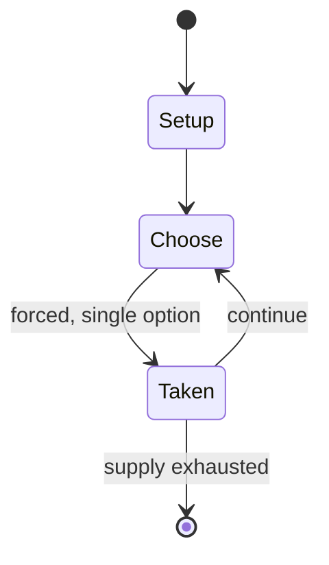

# Stoßpudel

`sto_pudel` &nbsp; state: **DEEPENED** &nbsp; method: **heuristic**

## Found layer (recorded, not trusted)

| field | value |
| --- | --- |
| wikidata | Q1591255 |
| wikipedia | Stoßpudel |
| genres (source) | -- |
| instance of (source) | -- |
| country of origin | -- |

## Declared layer (orders bench work)

| field | value |
| --- | --- |
| year created | -- |
| epoch | -- |
| region | -- |
| media | BOARD |
| players | -- |
| age band | -- |
| exogenous process | -- |
| loss shape | -- |
| live axes | - |
| horizon | -- |
| scoring shape | LINEAR_ACCUMULATION |
| information | -- |
| interaction | -- |
| turn structure | STRICT_TURN |
| tractability | SAMPLING_ONLY |
| randomness | -- |
| luck factor | 0.35 |
| rules complexity | 1.71 |
| strategic depth | 2.0 |
| novelty | 0.5837 |
| solved status | -- |
| strategies | -- |
| algorithms | -- |

## Object model

```
Episode
  players      : ?
  turn_structure: STRICT_TURN
  horizon       : ?
  scoring       : LINEAR_ACCUMULATION

Board          -- spatial substrate; cells carry position and occupancy
Piece          -- movable token owned by a player
```

## State transition diagram



## Research item -- turn trace

```
# Stoßpudel -- simulated turn events
# generated from the DECLARED vector, not from a rulebook.
# structure: exo=None loss=None horizon=None scoring=LINEAR_ACCUMULATION axes=-

t=0    SETUP        players=2  pot=0  capacity=7
t=1    FORCED       p1 single legal option taken (pot_gain=+1.2)
t=2    FORCED       p1 single legal option taken (pot_gain=+1.8)
t=3    FORCED       p1 single legal option taken (pot_gain=+1.6)
t=4    FORCED       p1 single legal option taken (pot_gain=+1.5)
t=5    FORCED       p1 single legal option taken (pot_gain=+1.9)
t=6    ENDTURN      turn passes to p2
t=7    FORCED       p2 single legal option taken (pot_gain=+1.7)
t=8    ENDTURN      turn passes to p1
t=9    FORCED       p1 single legal option taken (pot_gain=+2.0)
t=10   FORCED       p1 single legal option taken (pot_gain=+1.5)
t=11   FORCED       p1 single legal option taken (pot_gain=+1.0)
t=12   FORCED       p1 single legal option taken (pot_gain=+0.8)
t=13   FORCED       p1 single legal option taken (pot_gain=+0.7)
t=14   FORCED       p1 single legal option taken (pot_gain=+1.1)
t=15   FORCED       p1 single legal option taken (pot_gain=+1.1)
t=16   FORCED       p1 single legal option taken (pot_gain=+1.8)
t=17   FORCED       p1 single legal option taken (pot_gain=+0.9)
t=18   FORCED       p1 single legal option taken (pot_gain=+0.8)
t=19   FORCED       p1 single legal option taken (pot_gain=+0.8)
t=20   ENDTURN      turn passes to p2
t=21   FORCED       p2 single legal option taken (pot_gain=+1.3)
t=22   FORCED       p2 single legal option taken (pot_gain=+1.3)
t=23   FORCED       p2 single legal option taken (pot_gain=+1.9)
t=24   FORCED       p2 single legal option taken (pot_gain=+0.6)
t=25   FORCED       p2 single legal option taken (pot_gain=+0.8)
t=26   FORCED       p2 single legal option taken (pot_gain=+1.9)
t=27   ENDTURN      turn passes to p1

terminal: VARIABLE
```

## Source extract

Stoßpudel is an historical, south German and Austrian pinball game in which a ball is projected
onto an inclined wooden playing board and falls into hollows or rolls into demarcated slots.
Various points are scored for each shot depending on where the ball ends up. An 1834 Bavarian
dictionary describes a Stoßpudel as a "portable bowling alley, roughly like a type of billiard
table, onto which an ivory ball is struck with a stick".   == Design == Stoßpudel equipment
consists of an inclined and framed wooden board, in which - similar to a pinball machine - a
small steel or glass ball is inserted at the bottom right and fired by means of a spring
plunger. The player can regulate the force himself by pulling the spring plunger back a certain
distance and thus setting the tension of the mainspring. The ball shot into the playing field
now rolls down the sloping wooden surface and is deflected by small iron nails hammered at
regular intervals into the wooden board. The ball can be caught in one of several small hollows
or roll down the playing field and into one of the demarcated slots at the bottom. Each pit has
a numerical value. The highest score is achieved when the ball rolls into t

<sub>Wikipedia, CC BY-SA. Retained as evidence for the structural
classification above. Every rule inferred from it is HYPOTHESIZED
until audited against a rulebook.</sub>
