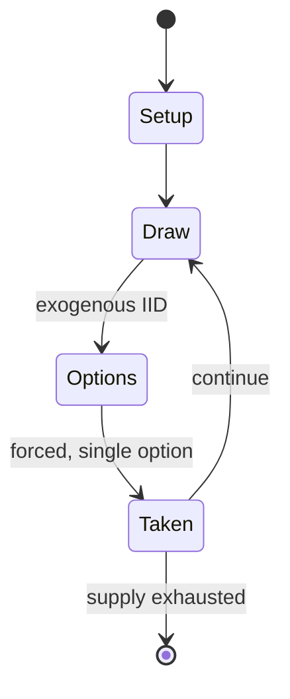

# Stone Age

*2008 board game*

`stone_age` &nbsp; state: **DEEPENED** &nbsp; method: **heuristic**

## Found layer (recorded, not trusted)

| field | value |
| --- | --- |
| wikidata | Q1518661 |
| wikipedia | Stone Age (board game) |
| genres (source) | -- |
| instance of (source) | board game |
| country of origin | Germany |

## Declared layer (orders bench work)

| field | value |
| --- | --- |
| year created | 2008 |
| epoch | CONTEMPORARY |
| region | EUROPE_WEST |
| media | BOARD, DICE, TILE |
| players | 2-4 |
| age band | -- |
| exogenous process | IID |
| loss shape | -- |
| live axes | TRADE |
| horizon | -- |
| scoring shape | -- |
| information | -- |
| interaction | NEGOTIATION |
| turn structure | -- |
| tractability | INTRACTABLE |
| randomness | DICE |
| luck factor | 0.58 |
| rules complexity | 2.49 |
| strategic depth | 1.87 |
| novelty | 1.0 |
| solved status | -- |
| strategies | -- |
| algorithms | -- |

## Object model

```
Episode
  players      : 2-4
  turn_structure: ?
  horizon       : ?
  scoring       : ?

Board          -- spatial substrate; cells carry position and occupancy
Piece          -- movable token owned by a player
DicePool       -- n dice, each an iid categorical draw
Roll           -- realised outcome of a pool
TileBag        -- unordered draw source
Layout         -- placed tiles and their adjacencies
Offer          -- proposed exchange between two agents
```

## State transition diagram



## Research item -- turn trace

```
# Stone Age -- simulated turn events
# generated from the DECLARED vector, not from a rulebook.
# structure: exo=IID loss=None horizon=None scoring=None axes=TRADE

t=0    SETUP        players=2  pot=0  capacity=4
t=1    DRAW         p1 roll from d6 pool -> outcome #1  (p=0.221)
t=2    FORCED       p1 single legal option taken (pot_gain=+0.8)
t=3    DRAW         p1 roll from d6 pool -> outcome #6  (p=0.166)
t=4    FORCED       p1 single legal option taken (pot_gain=+1.1)
t=5    DRAW         p1 roll from d6 pool -> outcome #1  (p=0.113)
t=6    FORCED       p1 single legal option taken (pot_gain=+1.5)
t=7    DRAW         p1 roll from d6 pool -> outcome #6  (p=0.001)
t=8    FORCED       p1 single legal option taken (pot_gain=+1.8)
t=9    TRADE        p1 offers 2:1 exchange to p2
t=10   DRAW         p1 roll from d6 pool -> outcome #1  (p=0.158)
t=11   FORCED       p1 single legal option taken (pot_gain=+1.8)
t=12   TRADE        p1 offers 2:1 exchange to p2
t=13   DRAW         p1 roll from d6 pool -> outcome #5  (p=0.049)
t=14   FORCED       p1 single legal option taken (pot_gain=+0.6)
t=15   TRADE        p1 offers 2:1 exchange to p2
t=16   ENDTURN      turn passes to p2
t=17   DRAW         p2 roll from d6 pool -> outcome #1  (p=0.157)
t=18   FORCED       p2 single legal option taken (pot_gain=+2.0)
t=19   DRAW         p2 roll from d6 pool -> outcome #2  (p=0.137)
t=20   FORCED       p2 single legal option taken (pot_gain=+0.6)
t=21   TRADE        p2 offers 2:1 exchange to p1
t=22   DRAW         p2 roll from d6 pool -> outcome #4  (p=0.231)
t=23   FORCED       p2 single legal option taken (pot_gain=+0.5)
t=24   DRAW         p2 roll from d6 pool -> outcome #2  (p=0.075)
t=25   FORCED       p2 single legal option taken (pot_gain=+0.9)
t=26   ENDTURN      turn passes to p1

terminal: VARIABLE
```

## Source extract

Stone Age is a designer board game designed by Michael Tummelhofer and published by Hans im
Glück in 2008. It is a development game with a Stone Age theme that involves taking control of a
tribe to collect resources and build a village that has the most powerful chief. Players collect
wood, break stone and wash their gold from the river. They trade freely, expand their village
and so achieve new levels of civilization. With a balance of luck and planning, the players
compete for food in this prehistoric time.   == Components == 1 gameboard 4 individual player
boards 68 wooden resources 40 wooden people 8 wooden markers in 2 sizes 53 food tiles 28
building tiles 18 tool tiles 1 start player figure 36 civilization cards 7 dice 1 leather dice
cup 1 information sheet   == Awards == 2008 Spiel des Jahres Nominee. 2008 Deutscher Spiele
Preis 2nd Place.   == External links ==  Stone Age   at BoardGameGeek Stone Age at Rio Grande
Games Stone Age at Z-Man Games Stone Age Rules

<sub>Wikipedia, CC BY-SA. Retained as evidence for the structural
classification above. Every rule inferred from it is HYPOTHESIZED
until audited against a rulebook.</sub>
