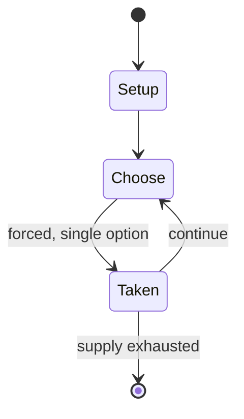

# String figure

`string_figure` &nbsp; state: **DEEPENED** &nbsp; method: **heuristic**

## Found layer (recorded, not trusted)

| field | value |
| --- | --- |
| wikidata | Q584764 |
| wikipedia | String figure |
| genres (source) | -- |
| instance of (source) | -- |
| country of origin | -- |

## Declared layer (orders bench work)

| field | value |
| --- | --- |
| year created | -- |
| epoch | -- |
| region | -- |
| media | - |
| players | -- |
| age band | -- |
| exogenous process | NONE |
| loss shape | OPPORTUNITY_ONLY |
| live axes | ORDER |
| horizon | -- |
| scoring shape | SET_COLLECTION_CONVEX |
| information | PERFECT |
| interaction | -- |
| turn structure | -- |
| tractability | EXACT_WITH_CUT |
| randomness | NONE |
| luck factor | 0.02 |
| rules complexity | 2.18 |
| strategic depth | 2.65 |
| novelty | 0.7631 |
| solved status | -- |
| strategies | set_collection |
| algorithms | -- |

## Object model

```
Episode
  players      : ?
  turn_structure: ?
  horizon       : ?
  scoring       : SET_COLLECTION_CONVEX

Sequence       -- the permutation under the player's control
```

## State transition diagram



## Research item -- turn trace

```
# String figure -- simulated turn events
# generated from the DECLARED vector, not from a rulebook.
# structure: exo=NONE loss=OPPORTUNITY_ONLY horizon=None scoring=SET_COLLECTION_CONVEX axes=ORDER

t=0    SETUP        players=2  pot=0  capacity=4
t=1    FORCED       p1 single legal option taken (pot_gain=+1.2)
t=2    FORCED       p1 single legal option taken (pot_gain=+1.5)
t=3    FORCED       p1 single legal option taken (pot_gain=+1.6)
t=4    FORCED       p1 single legal option taken (pot_gain=+1.0)
t=5    FORCED       p1 single legal option taken (pot_gain=+1.3)
t=6    FORCED       p1 single legal option taken (pot_gain=+1.4)
t=7    FORCED       p1 single legal option taken (pot_gain=+1.0)
t=8    FORCED       p1 single legal option taken (pot_gain=+1.1)
t=9    FORCED       p1 single legal option taken (pot_gain=+1.3)
t=10   ENDTURN      turn passes to p2
t=11   FORCED       p2 single legal option taken (pot_gain=+1.9)
t=12   FORCED       p2 single legal option taken (pot_gain=+1.6)
t=13   FORCED       p2 single legal option taken (pot_gain=+1.2)
t=14   FORCED       p2 single legal option taken (pot_gain=+1.6)
t=15   ENDTURN      turn passes to p1
t=16   FORCED       p1 single legal option taken (pot_gain=+0.7)
t=17   ENDTURN      turn passes to p2
t=18   FORCED       p2 single legal option taken (pot_gain=+1.8)
t=19   FORCED       p2 single legal option taken (pot_gain=+1.6)
t=20   ENDTURN      turn passes to p1
t=21   FORCED       p1 single legal option taken (pot_gain=+1.4)
t=22   ENDTURN      turn passes to p2
t=23   FORCED       p2 single legal option taken (pot_gain=+0.7)
t=24   FORCED       p2 single legal option taken (pot_gain=+1.9)
t=25   FORCED       p2 single legal option taken (pot_gain=+1.0)
t=26   FORCED       p2 single legal option taken (pot_gain=+0.8)

terminal: VARIABLE
```

## Source extract

A string figure  is a design formed by manipulating string on, around, and using one's fingers
or sometimes between the fingers of multiple people. String figures may also involve the use of
the mouth, wrist, and feet. They may consist of singular images or be created and altered as a
game, known as a string game, or as part of a story involving various figures made in sequence
(string story). String figures have also been used for divination, such as to predict the sex of
an unborn child. A popular string game is cat's cradle, but many string figures are known in
many places under different names, and string figures are well distributed throughout the world.
== History == According to Camilla Gryski, a Canadian librarian and author of numerous string
figure books, "We don't know when people first started playing with string, or which primitive
people invented this ancient art. We do know that all primitive societies had and used
string—for hunting, fishing, and weaving—and that string figures have been collected from native
peoples all over the world." "Of the games people play, string figures enjoy the reputation of
being the most widespread form of amusement in the world: more

<sub>Wikipedia, CC BY-SA. Retained as evidence for the structural
classification above. Every rule inferred from it is HYPOTHESIZED
until audited against a rulebook.</sub>
