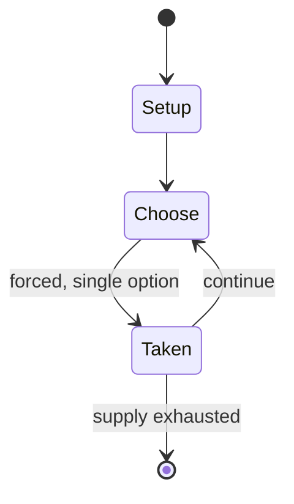

# Sudoku

`sudoku` &nbsp; state: **DEEPENED** &nbsp; method: **heuristic**

## Found layer (recorded, not trusted)

| field | value |
| --- | --- |
| wikidata | Q44914 |
| wikipedia | Sudoku |
| genres (source) | -- |
| instance of (source) | -- |
| country of origin | -- |

## Declared layer (orders bench work)

| field | value |
| --- | --- |
| year created | -- |
| epoch | -- |
| region | -- |
| media | PUZZLE |
| players | -- |
| age band | -- |
| exogenous process | -- |
| loss shape | -- |
| live axes | SPATIAL |
| horizon | -- |
| scoring shape | -- |
| information | -- |
| interaction | -- |
| turn structure | -- |
| tractability | SAMPLING_ONLY |
| randomness | -- |
| luck factor | 0.35 |
| rules complexity | 2.12 |
| strategic depth | 2.3 |
| novelty | 0.0938 |
| solved status | -- |
| strategies | -- |
| algorithms | exact_cover_dancing_links |

## Object model

```
Episode
  players      : ?
  turn_structure: ?
  horizon       : ?
  scoring       : ?

Configuration  -- the arrangement to be resolved
Constraint     -- predicate a legal configuration must satisfy
Placement      -- position subject to geometric legality
```

## State transition diagram



## Research item -- turn trace

```
# Sudoku -- simulated turn events
# generated from the DECLARED vector, not from a rulebook.
# structure: exo=None loss=None horizon=None scoring=None axes=SPATIAL

t=0    SETUP        players=2  pot=0  capacity=6
t=1    FORCED       p1 single legal option taken (pot_gain=+1.6)
t=2    SPATIAL      p1 places at (7,1); adjacency legal
t=3    FORCED       p1 single legal option taken (pot_gain=+1.4)
t=4    FORCED       p1 single legal option taken (pot_gain=+0.6)
t=5    FORCED       p1 single legal option taken (pot_gain=+1.9)
t=6    FORCED       p1 single legal option taken (pot_gain=+1.0)
t=7    SPATIAL      p1 places at (1,3); adjacency legal
t=8    ENDTURN      turn passes to p2
t=9    FORCED       p2 single legal option taken (pot_gain=+1.1)
t=10   SPATIAL      p2 places at (7,4); adjacency legal
t=11   ENDTURN      turn passes to p1
t=12   FORCED       p1 single legal option taken (pot_gain=+1.2)
t=13   FORCED       p1 single legal option taken (pot_gain=+0.5)
t=14   SPATIAL      p1 places at (0,0); adjacency legal
t=15   FORCED       p1 single legal option taken (pot_gain=+1.3)
t=16   FORCED       p1 single legal option taken (pot_gain=+1.8)
t=17   FORCED       p1 single legal option taken (pot_gain=+2.0)
t=18   FORCED       p1 single legal option taken (pot_gain=+1.0)
t=19   FORCED       p1 single legal option taken (pot_gain=+0.8)
t=20   FORCED       p1 single legal option taken (pot_gain=+1.4)
t=21   SPATIAL      p1 places at (2,1); adjacency legal
t=22   FORCED       p1 single legal option taken (pot_gain=+1.6)
t=23   SPATIAL      p1 places at (1,0); adjacency legal
t=24   ENDTURN      turn passes to p2
t=25   FORCED       p2 single legal option taken (pot_gain=+1.6)
t=26   FORCED       p2 single legal option taken (pot_gain=+0.6)
t=27   SPATIAL      p2 places at (6,3); adjacency legal

terminal: VARIABLE
```

## Conditions

| kind | threshold | effect | trigger |
| --- | --- | --- | --- |
| BOUNDARY | -- | -- | In 1986, Nikoli introduced two innovations: the number of givens was restricted to no more than 32, and puzzles became "symmetrical" (meaning the givens were distributed in rotationally symmetric cells). |

## Source extract

Sudoku (; Japanese: 数独, romanized: sūdoku, lit. 'digit-single'; originally called Number Place)
is a logic-based, combinatorial number-placement puzzle. In classic Sudoku, the objective is to
fill a 9×9 grid with digits so that each column, each row, and each of the nine 3×3 subgrids
that compose the grid (also called "boxes", "blocks", or "regions") contains all of the digits
from 1 to 9. The puzzle setter provides a partially completed grid, which, for a well-posed
puzzle, has a single solution. French newspapers featured similar puzzles in the 19th century,
and the modern form of the puzzle first appeared in 1979 puzzle books by Dell Magazines under
the name Number Place. However, the puzzle type only began to gain widespread popularity in 1986
when it was published by the Japanese puzzle company Nikoli under the name Sudoku, meaning
"single number". In newspapers outside of Japan, it first appeared in The Conway Daily Sun (New
Hampshire) in September 2004, and then The Times (London) in November 2004, both of which were
thanks to the efforts of the Hong Kong judge Wayne Gould, who devised a computer program to
rapidly produce unique puzzles.   == History ==   === Predecessors =

<sub>Wikipedia, CC BY-SA. Retained as evidence for the structural
classification above. Every rule inferred from it is HYPOTHESIZED
until audited against a rulebook.</sub>
