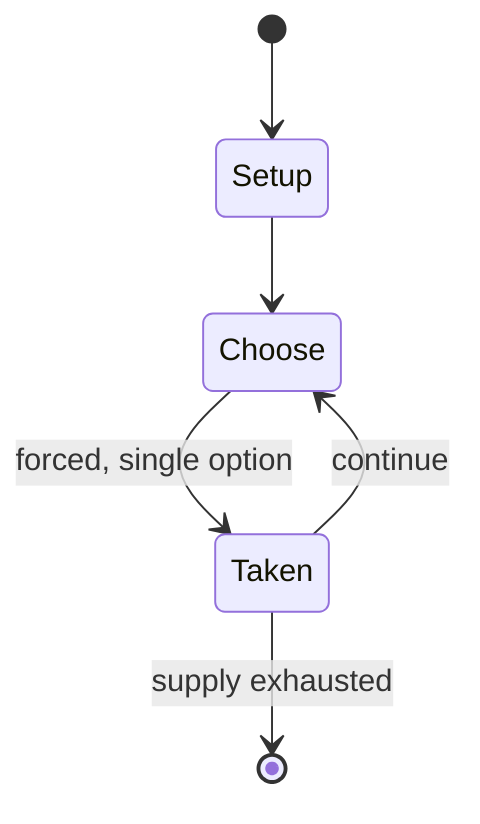

# Sugoroku

`sugoroku` &nbsp; state: **DEEPENED** &nbsp; method: **heuristic**

## Found layer (recorded, not trusted)

| field | value |
| --- | --- |
| wikidata | Q1472906 |
| wikipedia | Sugoroku |
| genres (source) | -- |
| instance of (source) | -- |
| country of origin | -- |

## Declared layer (orders bench work)

| field | value |
| --- | --- |
| year created | -- |
| epoch | -- |
| region | -- |
| media | BOARD, GAMBLING, VIDEO |
| players | -- |
| age band | -- |
| exogenous process | -- |
| loss shape | -- |
| live axes | - |
| horizon | -- |
| scoring shape | SURVIVAL |
| information | -- |
| interaction | SOLITAIRE |
| turn structure | STRICT_TURN |
| tractability | SAMPLING_ONLY |
| randomness | DICE |
| luck factor | 0.58 |
| rules complexity | 1.95 |
| strategic depth | 1.87 |
| novelty | 0.6346 |
| solved status | -- |
| strategies | -- |
| algorithms | -- |

## Object model

```
Episode
  players      : ?
  turn_structure: STRICT_TURN
  horizon       : ?
  scoring       : SURVIVAL

Board          -- spatial substrate; cells carry position and occupancy
Piece          -- movable token owned by a player
WorldState     -- simulation state advanced by the engine
Avatar         -- player-controlled agent
Clock          -- frame or tick counter
```

## State transition diagram



## Research item -- turn trace

```
# Sugoroku -- simulated turn events
# generated from the DECLARED vector, not from a rulebook.
# structure: exo=None loss=None horizon=None scoring=SURVIVAL axes=-

t=0    SETUP        players=2  pot=0  capacity=6
t=1    FORCED       p1 single legal option taken (pot_gain=+1.4)
t=2    ENDTURN      turn passes to p2
t=3    FORCED       p2 single legal option taken (pot_gain=+0.9)
t=4    FORCED       p2 single legal option taken (pot_gain=+0.7)
t=5    FORCED       p2 single legal option taken (pot_gain=+1.4)
t=6    FORCED       p2 single legal option taken (pot_gain=+1.2)
t=7    FORCED       p2 single legal option taken (pot_gain=+1.3)
t=8    FORCED       p2 single legal option taken (pot_gain=+1.5)
t=9    FORCED       p2 single legal option taken (pot_gain=+0.7)
t=10   FORCED       p2 single legal option taken (pot_gain=+2.0)
t=11   FORCED       p2 single legal option taken (pot_gain=+0.8)
t=12   ENDTURN      turn passes to p1
t=13   FORCED       p1 single legal option taken (pot_gain=+0.7)
t=14   FORCED       p1 single legal option taken (pot_gain=+1.1)
t=15   ENDTURN      turn passes to p2
t=16   FORCED       p2 single legal option taken (pot_gain=+0.9)
t=17   FORCED       p2 single legal option taken (pot_gain=+1.5)
t=18   FORCED       p2 single legal option taken (pot_gain=+0.8)
t=19   ENDTURN      turn passes to p1
t=20   FORCED       p1 single legal option taken (pot_gain=+0.7)
t=21   FORCED       p1 single legal option taken (pot_gain=+2.0)
t=22   ENDTURN      turn passes to p2
t=23   FORCED       p2 single legal option taken (pot_gain=+1.0)
t=24   FORCED       p2 single legal option taken (pot_gain=+0.9)
t=25   FORCED       p2 single legal option taken (pot_gain=+0.8)
t=26   FORCED       p2 single legal option taken (pot_gain=+0.9)
t=27   ENDTURN      turn passes to p1

terminal: VARIABLE
```

## Source extract

Sugoroku (雙六 or 双六) (literally 'double six') refers to two different forms of a Japanese board
game: e-sugoroku (絵双六, 'picture-sugoroku') which is similar to Western snakes and ladders, and
ban-sugoroku (盤双六, 'board-sugoroku') which is similar to western tables games like backgammon.
With ban-sugoroku being obsolete, today the word sugoroku almost always means e-sugoroku.   ==
E-sugoroku ==  The simpler e-sugoroku, with rules similar to snakes and ladders, appeared as
early as late 13th century and was made popular due to the cheap and elaborate wooden block
printing technology of the Edo period. Thousands of variations of boards were made with pictures
and themes from religion, political, actors, and even adult material. In the Meiji and later
periods, this variation of the game remained popular and was often included in child-oriented
magazines. With ban-sugoroku being obsolete, today the word sugoroku almost always means
e-sugoroku.   == Ban-sugoroku ==  Ban-sugoroku is played in a similar way to western tables
games. It has the same starting position as backgammon, but the aim and rules of play are
different. For example:  Doubles are not special. If a player rolls doubles, eac

<sub>Wikipedia, CC BY-SA. Retained as evidence for the structural
classification above. Every rule inferred from it is HYPOTHESIZED
until audited against a rulebook.</sub>
