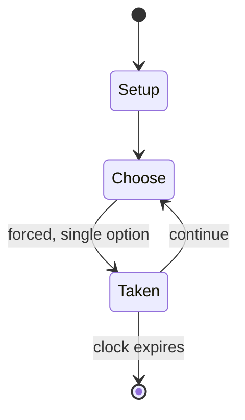

# suikawari

*game of splitting a watermelon while blindfolded*

`suikawari` &nbsp; state: **DEEPENED** &nbsp; method: **heuristic**

## Found layer (recorded, not trusted)

| field | value |
| --- | --- |
| wikidata | Q869422 |
| wikipedia | Suikawari |
| genres (source) | -- |
| instance of (source) | outdoor game, traditional game |
| country of origin | Japan |

## Declared layer (orders bench work)

| field | value |
| --- | --- |
| year created | -- |
| epoch | -- |
| region | EAST_ASIA |
| media | - |
| players | -- |
| age band | -- |
| exogenous process | -- |
| loss shape | -- |
| live axes | COMMIT_BLIND |
| horizon | CLOCK_LIMITED |
| scoring shape | SET_COLLECTION_CONVEX |
| information | -- |
| interaction | COOPERATIVE |
| turn structure | STRICT_TURN |
| tractability | SAMPLING_ONLY |
| randomness | -- |
| luck factor | 0.35 |
| rules complexity | 2.05 |
| strategic depth | 2.25 |
| novelty | 0.6946 |
| solved status | -- |
| strategies | set_collection |
| algorithms | -- |

## Object model

```
Episode
  players      : ?
  turn_structure: STRICT_TURN
  horizon       : CLOCK_LIMITED
  scoring       : SET_COLLECTION_CONVEX

SealedChoice   -- irrevocable choice made without observation
```

## State transition diagram



## Research item -- turn trace

```
# suikawari -- simulated turn events
# generated from the DECLARED vector, not from a rulebook.
# structure: exo=None loss=None horizon=CLOCK_LIMITED scoring=SET_COLLECTION_CONVEX axes=COMMIT_BLIND

t=0    SETUP        players=2  pot=0  capacity=6
t=1    FORCED       p1 single legal option taken (pot_gain=+1.7)
t=2    FORCED       p1 single legal option taken (pot_gain=+1.4)
t=3    FORCED       p1 single legal option taken (pot_gain=+0.6)
t=4    FORCED       p1 single legal option taken (pot_gain=+1.3)
t=5    FORCED       p1 single legal option taken (pot_gain=+0.5)
t=6    FORCED       p1 single legal option taken (pot_gain=+0.7)
t=7    FORCED       p1 single legal option taken (pot_gain=+0.9)
t=8    FORCED       p1 single legal option taken (pot_gain=+1.5)
t=9    ENDTURN      turn passes to p2
t=10   FORCED       p2 single legal option taken (pot_gain=+1.6)
t=11   FORCED       p2 single legal option taken (pot_gain=+0.9)
t=12   ENDTURN      turn passes to p1
t=13   FORCED       p1 single legal option taken (pot_gain=+0.9)
t=14   ENDTURN      turn passes to p2
t=15   FORCED       p2 single legal option taken (pot_gain=+1.6)
t=16   FORCED       p2 single legal option taken (pot_gain=+1.0)
t=17   FORCED       p2 single legal option taken (pot_gain=+0.7)
t=18   FORCED       p2 single legal option taken (pot_gain=+0.9)
t=19   FORCED       p2 single legal option taken (pot_gain=+1.6)
t=20   FORCED       p2 single legal option taken (pot_gain=+1.3)
t=21   FORCED       p2 single legal option taken (pot_gain=+1.3)
t=22   FORCED       p2 single legal option taken (pot_gain=+1.2)
t=23   ENDTURN      turn passes to p1
t=24   FORCED       p1 single legal option taken (pot_gain=+0.9)
t=25   FORCED       p1 single legal option taken (pot_gain=+1.2)
t=26   FORCED       p1 single legal option taken (pot_gain=+1.5)

terminal: CLOCK_LIMITED
```

## Conditions

| kind | threshold | effect | trigger |
| --- | --- | --- | --- |
| BOUNDARY | -- | -- | Other details: Judges should have eaten at least 10 watermelons in the current year. |

## Source extract

Suikawari (スイカ割り, suika-wari; lit. 'watermelon splitting') is a traditional Japanese game that
involves splitting a watermelon with a stick while blindfolded. Played in the summertime,
suikawari is most often seen at beaches, but also occurs at festivals, picnics, and other summer
events.  The rules are similar to piñata. A watermelon is placed, typically on a towel or other
protection, on the sand. Each participant is in turn blindfolded, spun around three times, and
handed a wooden stick, or bokken, to attempt to hit the watermelon; the first to crack it open
wins.  Other participants or teammates may give the player hints such as left/right or straight
ahead. Afterwards the chunks of watermelon produced are shared among participants.   == Rules ==
=== Japan Suika-Wari Association rules === The Japan Suika-Wari Association (JSWA), established
by the Japan Agricultural Cooperative (JA), established a set of rules in 1991 governing the
game. The JSWA was created by the JA to increase consumption of watermelon. The organization no
longer exists. The rules established were as follows:  Distance between player and watermelon:
over 5m, and within 7m Stick: Circumference of 5cm; lengt

<sub>Wikipedia, CC BY-SA. Retained as evidence for the structural
classification above. Every rule inferred from it is HYPOTHESIZED
until audited against a rulebook.</sub>
